# CSAPP 连接

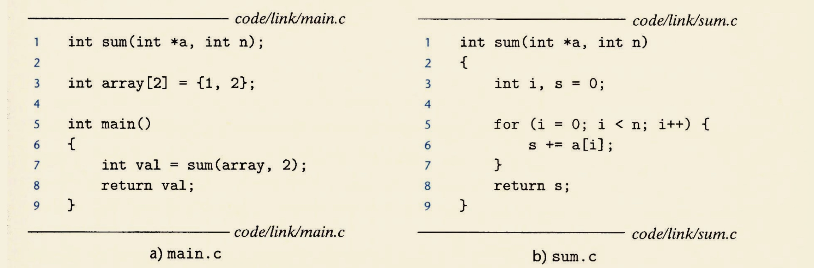

## 静态编译过程

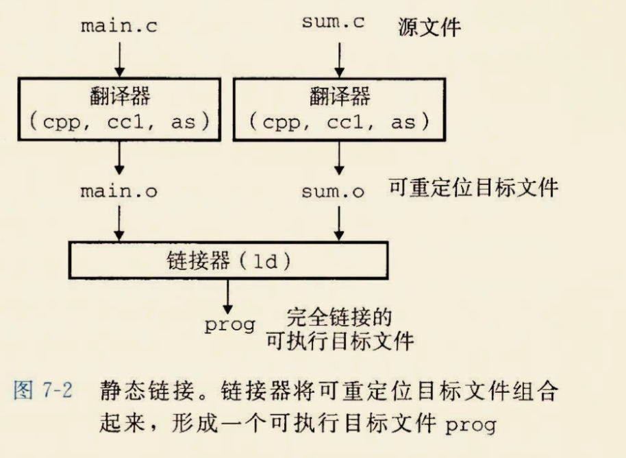

1. 使用C预处理器（cpp），翻译成ASCII中间文件

   `cpp main.c main.i`

2. C编译器（ccl），翻译成ASCII的汇编文件

   `ccl main.i -Og -o main.s`

3. 汇编器（as），翻译成可重定位目标文件（relocatable object file\) `as -o main.o main.s` 同样经过这三个过程生成一个sum.o
4. 通过链接器程序（ld） `ld main.o sum.o -o prog`
5. 执行 `./prog` shell调用操作系统中的加载器（loader），将可执行文件prog中的代码和数据复制到内存中

## 静态链接

链接器的作用：

* 符号解析\(symbol resolution\) 符号：函数 or 全局变量 or 静态变量\(static\) 符号解析的作用是将符号**引用**与符号**定义**连接起来
* 重定位\(relocation\) 编译器和汇编器生成的代码和数据节是从地址0开始的

  链接器： 1. 把每个 符号定义 与 内存位置 关联起来 2. 修改对每个符号的引用，使他们指向这个内存位置

  链接器使用 **汇编器产生的重定位条目\(relocation entry\)**，**不加甄别**地进行重定位。

## 目标文件

三种：

* 可重定位目标文件
* 共享目标文件： 可以在加载或者运行的时候**动态**地被加载进内存并链接
* 可执行目标文件

### 格式

最早是a.out\(unix\)，现在逐渐演变为ELF\(Linux/Unix\)

### 可重定位目标文件

 !\[w300\]\(media/15383342765452/15383364744040.jpg\)

* ELF头帮助链接器语法分析，解释目标文件的信息
* 不同section的位置和大小由 section头部表描述
* 每个section都有一个固定大小的条目（entry）

#### sections

静态变量应该包含静态局部变量和静态全局变量

* .bss 未初始化的全局/静态，或者初始化为0的全局/静态
* .symtab: 程序中定义/引用的函数和全局变量信息
* .rel.text: .text段中需要被重定位的位置的列表。 可执行目标文件不需要重定位信息
* .rel.data: 被引用的全局变量的重定位信息，所有已初始化的全局变量，如果它的初始值是一个全局变量地址或者外部定义函数的地址，都需要被修改
* .strtab: 好像几乎包含了所有字符串的表，包括.symtab以及.debug的符号，还加上section头部中各section的名字

### 符号和符号表

#### static

C中的static引用方法有数个

* 全局static： 不论是函数还是变量，代表invisible 对于other files
* 局部static： 在函数中定义，但是在函数调用结束后这个变量不会被销毁

#### 三种不同的符号

* 全局链接器符号：在模块m（一个.o）中定义的非静态的C函数和全局变量
* 外部符号：可以再模块m中引用的符号，即其他文件中定义的全局非静态函数或变量
* 局部符号：不是局部变量（局部变量在栈中临时压入，连名字都没有），是带static属性的C函数和变量，这些函数和变量在模块m中全局可见，但不被其他模块可见

#### 符号表

符号表是由汇编器构造的，里面是编译器输出到汇编语言文件.s中的符号 同时会包含一些链接器在链接过程中内部使用的符号

.symtab 是 Elf64\_Symbol\[\]

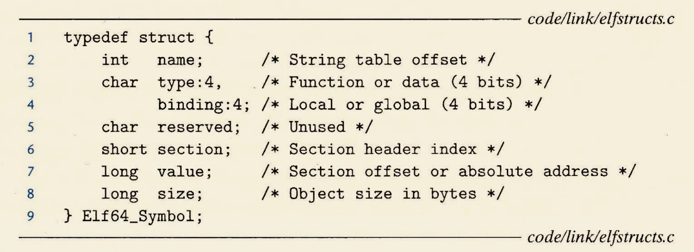

* name 是 Offset， 这样.symtab + name（伪代码）就是 指向符号的以null结尾的字符串名字
* value 对于可重定位文件，这个是距离 定义该符号 的节 的起始位置的偏移，而对于可执行目标文件，这就是绝对的运行时的地址
* section 符号所在section的编号

 可以看出，这是三个符号在对应的段中偏移（value）都是0

### 三个pseudosection（可重定位目标才有）

These tree pseudosections won't be in section headers table

* ABS : symbols shouldn't be relocated
* UNDEF : 引用了但是还尚未被定义的符号
* COMMON : 尚未被分配位置的 未初始化的 数据目标

COMMON is like .bss，但是有一点点区别：

* COMMON: 未初始化的全局变量
* .bss : 未初始化的 静态变量，以及初始化为0的全局和静态变量

## 符号解析

链接器解析符号的方法是，将每个 引用 与可重定位目标文件符号表中的一个确定的符号定义关联起来。 当**编译器（2）**遇到一个不是在当前模块中定义的符号时，假设符号在其他模块中蒂尼，生成一个**链接器符号表**，在链接器连接的时候，如果在任何模块中都找不到这个符号的话，就会抛出错误。

### 例如main

链接器在连接main时，就会在符号表中找到main，发现其的定义在text段偏移为0，就能找到main的定义

例如

```text
.main

push ebp
mov esp ebp
```

这样就知道main的”意义“了

### 多重定义的全局符号

编译时，**编译器（2）**给**编译器（3）**输出每个全局符号，并标记Strong/weak，然后编译器将这些信息隐含编码在 可重定位文件 的 符号表中。strong通常是已初始化的函数和全局变量，未初始化为weak 在链接的时候，对strong/weak 尊崇一下规则： 1. no multiple strong symbols 2. one strong + multiple weak = the strong 3. multiple weaks = a random weak

#### 通过strong 和 weak 进一步理解 COMMON 和 .bss

在编译器遇到一个弱全局符号x，并不知道其他模块是否定义x，所以无法预测链接器该用哪一个，所以放进COMMON。

如果 x 初始化为0， 那么X是strong的， 编译器就可以自信地放进.bss了

#### 与静态库连接

**为什么使用静态库**

如果不使用静态库的话，有了两种解决方案

1. 将所有标准函数（例如C标准函数）放在一个可重定位目标文件。 `gcc main.c libc.o -o main` 这样的话，每个可执行文件都会有一个Libc的完整副本，十分占用硬盘，更占用内存。更糟糕的是，如果标准函数改变了，那么所有用了标准函数的代码 都要重新编译， 并且库文件也需要 整个重新编译
2. 将所有标准函数分开放在不同的可重定位目标文件中 这样的话，每次写代码使用了标准函数，都需要在编译的时候显示地指定 `gcc main.c /usr/lib/printf.o /usr/lib/scanf.o` 麻烦且易出错
3. 将标准函数内容告诉编译器，每次编译器发现有标准函数引用的时候就编译进去 Perl是这样做得，因为perl标准函数少，这样对于编译器的负担很大

#### 使用静态库

使用静态库之后，每次编译的时候，编译器只会从lib中找出 需要使用的函数

静态库以后缀.a标识

#### 链接器链接静态库的过程

**连接器维护三个集合：**

* **E**： 这个集合里面保存可重定位目标文件，最后这个集合里面的文件会被合起来形成可执行目标文件
* **U**： 引用了但是尚未定义的符号
* **D**：在E中的文件已经定义了的符号集合

**符号链接流程**

```python
for(每个输入文件f):
if f==目标文件：
    E.append(f)
    根据f中的符号引用和定义修改U,D
if f==存档文件:
    搜索f中有没有U中的符号
    if 有：
        E.append(此.o) #存档文件只是生成它的所有.o的Archive，内部依旧相对独立划分

for h.o in lib.a:
    if h.o not in E:
        drop(h.o)

if U != []:
    raise Error
else:
    用E建立输出可执行文件
```

有一个小问题，连接会因为命令行的输入顺序产生变化。

如果将lib库文件放在最前面，例如 `gcc libc.a main.c -o main` 在链接器对libc.a进行操作的时候，还没有对main.o进行扫描，所以U是空的，所以libc.a中没有.o会进入E，导致最后报错。所以编译的时候一定要注意顺序

在比较极端的情况下，例如foo.c调用libx.a，libx.a调用liby.a，而liby.a又调用libx.a，那么就需要写两次libx.a `gcc foo.c libx.a liby.a libx.a`

## 重定位

完成符号解析只是确定 代码中 每个符号引用 能够找到对应的 符号（输入的目标模块\(即一个.o或lib中的一个.o）中的一个符号表条目关联起来）

然后进行重定位：将输入模块合并，分配运行时的地址

1. 重定位节 1. 将所有输入模块中相同类型的节合并为segment 2. 将运行时内存分给segments，付给输入模块定义的每个节和符号。于是程序中的每条指令和全局变量都有唯一的运行时内存了
2. 链接器 修改代码节和数据节中对每个符号的引用，使他们指向正确的运行时地址。这依赖于可重定位目标模块中relocation entry\(重定位条目\)

### 重定位条目

汇编器（before link\)遇到对最终位置未知的引用时，就会生成一个 **重定位条目**，在.rel.text 或者 .rel.data section中


共32种types, we only focus on two types:

符号表是 你定义了哪些符号 .rel是需要哪些符号重定位

* R\_X86\_64\_PC32 : 使用PC相对寻址 例如在之前的代码中有一个 jmp haha 在汇编这段代码的时候，机器码应该类似 jmp 0x0这样的，并且把这个0x0所在地址偏移记在.rel.text中，并且jmp使用的是相对寻址（不确定，假比），所以这个haha在.rel.text中记录就是PC32类型的
* R\_X86\_64\_32 ：使用绝对寻址的需要重定位条目

GCC默认 小型代码模型（虽64，用32代替）

### 重定位引用

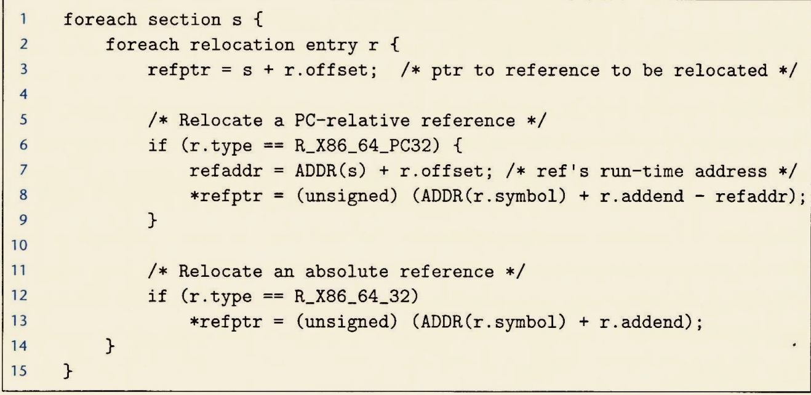

#### 相对：

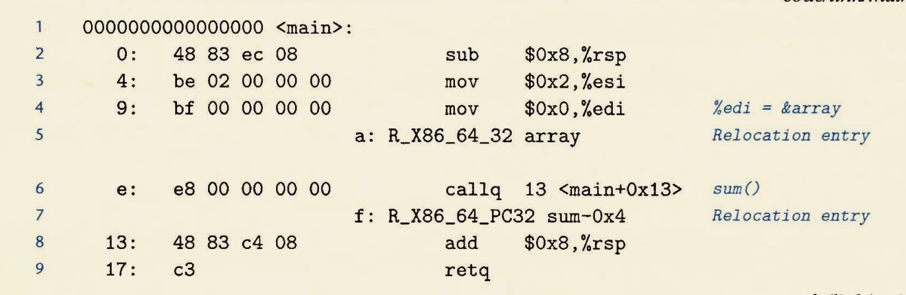 重定位13行的call

假设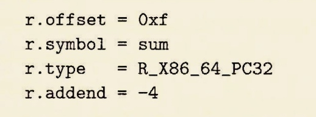

* ADDR\(s\)代表符号所在的section， ADDR\(s\) = ADDR\(.text\) = 0x4004d0
* ADDR\(r.symbol\)是这个条目对应符号的运行时地址

所以重定位为ADDR\(r.symbol\) + r.addend - refaddr\(引用的地址\) refaddr = ADDR\(s\) + r.offset

可以得到结果就是0x5 所以4004de 变成： 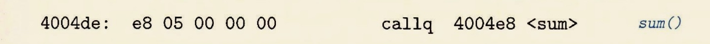

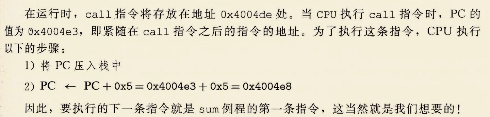

## 重定位小结

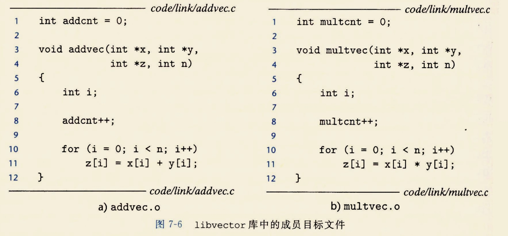

上面两个文件通过 `gcc -c addvec.c multvec.c` \(.c指明输出两个.o） `ar rcs libvector.a addvec.o multvec.o` 编译成libvector.a库

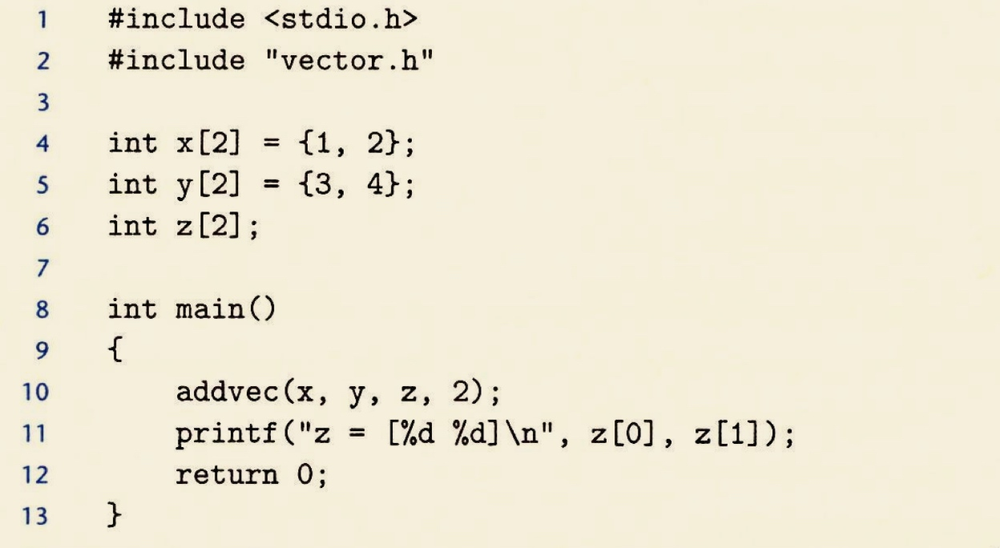

参与连接过程的有三个.o文件，他们都分别有.symtab表

main2.o的.symtab表中有addvec，但是.symtab表实际上只记录**addvec**这个符号出现在main2.o的.text节的位置

并且由于编译器发现addvec没有被链接，会将addvec加入.rel.text中，形成一个**重定位条目**，重定位条目指示这个符号的位置和在.symtab中的条目index。

* 通过符号解析，首先会解析main2.o
  1. 将main2.o加入E集合，x/y/z加入D集合，addvec和printf加入U集合（**以下忽略printf**）
  2. 然后解析libvector.a，发现在这个archive中，addvec.o中含有U集合中的addvec，于是将addvec.o加入E集合，并从U中将addvec移到D集合中。
  3. 生成一个供下一步重定位用的临时文件（猜测）将main2.o中的addvec与addvec.o的.symtab对应起来
  4. 重定位
     1. 从上一步的临时文件中知道了main2.o的symtab中的addvec实际上是addvec.o的symtab中的addvec，于是将这两个.symtab合并在一起，只包含一个addvec，需要注意的是，symtab只会记录addvec在.text节中的偏移！而不会记录加载进运行内存的地址。
     2. 给.text和.data什么的赋予运行时内存地址
     3. 遍历.rel.text，发现对addvec的引用（由于这一部分是从main2.o过来的）还是32个0 0x0000（占位），于是根据addvec对应的重定位条目的指示：
        1. 查找到此时的.symtab（已经合并），然后.symtab中有addvec在新的.text中的偏移，此时.text的运行时内存已经确定
        2. 通过上面的信息计算出addvec此时的运行时内存地址，并根据重定位条目的指示，将.text中对addvec的引用修改为正确的地址

## ELF

ELF比较有一个程序的镜像的意思了 程序头部表会进行如下指示：

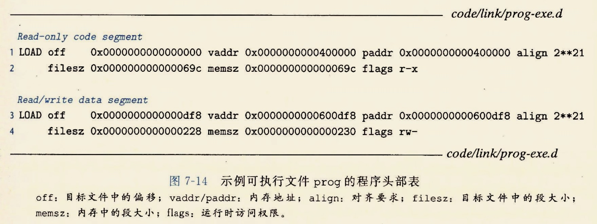

memsz - filesz = 0x8 这就是.bss段加载进内存，**所以说bss段在内存中是占地方的** 在加载进内存的时候，.bss段对应的符号会全部被初始化为0，\(通过objdump发现.bss还真的一点大小没有）

> BSS段内容：无内容，它将在段表中占一个段描述符，该段描述符的size属性将记录未初始化的全局变量与局部静态变量的大小总和
>
> 每个未初始化全局对象与静态对象的大小：存储在符号表的 size 属性中

如果bss段一点空间都不占，它怎么记录哪些符号未初始化呢？ 通过symtab可以显示哪些变量是属于bss段的，说明这些就是没有初始化的， 并且没有初始化的变量在symtab中也会记录一个大小，仅仅是记录而已，真正在被加载才会初始化，占用（内存）空间

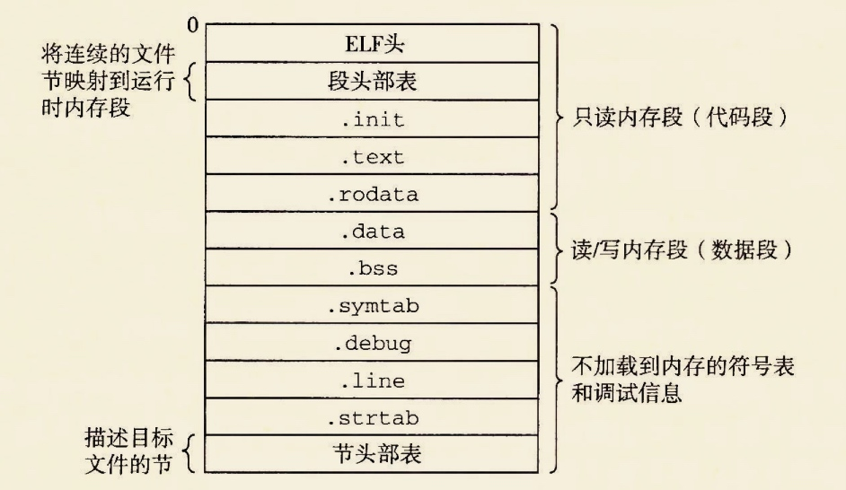

## 加载elf

linux通过调用execve\(\)来调用驻留在存储器中的loader加载执行ELF，然后跳转到\_start函数（ctrl.o定义），\_start调用\_\_libc\_start\_main

代码段总是从0x400000开始，堆在数据段之后，

将程序复制到内存并且运行的过程叫**加载**

## 动态链接共享库

例如printf这种函数，几乎每个程序都会用到，如果使用静态库，那么每个进程的内存文本段，都会有printf的代码

**共享库\(shared library\)** 也称为 **共享目标\(shared object\)**，linux中.so，windows中.dll，由**动态链接器**在运行或加载的时候加载到内存的任意位置，并和在内存中的程序连接起来。 两点不同：

* 所有引用a.so的可执行目标文件共享它，而不是静态库被复制到各个可执行文件的代码段和数据段中。
* 一个共享库的.text节可以被不同的正在运行的**进程**共享

### 大致过程

 

* 创建可执行目标文件的时候，静态执行**一些**链接，没有text或data真的被复制到prog21中，链接器复制一些**重定位/符号表**信息
* 然后在程序加载时动态完成链接过程：加载器加载**部分链接**的可执行文件prog21，然后发现prog21有.interp节，包含动态链接器的路径名，动态链接器本身就是一个.so（ld-linux.so\)，加载器加载运行这个动态链接器，动态链接器完成： 1.重定位libc.so的文本数据到某个内存段 2.重定位libvector.so到另一数据段 3.重定位prog21中所有对libc.so和libvector.so的符号引用
* 最后，加载器将控制权交给程序，此时共享库位置已经固定

## 动态链接器的三个函数

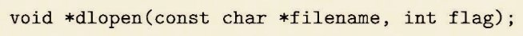 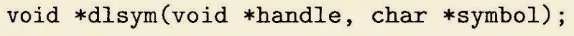  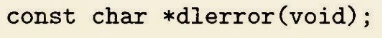

## 位置无关代码

使用共享库 必须使用 位置无关代码

### PIC引用变量

PIC的编译器利用 **代码段任何一指令** 与 **数据段任何一数据** 的距离 **总是不变**的

这样在.text段，对任何一个变量的引用，只用写0x044000\($eip\)，因为eip是下一条地址，他和GOT\[3\]之间的距离 是在生成 可执行目标文件 的时候就确定了的。动态链接器是在**加载时**工作的

**编译器**在**数据段开头**创建GOT表

#### GOT

* 每个被该目标模块引用的**全局数据目标（过程或全局变量）** 都有一个8 bytes的条目
* 每个条目 还会对应一个 重定位条目，动态链接器会重定位GOT中每个条目
* 每个目标模块 都会有个GOT

PIC 的核心是 **链接器不会修改.text** 不论是PIC引用变量还是函数，引用变量的话，.text都是让去.got找，.got在数据段，链接的时候只用根据重定位条目改.got段即可

回想静态连接，在连接的时候，链接器会根据重定位表，对需要重定位的字节进行**修改**（占位符-&gt;真实地址）

### PIC

* 延迟绑定\(lazy binding\) 将过程地址的绑定推迟到第一次调用时

GOT是数据段的一部分 PLT\(Procedure Linkage Table\)是.text段的一部分

## 小结


