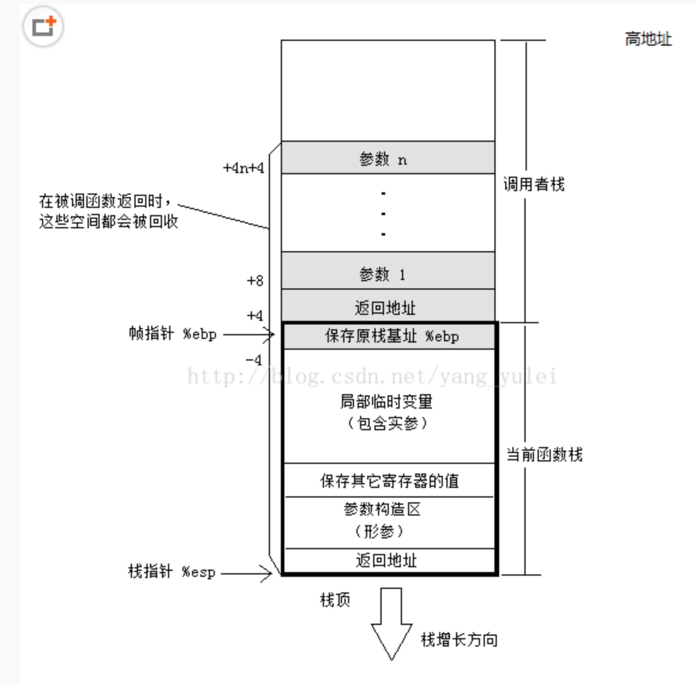

# 函数调用栈

* ESP：栈指针寄存器\(extended stack pointer\)，其内存放着一个指针，该指针永远指向系统栈最上面一个栈帧的栈顶
* EBP：基址指针寄存器\(extended base pointer\)，其内存放着一个指针，该指针永远指向系统栈最上面一个栈帧的底部
* 函数栈帧：ESP和EBP之间的内存空间为当前栈帧，EBP标识了当前栈帧的底部，ESP标识了当前栈帧的顶部。

返回地址：函数A调用函数B后下一条要执行的命令的地址（与指令寄存器挂钩） 例如

```c
B();
print('haha');
```

那么调用B的时候，会将print\('haha'\)的地址压入栈中，调用结束后方便跳转。（这个操作隐藏在call中）

push这个汇编指令代表将值压入当前进程的栈空间中，并且将esp更新到栈顶的地址。

[https://www.jianshu.com/p/ea9fc7d2393d](https://www.jianshu.com/p/ea9fc7d2393d)

* 如果esp指向0x1000这个点,向\(%esp\)写内容4bytes\(32位\)就会是0x992-0x1000（高内存到低内存，栈底到栈顶） 每一个数字点 代表的是一个 十六进制的数

## 一个函数调用的完整过程

函数funA 调用 funB

* funA中：
  1. 将实参以函数定义形参从右到左的顺序压入栈中。
  2. call
     1. 将调用funB后下一条语句的地址压入栈中
     2. 跳转到funB
* funB中
  1. 将funA的ebp压入栈中
  2. 将现在的esp（栈顶，即funA的esp）设置为ebp\(栈底，funB的ebp\)。 此时esp和ebp是重叠的
  3. 给自己的局部变量分配地址空间（esp-xxx\)来抬高栈顶指针
  4. 将被调用函数需保存的寄存器值压入栈中
  5. 开始函数功能（通过ebp+4,ebp+8什么的去找形参）
* 结束funB功能后
  1. 将现在的栈底指针的值付给栈顶指针
  2. pop ebp \(可以查看funB的第一步，这时候栈顶指针的下面正好是旧的ebp\)
  3. ret \(可以查看funA的最后一步，现在栈顶指针的下面正好是返回地址即caller的下一条语句地址）

 注意这个图栈的方向是向下的

**将代码（PC（eip）和栈作为两个独立的部分来看待！**

