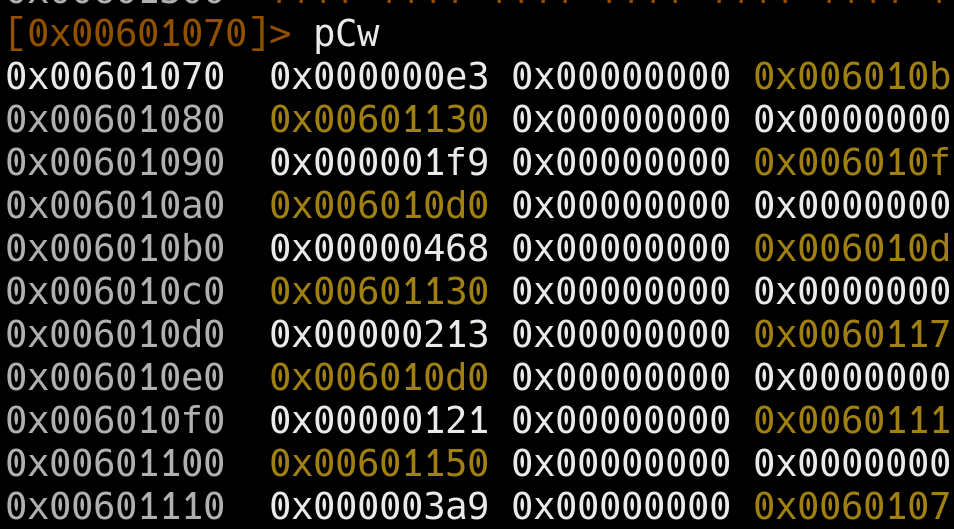
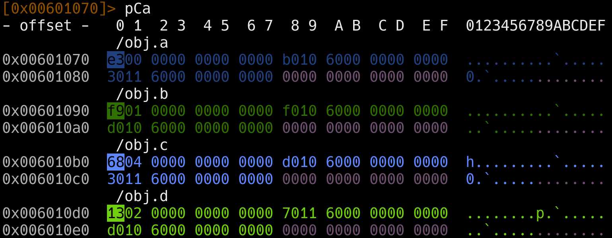

# radare2

## in V

- ?: help
- V: enter VV
- p/P: change mode
- -/+: zoom
- g[]: go to 
- n: next function
- \_: start search in symbol table 
- e: change edge mode in graph mode

## 

- s: seek to address
    needs to add sym. as prefix for some func.

- pC: print assembly code form current address
    - pCw: print every 4 bytes(concur little endian)
    

    - pCa
     

- xc: print hex(raw)
