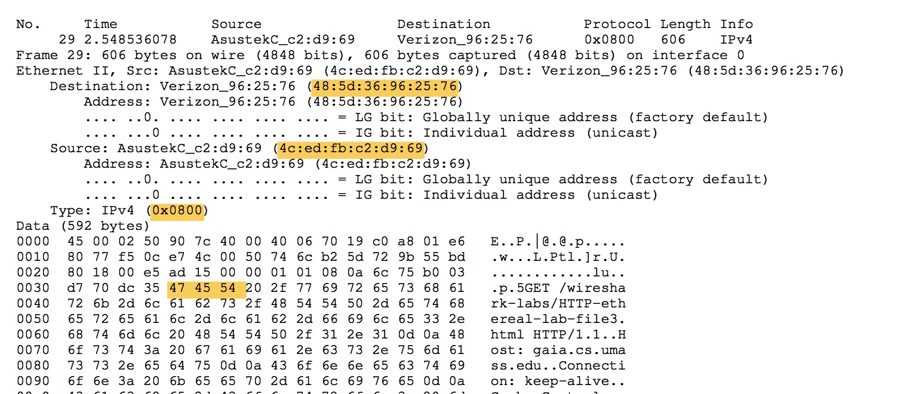

# Wireshark: Ethernet and ARP

[TOC]

## Configuration

## Answer

### Ethernet

#### Part 1

(1)
it's 48:5d:36:96:25:76
(2) 
- 4c:ed:fb:c2:d9:69
- it's not the Ethernet address of gaia.cs.umass.edu
- it's the Ethernet address of the switch in my room

(3)
0x0800, ipv4

(4)
It's 0x35(53) bytes from the start of Ethernet payload
While the Ethernet header is 14 bytes long
So it's 68 bytes from the very beginnign of Ethernet packet

#### Part 2

(5)
It's 48:5d:36:96:25:76, MAC address of switch in my room

(6)
 4c:ed:fb:c2:d9:69, yes

(7)
0x0800 IPv4

(8)
It's 0x41(65) bytes from the beginning of Ethernet payload 
Ethernet header is 14 bytes long
So it's 79 bytes from the very beginning of the Ethernet packet

### ARP 

(9)
>since arp command has been deprecated, i'm using `ip neighbour`

192.168.1.1 dev enp4s0 lladdr 48:5d:36:96:25:76 REACHABLE
192.168.1.215 dev enp4s0 lladdr 9c:2e:a1:d3:69:51 STALE
192.168.1.218 dev enp4s0 lladdr f4:5c:89:ab:42:85 REACHABLE

column|meaning
---|---
192.168.1.1 | ip address 
dev | the device to which the neighbour is attached
enp4so | the interface to which this neighbour is attached|
lladdr 48:5d:36:96:25:76| link layer address of the host
REACHABLE/STABLE| the states of neighbour entry 

#### Part 1

(10) 

- source address: 4c:ed:fb:c2:d9:69
- destination address: 0:0:0:0:0:0

(11) 

0x0806 ARP

(12)

    (a) 0x15(21) bytes

    (b) 1

    (c) yes

    (d)  in the "Target MAC address" field, 0:0:0:0:0:0

(13)

    (a) 0x15(21) bytes

    (b) 2

    (c) Sender MAC address field, which is 48:5d:36:96:25:76

(14)

- Destination address: 4c:ed:fb:c2:d9:69
- Source address: 48:5d:36:96:25:76

(15)

Because ARP reply message is note broadcast

#### Extra Credit

##### EX- 1

In my LAN,  MAC address of router should be 48:5d:36:96:25:76, I changed the last bytes to 76 by:

`sudo arp -a -d|sudo arp -s 192.168.1.1 48:5d:36:96:25:75`

Then, all packets going to 192.168.1.1 will be sent to 48:5d:36:96:25:75, which not exists.

##### EX-2

I determine it by looking /proc/sys/net/ipv4/neigh/default/gc_stale_time

Based on that, the default timeout of ARP entry should be 60 seconds.
