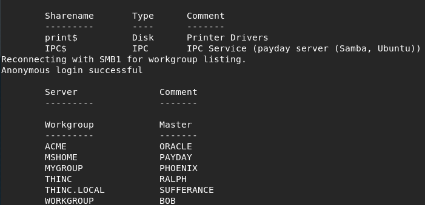

# config

to config in a new environment

git config --global user.name 
git config --global user.email

## generate ssh key(from exist)

chmod 600 ~/.ssh/gitnyu
git-add ~/.ssh/gitnyu

default passphrase sholuld be emply

