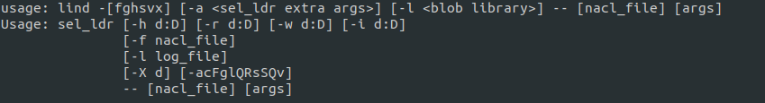

# how to use lind

[TOC]

### lind_fs

lind_fs is wrapped lind_fs_utils.py

- in linux
  python2 lind_fs_utils.py says no repy_path in env
- in macos 
  python2 lind_fs_utils.py works fine
  
#### usage

- lind_fs find 
list all files in the fs

- lind_fs cp a.out
copy a.out into fs, then lind a.out can work

but it has a sort of weird way to parse path

lind_fs a.out in 
/home/lind/lind_project/lind
turns out copy result :

`Copied /home/lind/lind_project/lind/repy/repy/../../a.out as ../../a.out(903)`

  
  
### lind

lind is wrapped sel_ldr

sel_ldr is the core of nacl, load ELF and exec

#### usage

exec lind almost is executing
`sel_ldr -a -- "/lib/glibc/runnable-ld.so" --library-path "/lib/glibc"`

if use `lind -h`

the parameter passed to lind is wrapped.
So some parameter works for sel_ldr doesnt' work for lind

### utf

utf only suppurt python2, 
but it writes something like `python ...`
so have to replace /bin/python with /bin/python2 

python2 utf.py -h
python2 utf.py --help

#### usage

python2 utf.py -f ut_lind_fs_dup.py

#### lind_fs_utils.py

This file deal with real file operation with a lind filesystem. 

and this actually invoke functions in 

**lind_fs_calls.py**