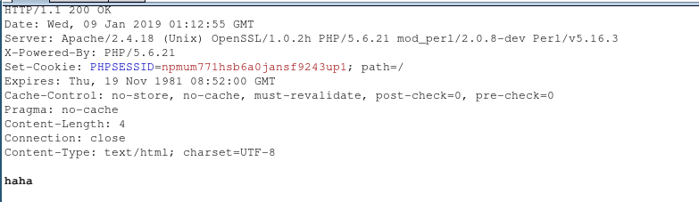

# natas
24 OsRmXFguozKpTZZ5X14zNO43379LZveg

29 airooCaiseiyee8he8xongien9euhe8b

several mroe memorable challenges

## blind injection

if(a>0, sleep(5), null)

## php   

challenge is associated with session

php engine has a "database"
every session id is the name of a dictionary
$_SESSION['name']="haha" is storing things into the dictionary

this dictionary is invisible for client side


PHP assign session id by 
`session_start()` function
response a 


when php using `$_SESSION` variable, it actually using the ID to retrive the array
so when `print_r($_SESSION)`, **it's an array, not the ID**

## shell injection

there're no alternative for && ; |

### chall
grep -i "$needle" dictionary.   
almost all special characters are banned

the way to blind injection is intereating
because the variable I can manipulate is quoted, I can't escape it 

payload:

```shell
$(grep -E ^a0n.* /etc/natas_webshell/natas19)hack
```

the result of the first setence will be stitched to "hach"
the entire setence is like:
```shell
grep -i "$grep -E ^a0n.* /etc/natas_webshell/natas19)hack" dictionary.txt
```

The dictionary has the word "hack", if nothing got in $grep, then it's like
grep -i hack dictionary

But if somthing is got. it's like
grep -i a0nhack dictionary.
The answer is obvious nothing.

Then, this is a boolen injection