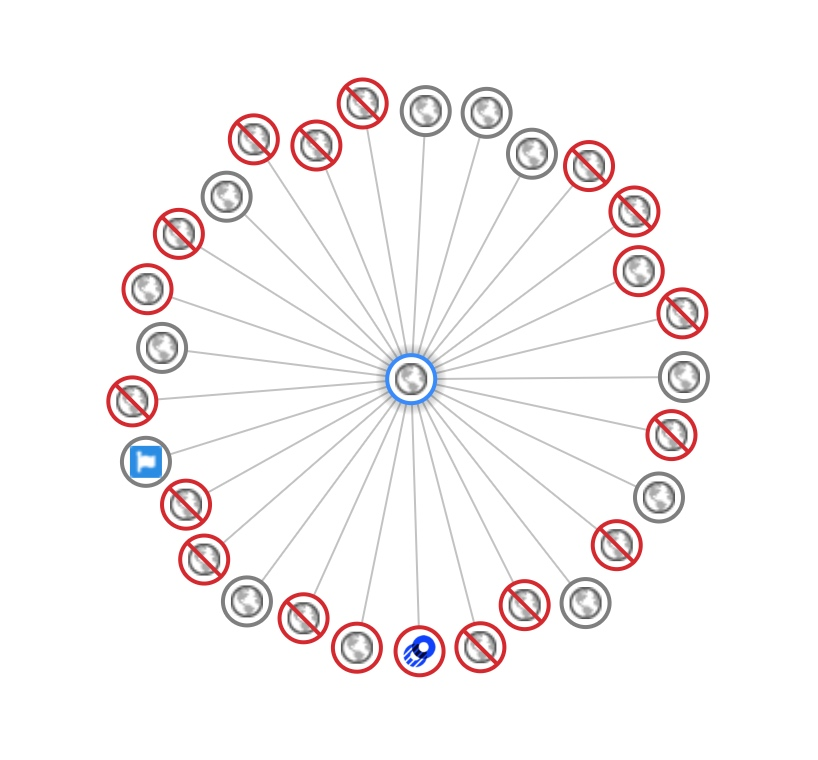
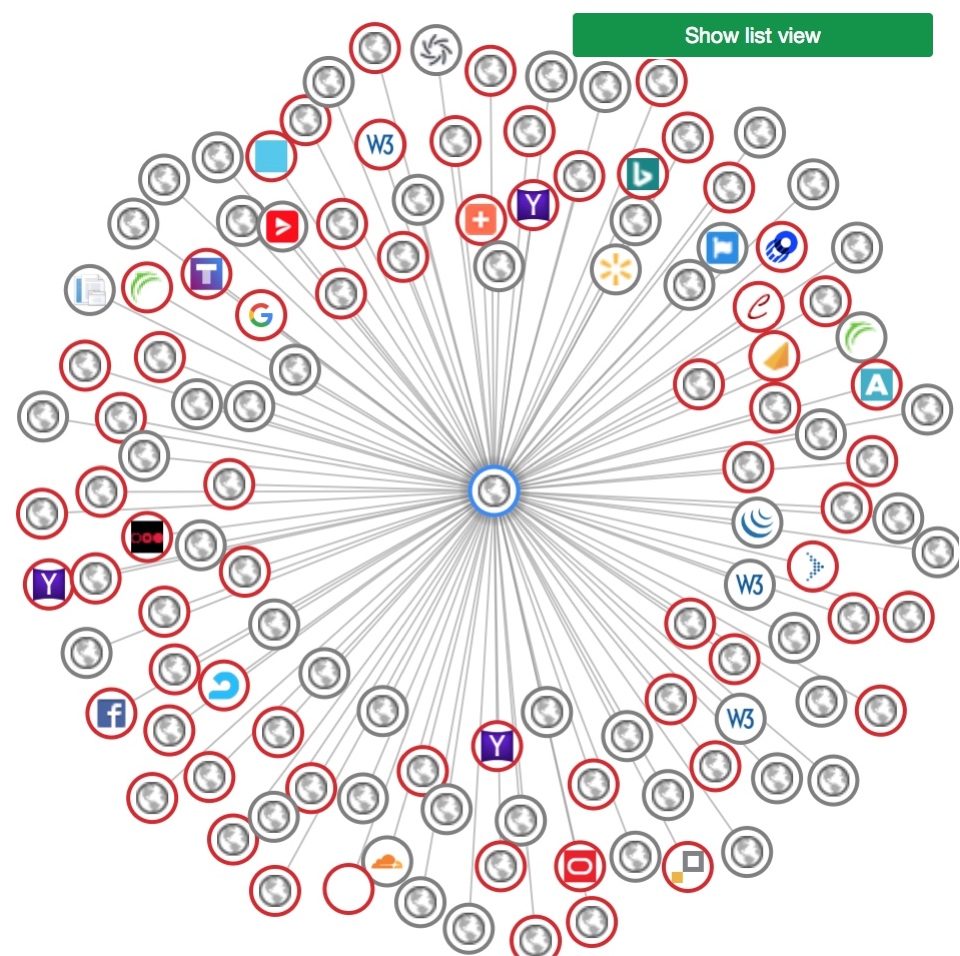
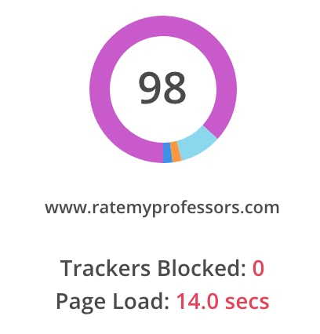
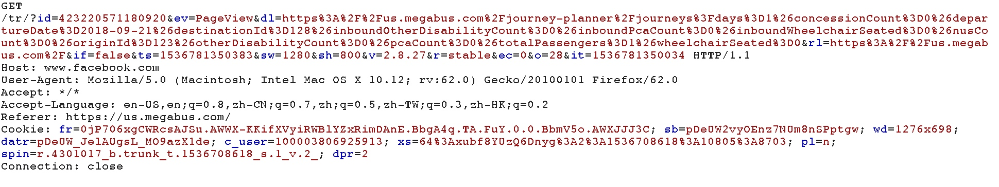
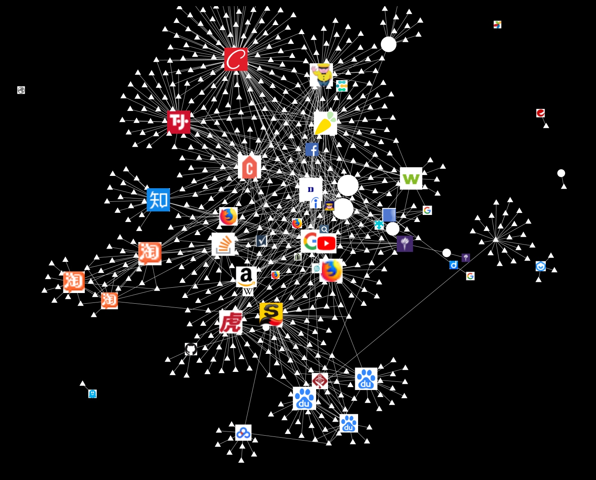
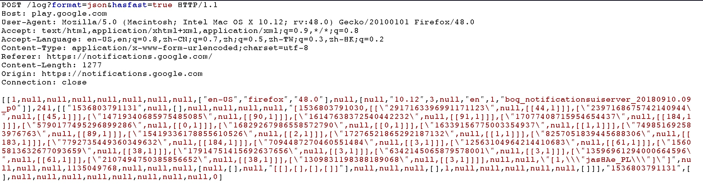

# Assignment 1, Part 1

Name: Xu Congyu

## What is this plug-in tracks and how

* **What?**  Plugin tracks websites which track me when I browse websites.
* **How?** Every external url request when I visit a site is recorded by Lightbeam, and then use records to draw graph.
* Example \(Facebook\) 

  &lt;img width="100"align="right" src="media/15366873377210/15367634584750.jpg"\)

  ```text
   </img>
  ```

  * Circle points mean websites I visit. 
  * Two points also connected if one is requested when browsing the other one.        
  * Purple edge means third-party cookies are used.      

## Three unexpected three edges

### ratemyprofessor's edges

I used to think rate my professor is a good, conscience website offering free information, and I didn't see much advertisement when I used it. But its circle in Lightbeam shocked me.  So I use Disconnect in Chrome to track it, when I blocked some third-party sites detected by Disconnect as advertisement in advanced,it would not request too many sites. Like this:  However, if I turn off the Disconnect's block, some third-party sites even let browser to request more other sites. Turns to this:

 And I use another add-on: ghostery to analyze urls it requested, I found that almost all third-party urls it requested are advertisement provider. Not only my information are tracked by those advertisement provider tracker, but also I need much more time to load the page.

### Megabus - Facebook

At first, I saw some edges connect Facebook with other websites, but I thought it was just because those websites used Facebook' API to do something like "Login with Facebook". However, when I tracked some data from megabus, I search tickets with departure and destination, I found some weird package sent to Facebook, like this:  The directory this package request is "/tr", seems to be an abbr. of "track", also, it sends cookies of Facebook. And Facebook connects with a lot more other websites like Century21, Instacart, in this way, it can have a full print of me.

### Google - Anything

 Like the graph shows, I visited a lot of websites these day, and most of them are connected with google's service like adservice, doubleclick, Google Analytics. &lt;/br&gt;

Take doubleclick as an example, I have 47 websites connecting with doubleclick, including reddit, nyu, youtube, Linkedin, etc. Almost every single step I move in the Internet world can be tracked by google.

## Going directly vs. through Google

If I going to a websites through Google, there're three more request made, first it made a GET request and redirect to another google link, this allows it to send two POST requests, one of them is like this:

 I guess this is thumbprint of me, and params the other request are not plain text.

