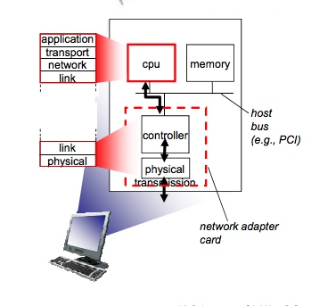
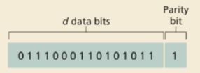
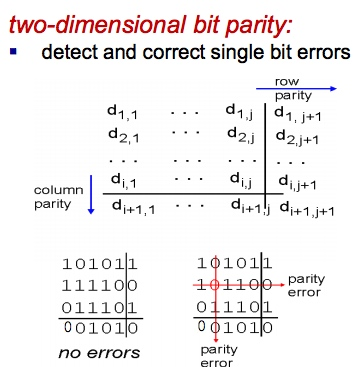

# Chapter6 Link Layer-1

## Introduction

不同于network层几乎只有IP协议，link layer 层有各种不同的协议，不同的协议提供的服务也十分不同

### Services

#### Reliable delivery

protocol for some links suffering from packet loss provides reliable for others, reliable delivery is an unnecessary overhead.

### Error detection

#### single bit parity

* error detection is not 100% reliable

**EDC** = Error Detection and Correction bits

D has d bits. In an even parity scheme, the sender simply includes one additional bit and chooses its value such that the total number of 1s in the d bits \(the original information plus a parity bit\) is even

#### two dimensional parity

> how to make packet content to two dimension?

This can locate the error bit, so can correct it.

### Cyclic Redundancy Check\(CRC\)

more powerful than check method in TCP or UDP. Because TCP/UDP deployed by software, much slower than link layer deployment\(hardware\). So can do more complicated check.

