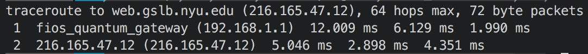

# ICMP traceroute

\[TOC\]

## Configuration

* Network

* Python

## Running

> ICMP traceroute only show 2 hops in my network I guess it is because my router will force TTL field to be big enough

### nyu.edu

* my traceroute

* traceroute\(OS X\)

### google.com

* my traceroute

* traceroute\(OS X\)

### tencent.com

* my traceroute 

* traceroute\(OS X\) 

### ethz.ch

* my traceroute

* traceroute\(OS X\) 

