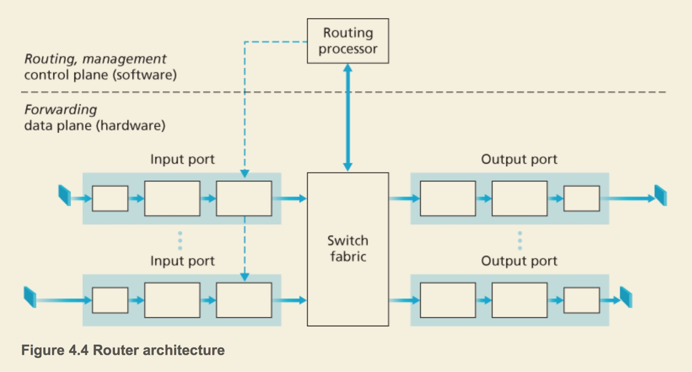

# Network Layer - data plane-1

## To be relocate

### ip header

#### TTL: time to live

Time to live is not time, but how many router can go through fro this packet. Every time a router gets a packet, check its TTL value: if TTL == 0: drop the packet, send ICMP TTL exceeded message to source else: TTL -=1

the traceroute function leverage TTL: i = 0 while\(true\): packet\[i\] = new packet\(ttl=\[i\]\) packet\[i\].send\(\) icmp\[i\] = recv\_icmp\(\) router\[i\] = icmp\[i\].source i+=1

but I don't know how it decide if the packet have arrived destination.

#### fragmentation

the outgoing interface has MTU\(max transmission unit\)

and ip\_packet.header has FLAG: Do not Fragment\(DF\)

if a ip\_packet.size &gt; MTU and \(DF==0\), the ip packet might be fragmented.

and in a fragmented ip packet, there'll be more\_fragment flag to indicate receiver whether still have packets behind it. And a fragmentation offset .

## Overview

一般来说control plan 花更多时间，好比开车

* control plan就是 route 就是出发之前一直指定路线，
* data plan就是 forwarding: 到达一个收费站之后，根据路线从当前入口到某一个出口

### Service Model

Service Model defines how to serve transportation layer. What kinds of "service" can provide

> example: Guaranteed delivery, Guaranteed minimal bandwidth

However, in real world, the service network layer provide is "best-effort service", that means, no guarantee of time or \(delivery or not\).

Some special things like ATM will not use best-effort service, instead, using like guaranteed delivery.

> the terms forwarding and switching are often used interchangeably

* the device "switch" switches packet according to link-layer head, so it's layer-2 device
* "router" switches packets according to network layer, so it's layer-3 device

## What's inside a router?

high level overview: 

#### input port

* \(first box\)It performs the **physical layer function** of terminating an incoming physical link at a router
* \(middle box\)An input port also performs **link-layer functions** needed to interoperate with the link layer at the other side of the incoming link
* \(third box\) Perhaps most crucially, a lookup function.
  * it's in here that Control Packets are forwarded to routing process

#### Switching fabric

The switching fabric connects the router’s input ports to its output ports

#### output port

* transmits these packets on the outgoing link by performing the necessary link-layer and physical-layer functions
* When a link is bidirectional \(that is, carries traffic in both directions\), an output port will typically be paired with the input port for that link on the same line card

即当双工的时候，与某一个input 配对

#### Routing Process

* The routing processor performs control-plane functions
* executes the routing protocols, maintains routing tables and attached link state information, and **computes the forwarding table** for the router
* Destination-based forwarding
* Generalized forwarding

