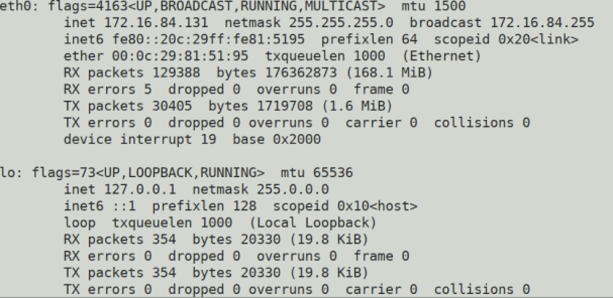
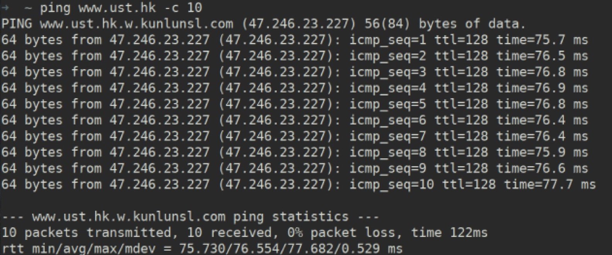
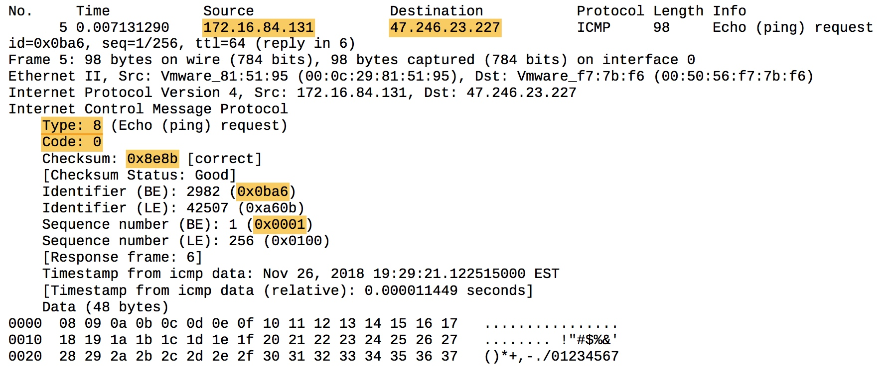
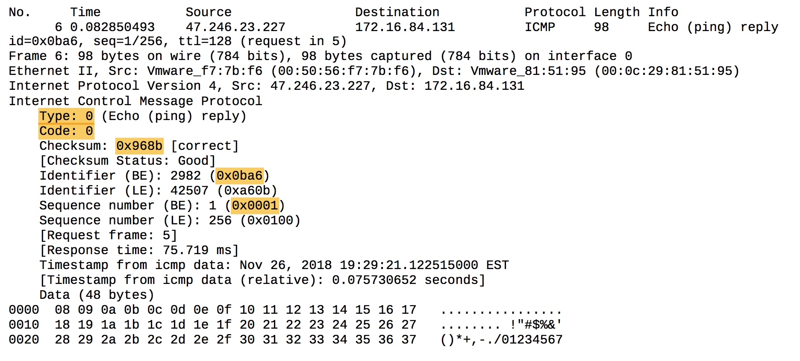
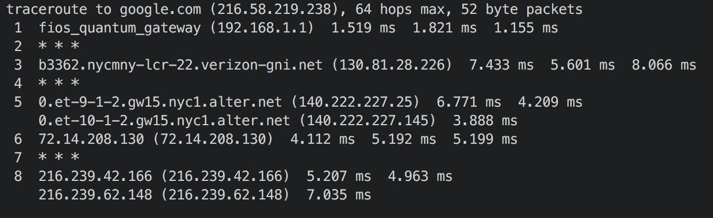
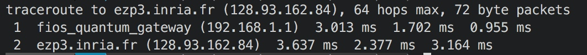
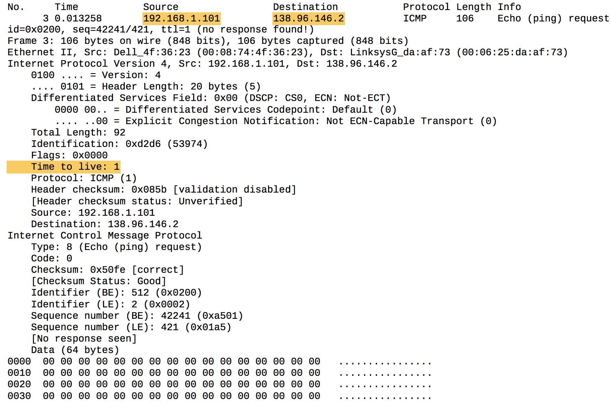
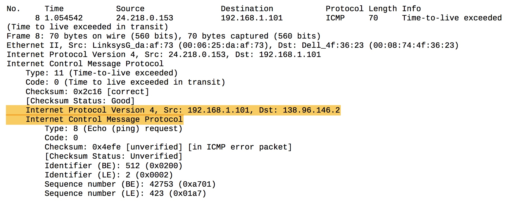
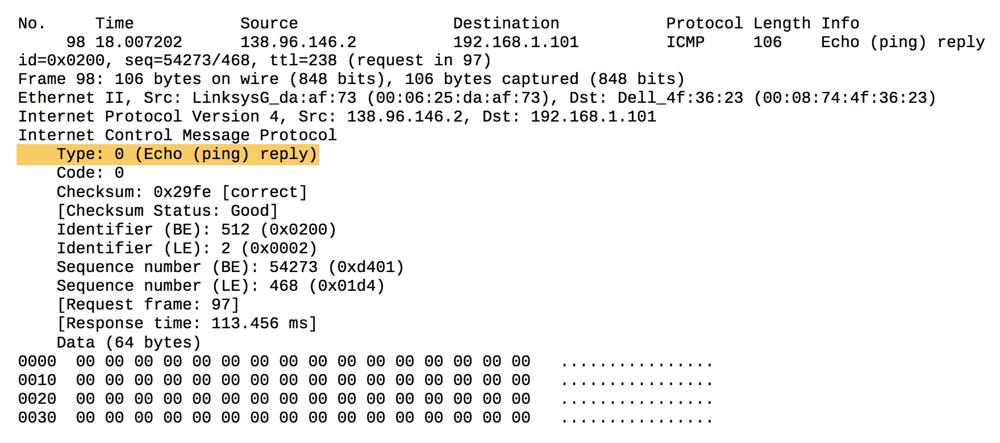
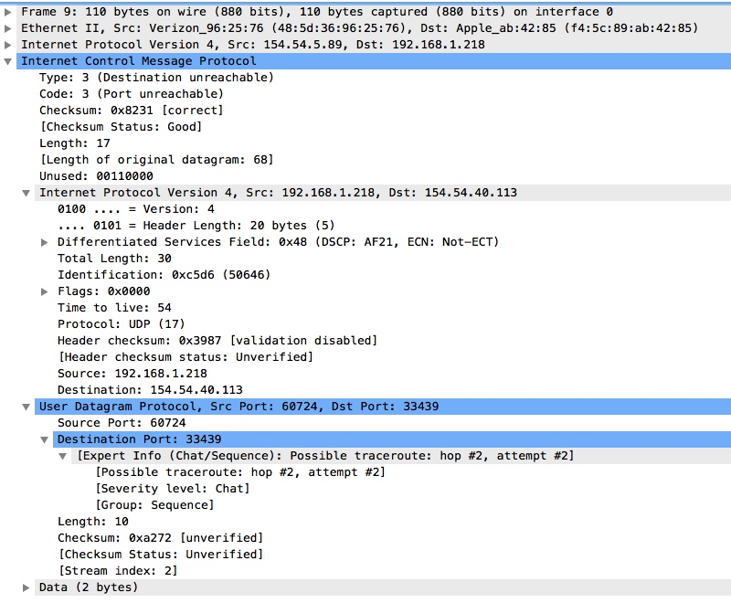

# wireshark ping

\[TOC\]

## Configuration

## ICMP and Ping

* ICMP echo packet

* ICMP reply packet

\(1\)

* my ip address: 172.16.84.131
* destination ip address: 47.246.23.227

\(2\)

1. Because port number is used by UDP or TCP for multiplex. ICMP is at the same layer as TCP and UDP, doesn't use any them. So ICMP doesn't have a TCP or UDP port number.
2. And for ICMP protocol itself, since it is used for communication network-layer information between hosts and routers, not between multiple application layer processes. So it doesn't need port number.

\(3\)

* Type: 8
* Code: 0
* Other field: "Timestamp from icmp data"
* Checksum: 2 bytes
* Identifier: 2 bytes
* Sequence number: 2 bytes

\(4\)

* Type: 0
* Code: 0
* Other field: "Timestamp from icmp data"
* Checksum: 2 bytes
* Identifier: 2 bytes
* Sequence number: 2 bytes

## ICMP and traceroute

### Problem statement

> I tried all windows, Debian, MacOS to traceroute. But there're some problem, so I will answer questions using the offline trace file to answer questions.

* MacOS traceroute using UDP

Have good normal output for some sites. But I think analyzing UDP packet doesn't meet lab requirement.

* MacOS traceroute using ICMP

Only have two hops constantly

* Debian

using Debian even worse than using MacOS

* Windows \(7\)

Only have two hops constantly.

### Answer

\(5\)

* my host: 192.168.1.101
* target: 138.96.146.2

\(6\)

Protocol: UDP\(17\)

\(7\)

Yes, the TTL field in IP header will be smaller than ICMP ping query packets, and that field will increase one every three packets sent.

\(8\)

I think they are almost the same, except the error packet contains IP and ICMP header of the original echo packet.

\(9\)

The type field of ICMP reply packet is different from error packet. And it doesn't contain ICMP and IP headers of original ICMP echo packet.

Because they arrive successfully, so it's a normal echo reply \(type 0\).

\(10\)

Yes, from Figure 4, delay from 9 to 10 is significantly longer than others. Maybe 9th hop is in North America while 10th is in Europe.

## Extra Credit

From my prospect of view, when the port of live hosts is not listening for UDP, it just reply a ICMP unreachable packet. When port is listening for UDP, it actually accepts it, and behaves as listening process suppose to do.

### For live hosts with random ports

I tried to use the UDP ping program to ping some live server with random port. Got ICMP port unreachable reply by that server. 

The content of the ICMP unreachable reply is exactly the IP packet I send to it.

### For live hosts with port listening for UDP

I use UDP Ping client to "ping" port 53 of my local DNS service

The host didn't give me any reply. I guess it is because it accepted the packet, then try to parse it as a DNS query. Failing to parse it, then the host just drop it.

