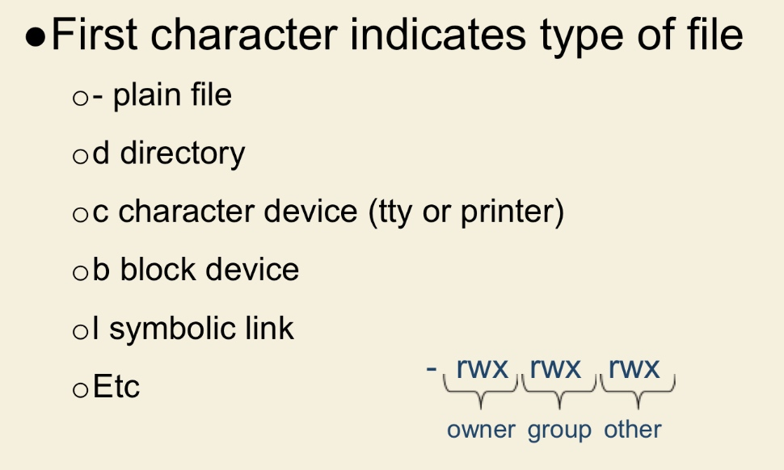
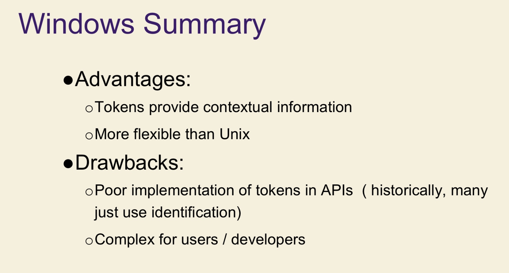
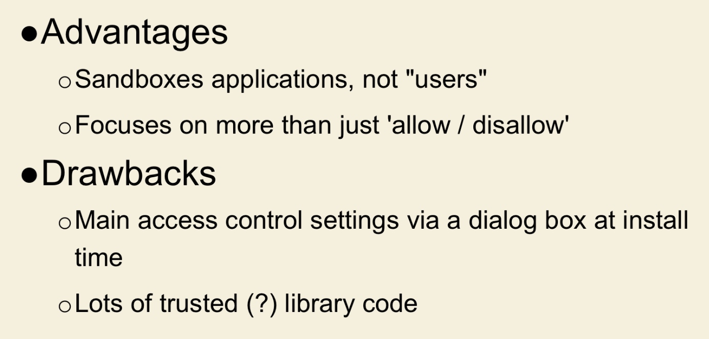
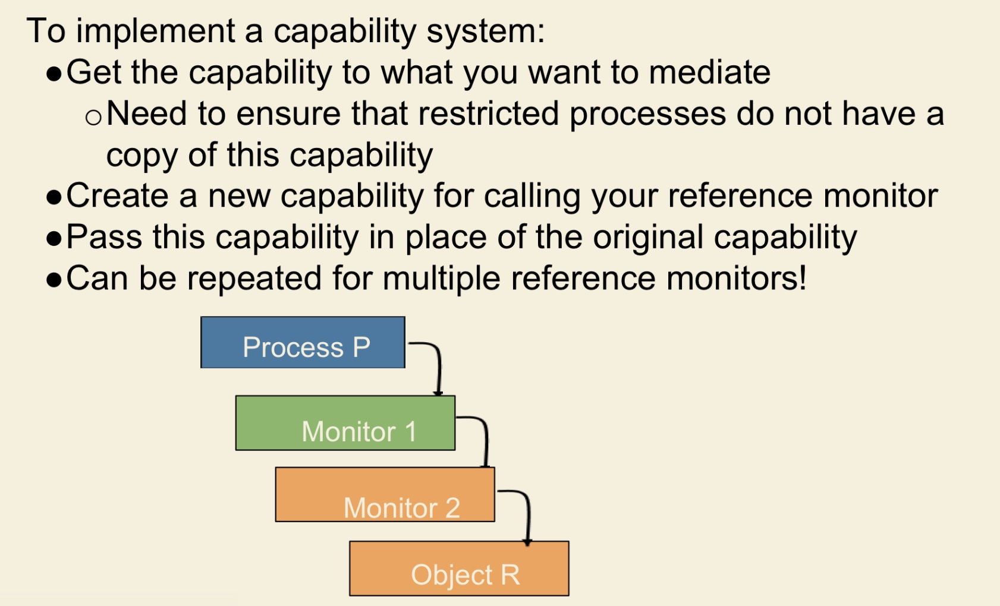

# Exam 2

\[TOC\]

## Access Control

* Two issues
  * how specify an access control policy
  * how enforce the policy

### Three functions

* Identification
* Authentication
* Authorization

#### Identification

subject's identity like username or other public information

#### Authentication

Method of proving the identify

via credentials

#### Autorization

proven identity 有什么 权限

### Access Control Models

How access control decided? Three main Models

* Discretionary\(可自由支配的\)   DAC

  
  owner of the resource to specify which subjects can access which resources

* Mandatory（MAC\)
  * Users have security clearances and resources have security labels that contain data classifications.
  * for where information classification and confidentiality is very important\(military\)
* Non-Discretionary \(Role Based\) \(RBAC\)

  
  centrally administered set of controls to determine how subjects and objects interact

### Access Control tech

#### ACL

* acl\(file 1\) = {\(proc.1, {r,w,o}\) \(proc. 2, {a}\)} 
* acl\(file 2\) = {\(proc.1, {r}\) \(proc. 2, {r,o}\)} 
* acl\(proc.1\) = {\(proc.1,{r,w,x,o}\) \(proc.2, {r}\) 
* acl\(proc.2\) = {\(proc.1,{rw}\) \(proc.2, {r,w,x,o}\)

## OS example

#### Multics

* Ring
* Segment

#### Unix

**File**

**Umask and Default Permissions**

* for new create file,It defines permission you do not want to be given

  0002 – umask means 0775 permissions

**effective UID\(euid\) for process**

each process has 3 IDs

* Real User ID  

    who start the process

* effective user id\(euid\) determine permission of process 配合file的setuid使用，当file含有setuid的时候，如果一个进程执行这个file，会将进程的euid设置成file的setuid
* saved UID save previous euid

**Setid bits \(for files\)**

set uid是权限的一个bit，而不是一个id

* setuid: set EUID of process to ID of file owner
* sticky:

  If Off: user has write permission on directory, can rename or remove files, even if not owner

-rwsr-xr-x indicates SUID

### windows

#### SID

replace UID

user, group, computers. domains, domain member all have SID

#### token

is a kind of security context:

* **Security context**: privileges, accounts, and groups associated with the process or thread

#### Security Descriptor

* specifies who can perform actions and what actions they can perform on an object
* DACL

  哪些access allow 哪些 denied 对哪些 user

* SACL

  哪些access要记录到log

### Android

## Capability

cap\(proc. 1\) = {\(file1, {r,w,o}\), \(file2, {r}\), \(proc 1, {r,w,x,o}\), \(proc 2, {w}\)}.

cap\(proc. 2\) = {\(file1, {a}\), \(file2, {r,o}\), \(proc 1, {r}\), \(proc 2, {r,w,x,o}\)}.

### ACL vs Capabilities

ACL:

* Relies on authentication: need to know user

Capabilities:

* Reference monitor checks ticket,

#### revocation

Capabilities:

* Indirection: capability points to pointer to resource ▪ If C -&gt; P -&gt; R, then revoke capability C by setting P=0

### Amoeba

this is a message to invoke, Rights is your ticket\( capability\)

#### capabilities 传递与验证

但create 一个 obj的时候，返回cap，并且cap的48bits all 1，check field C0是 48位 hash，

when 传递： set some bits to 0， hash\(new cap,C0\)

接受调用的server也有C0，就可以通过hash来验证了

#### revoke

Amoeba: Change random check and issue new capability. This invalidates all existing capabilities

就是重新生成origin 的 check

### Custom Reference Monitors

Is it easier to build a custom reference monitor when objects \(access-control list\) or subjects \(capability-based systems\) contain permissions?

monitor process本身和object同属于一个user R，如果按照ACL，想要access monitor就得获得User R的identity，但是这样monitor 就失效了

从底到上的看，先建立一个capability可以access Object R，然后建立一个capability可以access Monitor 2

就像Calender 调用 deserilize 进入 TCB一样，

Calender并没有执行一些的权限，

由于中间隔了TCB，所以调用Calender这个类需要经过检查，是否有权限调用"deserilize"，可能是capability，Calender只有调用deserialize的权限，通过调用deserialization之后，进入TCB，因为代码是受信任的，所以通过Calender传入的参数，就可能传入deserialize，然后进行exploit

所谓policy就是允不允许Calender执行deserialize,或者TCB里其他函数

