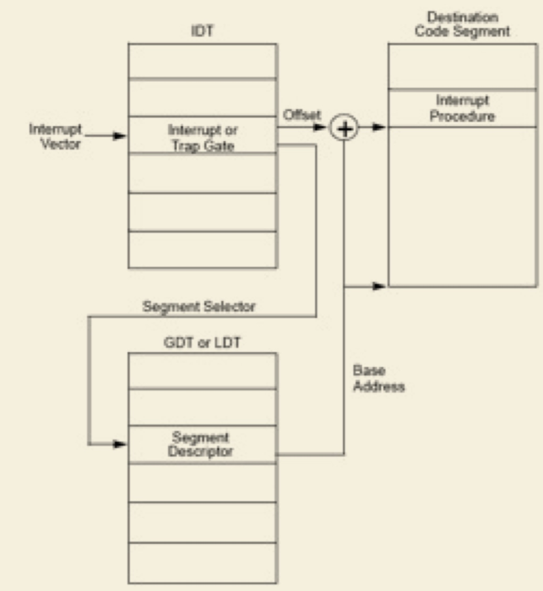
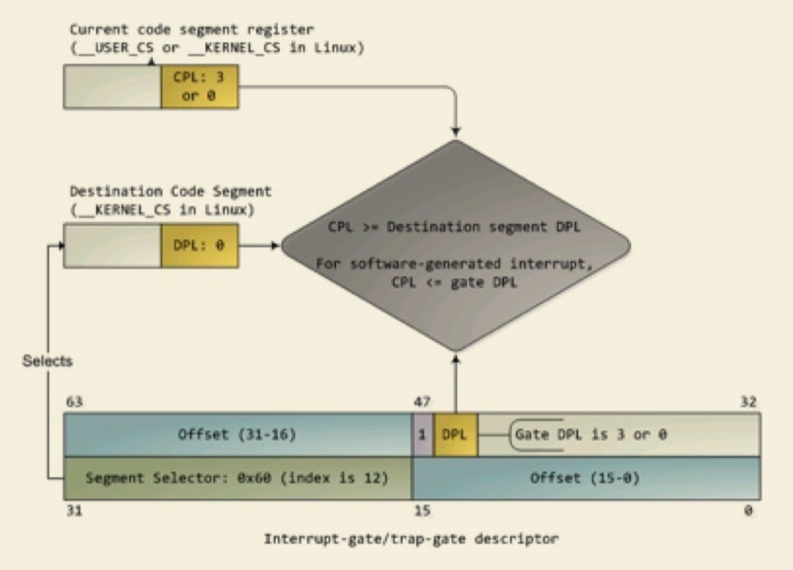
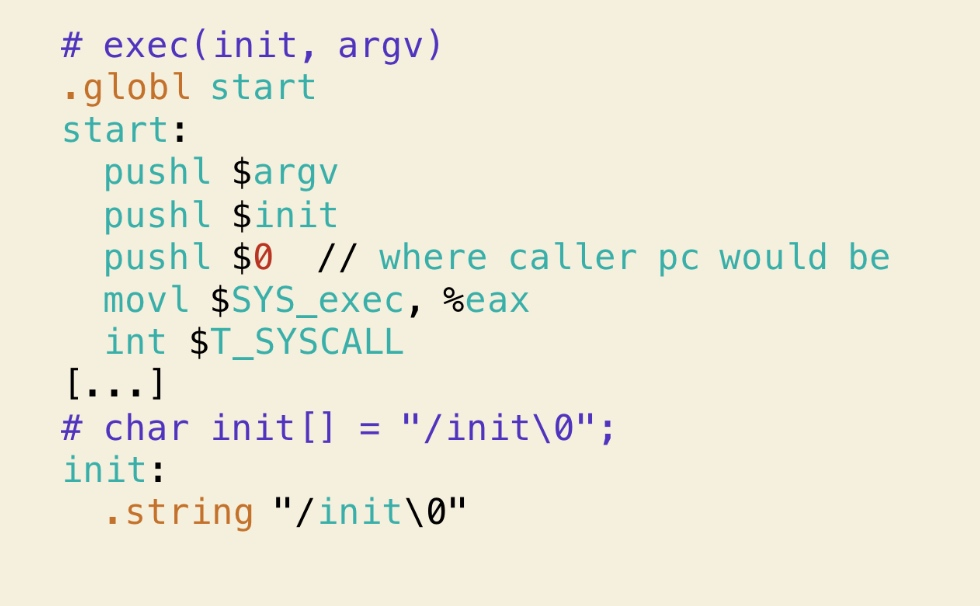
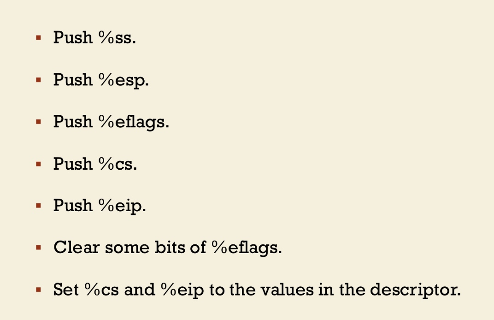
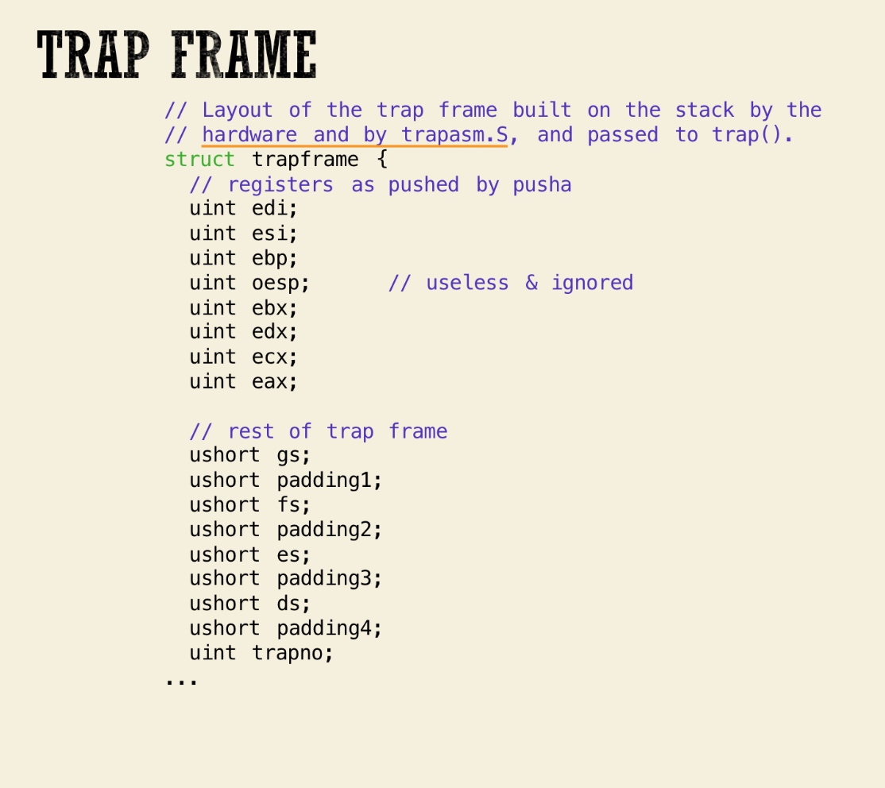
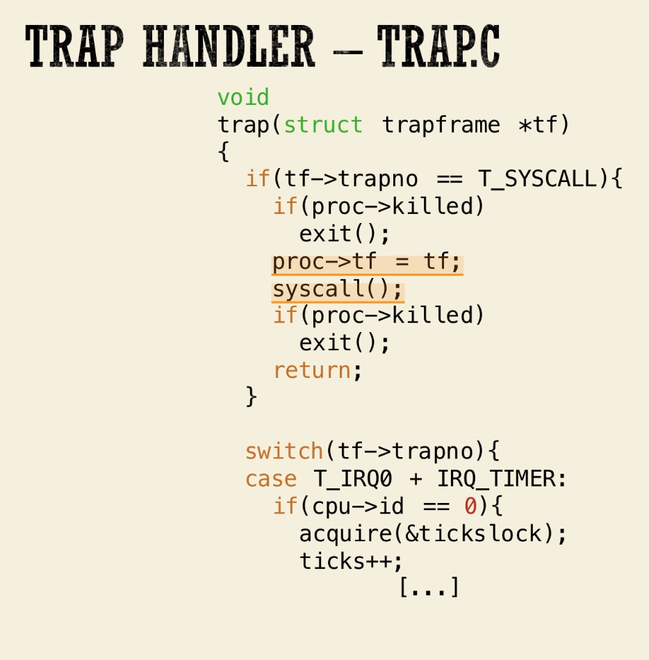
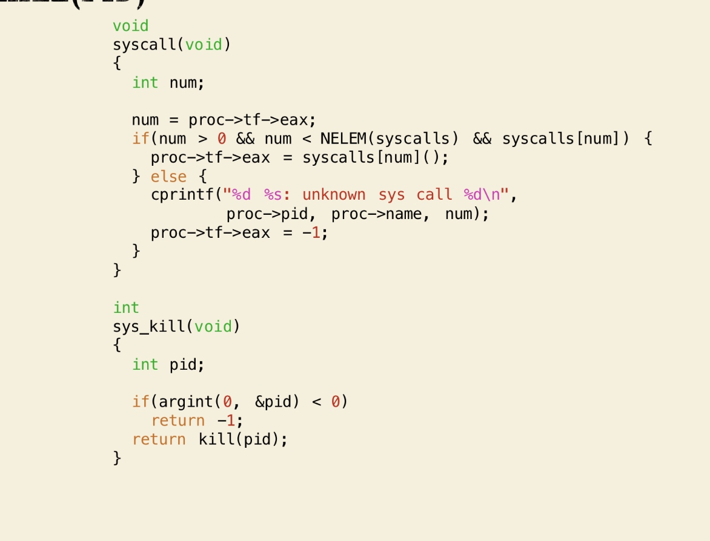
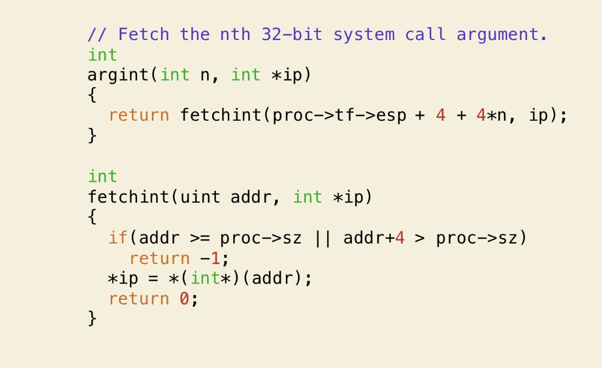

# Exception

Exception is about error Interception is from a device Trap is initiative from program

过程： 

int n 结合n和IDTR寄存器，找到对应的中断描述符

通过终端描述符有selector\(段选择字\)和offset

通过selector找到段描述符，段描述符找到该段的base address，加上Offest就是中断例程的位置了

通过比较cpl和段描述符里的dpl，如果现在的权限比较低（cpl数值大），那么就不能使用一个栈，需要保存当前栈的ss和esp信息

然后保存被打断程序使用的eflags，cs，eip，errorCode（如果是有错误码的异常）信息

### 特权检查：

在调用中断的时候，中断门会有DPL0，段描述符有个DPL1，当前有CPL

如果中断被用户态程序触发

先比较 CPL和DPL0，如果CPL权力更大或相同代表可以调用，然后再比较CPL和DPL1 

## System call完整流程

通过C标准库的exec来执行SYS\_exec

T\_SYSCALL为指定中断向量的号，SYSCALL恒为80 SYScall类型放在eax中，参数放在栈里例如"init"

int之后，进行特权级检查，通过cpu硬件，push以下 

然后进入kernel中，继续push 

其实 push就是单纯的push，但是如果通过C语言能够将他们解释为struct，就是trap\_frame，如下： 

这些都push完了，接下来调用trap 

由于刚刚才push完整个trap\_frame，它们都在栈顶，再根据汇编的管理，调用之前再push一遍参数（因为可能不确定是不是真的在栈顶，感觉pwn的时候遇到挺多这种情况），即%esp到栈顶。

trap就是trap\_handler了  设置当前进程proc的tf为传进来的tf，并调用syscall，

syscall通过检查proc-&gt;tf-&gt;eax来查找我们调用时设置的系统调用号

同样通过proc-&gt;tf里我们push的参数来找参数用

