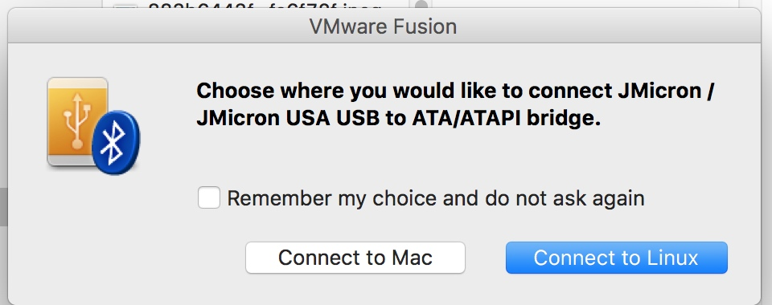

# hard drive

0000000000000000000000000000070080010000000000000000000000000000

389400 3a0a00 410800

看一看是什么filesystem 一个hard drive是什么file system 应该信息在分区的superblock中

## used instruction

df -Th mount -o exec /dev/sdc1 /media/root sudo fdisk -l

## level 0

/dev/sdc1 vfat 1.4G 2.0M 1.4G 1% /media/root/LEVEL0

cbf06ad97efb847d040d178ae953715c ../lod//31//level\_1.lod

> done be5f9c34d37d40e4486a7e8d7616dac4 Contents.txt f3e40b2f305b02159a69d287d09ba9e3 level0\_instructions.txt b76b02088c658bf3faeaea448d160321 level1.md5 ac04ddd55bfdd210473a681a32f15fe8 reference.pdf 9e5c043c0981e4f1b641bde358ea6a37 seaflashlin\_rbs 

### mount

mount -o exec /dev/cdrom /mnt/cdrom

if the disk is unmount, it exists as /dev/xxx, and is only a regular file, not directory

### embedded system structure

two parts: disk, SoC

#### Soc

* a ROM containing a "mask ROM" bootloader
* internal SRAM memories
* external serial FLASH \(via SPI bus\)
* external DRAM memory \(largest\)

this hard drive also provides a serial con- sole accessible through a physical serial port

1. bootloader in ROM execute first
2. boot firmware from FLASH
3. main firmware from magnetic disks\(not user accessible\)
4. \(additional overlays\) loaded on demand

**写指令**

when write,

1. 写指令应该是指定了写多少Block，每个block写什么，传给cache task
2. cache task aggregates those blocks, pass it to write/read task
3. write/read task position the head to write data

## 硬盘raw data

SCSI generic \(sg\) devices are

0x002a1400 记录有文件名，其中包含了level\_1.lod

0x002a0400 记录了短文件名

0x400是1024 0x1000是4096

