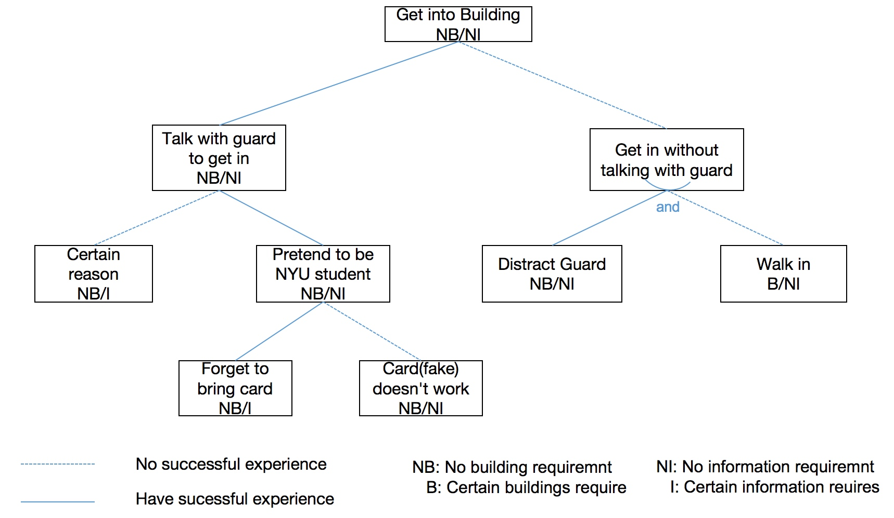

# Assignment1, Part3

Name: Xu, Congyu

&lt;/center&gt; This is my attack tree, some nodes can be further divided but I didn't due to 10 nodes limit.

* **Building requirement** is like some buildings need to tap card to open the door while in other buildings tapping card is just a check.
* **Information requirement** is attacker have to know some information. For example, if attacker want to get into 2 MetroTech using certain reason like having an appointment with Prof. Cappos, he has to know that Prof. Cappos often works in this building.

