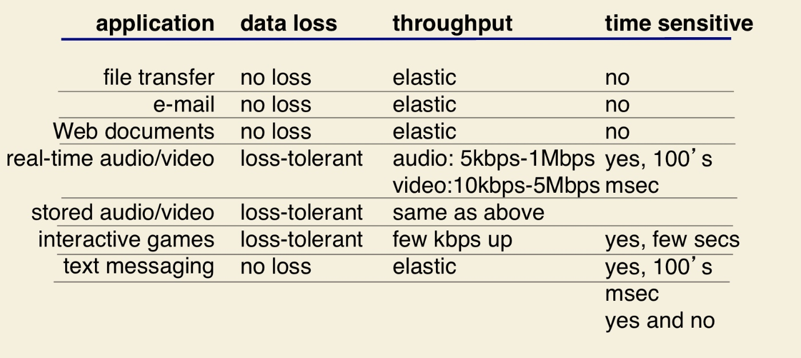
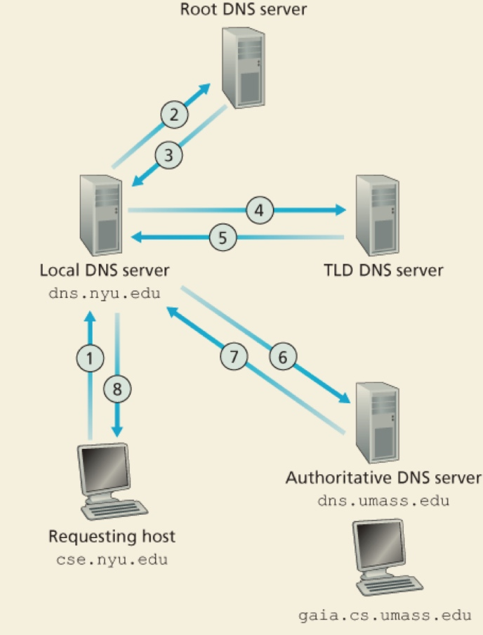
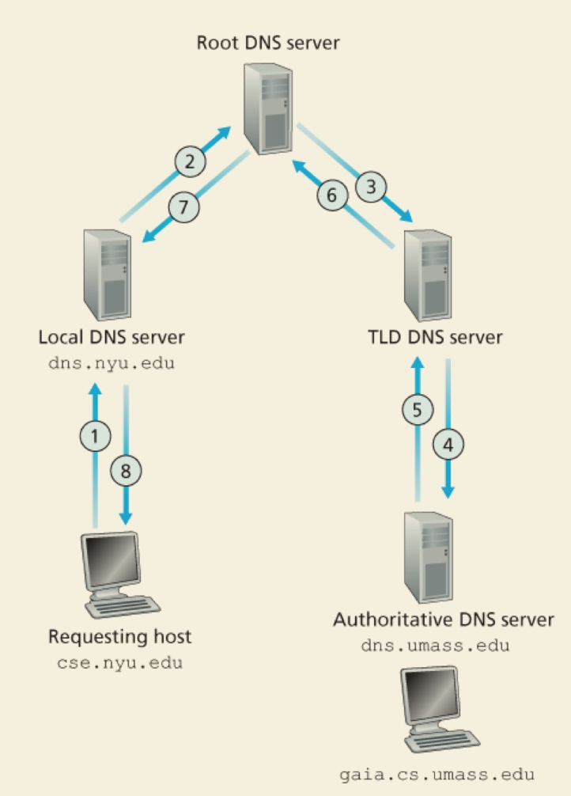

# Mid

## chap 1

* transmission rate has nothing to do with distance, but how many routers in the way
* end-to-end delay: NL/R
* a network layer can: 1. error control 2. flow control 3. segmentation and reassembly 4. multiplexing 5. connection setup

## chap 2

### DNS

why not central:

* A single point of failure
* Traffic volume
* Distant centralized database
* Maintenance

#### iterative

#### recursive

#### records

**type**

* A:\(relay1.bar.foo.com, 145.37.93.126, A\)
* NS:\(foo.com, dns.foo.com, NS\)
* \(foo.com, relay1.bar.foo.com, CNAME\)
* \(foo.com, mail.bar.foo.com, MX\) mail version of cname

### P2P

torrent: list of all peers distributing a file

#### new peer

1. tracker give new peer a list of 50 random peers on list
2. new peer establish TCP conn with 50 peers
3. ask peers chunks they have periodically\(diff peers have diff chunks\)
4. request chunk he doesn't have

* Alice first request file has rarest copies owned by peer.
* send to four peers with highest speed\(calc per 10s\)
* send random peer in list per 30s, then Alice may be his highest peer

