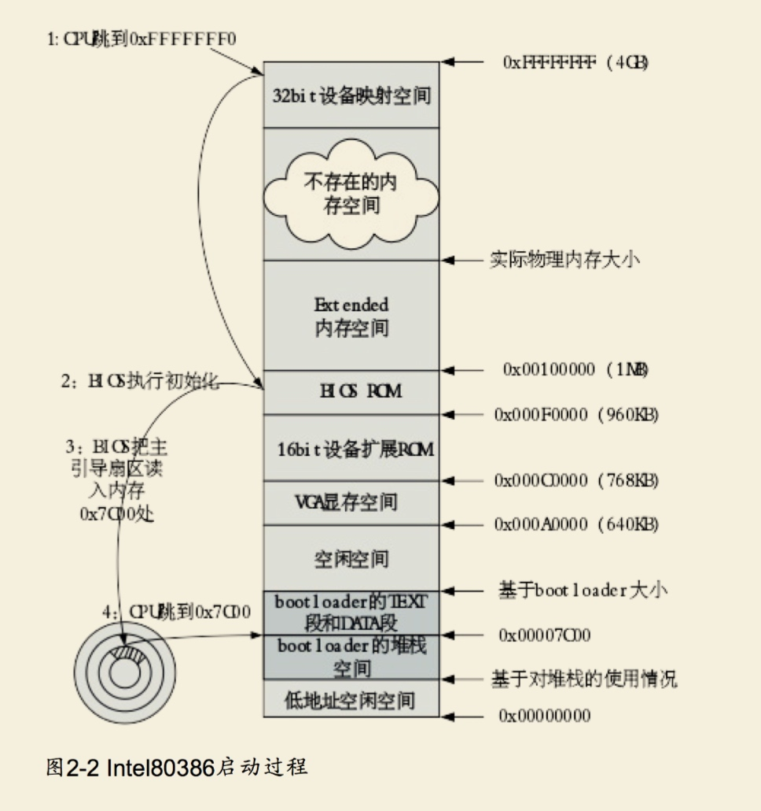

# BIOS启动补充信息

Intel的CPU具有很好的向后兼容性。在16位的8086 CPU时代，内存限制在1MB范围内，且BIOS的代码固化在EPROM中。在基于Intel的8086 CPU的PC机中的EPROM被编址在1ＭB内存地址空间的最高64KB中。PC加电后，CS寄存器初始化为0xF000，IP寄存器初始化为0xFFF0，所以CPU要执行的第一条指令的地址为CS:IP=0xF000:0XFFF0（Segment:Offset 表示）=0xFFFF0（Linear表示）。这个地址位于被固化EPROM中，指令是一个长跳转指令JMP F000:E05B。这样就开启了BIOS的执行过程。 到了32位的80386 CPU时代，内存空间扩大到了4G，多了段机制和页机制，但Intel依然很好地保证了80386向后兼容8086。地址空间的变化导致无法直接采用8086的启动约定。如果把BIOS启动固件编址在0xF000起始的64KB内存地址空间内，就会把整个物理内存地址空间隔离成不连续的两段，一段是0xF000以前的地址，一段是1MB以后的地址，这很不协调。为此，intel采用了一个折中的方案：默认将执行BIOS ROM编址在32位内存地址空间的最高端，即位于4GB地址的最后一个64KB内。在PC系统开机复位时，CPU进入实模式，并将CS寄存器设置成0xF000，将它的shadow register的Base值初始化设置为0xFFFF0000，EIP寄存器初始化设置为0x0000FFF0。所以机器执行的第一条指令的物理地址是0xFFFFFFF0。80386的BIOS代码也要和以前8086的BIOS代码兼容，故地址0xFFFFFFF0处的指令还是一条长跳转指令`jmp F000:E05B`。注意，这个长跳转指令会触发更新CS寄存器和它的shadow register，即执行`jmp F000 : E05B`后，CS将被更新成0xF000。表面上看CS其实没有变化，但CS的shadow register被更新为另外一个值了，它的Base域被更新成0x000F0000，此时形成的物理地址为Base+EIP=0x000FE05B，这就是CPU执行的第二条指令的地址。此时这条指令的地址已经是1M以内了，且此地址不再位于BIOS ROM中，而是位于RAM空间中。由于Intel设计了一种映射机制，将内存高端的BIOS ROM映射到1MB以内的RAM空间里，并且可以使这一段被映射的RAM空间具有与ROM类似的只读属性。所以PC机启动时将开启这种映射机制，让4GB地址空间的最高一个64KB的内容等同于1MB地址空间的最高一个64K的内容，从而使得执行了长跳转指令后，其实是回到了早期的8086 CPU初始化控制流，保证了向下兼容。

