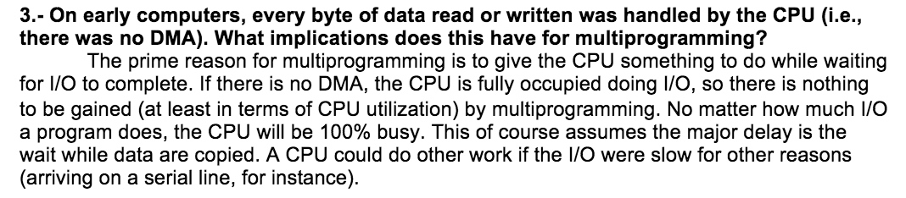
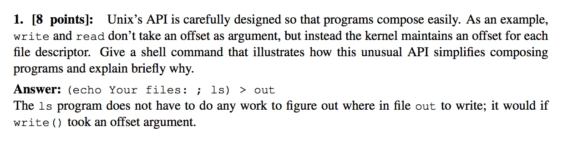
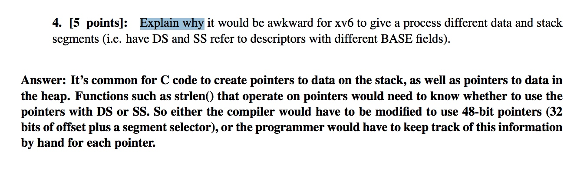
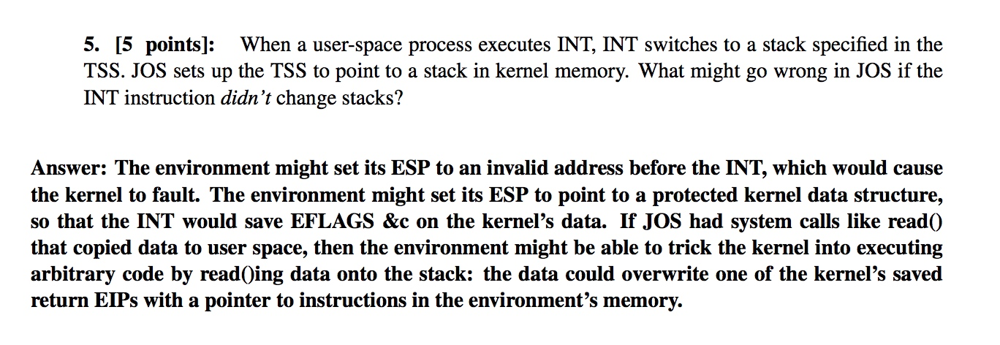
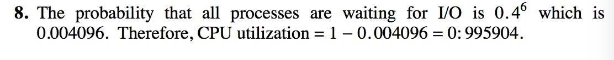

# 答案记录

The hardware—the central processing unit \(CPU\), the memory, and the input/output \(I/O\) devices—provides the basic computing resources for the system.

* volatile storage loses its contents when the power to the device is removed

 

### hardware

 有时候指针指向data段，有时候指向stack段，每次编译器都必须要做出更改以使用48位的指针，或者开发者必须要自己看每个指针

* Two of them are as follows. First, you do not want the operating system to crash be- cause a poorly written user program does not allow for enough stack space. Second, if the kernel leaves stack data in a user program’s memory space upon return from a system call, a malicious user might be able to use this data to find out information about other processes.

## Memory

### question 4

* TLB
* TLB useless after context switch, so needs to be flushed, makes more expensive
* tagged TLB

## Process

%esp points at the return address for the system call stub

* why yield acquire lock but scheduler release:

because through swtch, it needs the lock, but after swtch, yield lost control of processor, so it's unable to release the lock.

