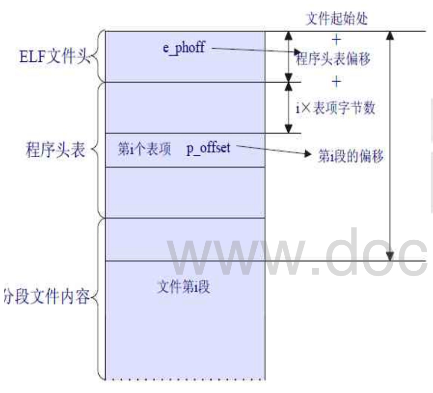

# 实模式到保护模式

\[TOC\]

```text
# bootasm.S

#include <asm.h>

# Start the CPU: switch to 32-bit protected mode, jump into C.
# The BIOS loads this code from the first sector of the hard disk into
# memory at physical address 0x7c00 and starts executing in real mode
# with %cs=0 %ip=7c00.

.set PROT_MODE_CSEG,        0x8                     # kernel code segment selector
.set PROT_MODE_DSEG,        0x10                    # kernel data segment selector
.set CR0_PE_ON,             0x1                     # protected mode enable flag

# start address should be 0:7c00, in real mode, the beginning address of the running bootloader
.globl start
start:
.code16                                             # Assemble for 16-bit mode
    cli                                             # Disable interrupts
    cld                                             # String operations increment
```

## 将几个段寄存器置为0

任何一个数与自己xor结果都是0

```text
    # Set up the important data segment registers (DS, ES, SS).
    xorw %ax, %ax                                   # Segment number zero
    movw %ax, %ds                                   # -> Data Segment
    movw %ax, %es                                   # -> Extra Segment
    movw %ax, %ss                                   # -> Stack Segment
```

## 开启A20

> [https://wenku.baidu.com/view/d6efe68fcc22bcd126ff0c00.html](https://wenku.baidu.com/view/d6efe68fcc22bcd126ff0c00.html)

### seta20.1

inb的意思就是从一个IO端口读入字符串 这里指从0x64端口（8042的status register） 该端口是0x2代表输入缓存是满的 如果是满的话 testb就会是真，重复执行以达到循环 0xd1给0x64代表要向p2端口写入内容

```text
    # Enable A20:
    #  For backwards compatibility with the earliest PCs, physical
    #  address line 20 is tied low, so that addresses higher than
    #  1MB wrap around to zero by default. This code undoes this.
seta20.1:
    inb $0x64, %al                                  # Wait for not busy(8042 input buffer empty).
    testb $0x2, %al
    jnz seta20.1

    movb $0xd1, %al                                 # 0xd1 -> port 0x64    11010001 
    outb %al, $0x64                                 # 0xd1 means: write data to 8042's P2 port   write 0xdl to 0x64 just means going to write on P2
```

### seta20.2

同样一开始测试一下input buffer是不是满的状态 不是的话就给0x60端口写入0xdf

> 0xdf = 11011111, means set P2's A20 bit\(the 1 bit\) to 1

```text
seta20.2:
    inb $0x64, %al                                  # Wait for not busy(8042 input buffer empty).
    testb $0x2, %al
    jnz seta20.2

    movb $0xdf, %al                                 # 0xdf -> port 0x60
    outb %al, $0x60                                 # 0xdf = 11011111, means set P2's A20 bit(the 1 bit) to 1
```

## 从实模式到保护模式

cr0是系统的控制寄存器，其中第一位代表实模式或者保护模式， 通过与0x1 or 一下，表示第一位变成1，其它位不变

lgdt将gdtdesc装入gdt寄存器

`ljmp $section,$offset` 跳转到section:offset地址。

```text
    # Switch from real to protected mode, using a bootstrap GDT
    # and segment translation that makes virtual addresses
    # identical to physical addresses, so that the
    # effective memory map does not change during the switch.
    lgdt gdtdesc
    movl %cr0, %eax
    orl $CR0_PE_ON, %eax
    movl %eax, %cr0

    # Jump to next instruction, but in 32-bit code segment.
    # Switches processor into 32-bit mode.
    ljmp $PROT_MODE_CSEG, $protcseg
```

```text
.code32                                             # Assemble for 32-bit mode
protcseg:
    # Set up the protected-mode data segment registers
    movw $PROT_MODE_DSEG, %ax                       # Our data segment selector
    movw %ax, %ds                                   # -> DS: Data Segment
    movw %ax, %es                                   # -> ES: Extra Segment
    movw %ax, %fs                                   # -> FS
    movw %ax, %gs                                   # -> GS
    movw %ax, %ss                                   # -> SS: Stack Segment

    # Set up the stack pointer and call into C. The stack region is from 0--start(0x7c00)
    movl $0x0, %ebp
    movl $start, %esp
    call bootmain

    # If bootmain returns (it shouldn't), loop.
spin:
    jmp spin
```

## Bootstrap GDP\(过渡用的GDP\)

```text
# Bootstrap GDT
.p2align 2                                          # force 4 byte alignment
gdt:
    SEG_NULLASM                                     # null seg
    SEG_ASM(STA_X|STA_R, 0x0, 0xffffffff)           # code seg for bootloader and kernel
    SEG_ASM(STA_W, 0x0, 0xffffffff)                 # data seg for bootloader and kernel

gdtdesc:
    .word 0x17                                      # sizeof(gdt) - 1
    .long gdt                                       #
```

## bootloader从elf读取硬盘

bootasm.S和bootmain.c一起连接成bootloader,先bootasm运行，然后call bootmain.

1. 读 I/O 地址 0x1f7,等待磁盘准备好;  
2. 写 I/O 地址 0x1f2~0x1f5,0x1f7,发出读取第 offseet 个扇区处的磁盘数据的命令; 
3. 读 I/O 地址 0x1f7,等待磁盘准备好;  
4. 连续读 I/O 地址 0x1f0,把磁盘扇区数据读到指定内存。 

> bootloader的访问硬盘都是LBA模式的PIO（Program IO）方式，即所有的IO操作是通过CPU访问硬盘的IO地址寄存器完成。

-

> 一般主板有2个IDE通道，每个通道可以接2个IDE硬盘。访问第一个硬盘的扇区可设置IO地址寄存器0x1f0-0x1f7实现的，具体参数见下表。一般第一个IDE通道通过访问IO地址0x1f0-0x1f7来实现，第二个IDE通道通过访问0x170-0x17f实现。每个通道的主从盘的选择通过第6个IO偏移地址寄存器来设置。

磁盘IO地址和对应功能:

第6位：为1=LBA模式；0 = CHS模式 第7位和第5位必须为1

IO地址 功能：

| 地址-- | 功能 |
| :--- | :--- |


0x1f0 \|读数据，当0x1f7不为忙状态时，可以读。 0x1f2\| 要读写的扇区数，每次读写前，你需要表明你要读写几个扇区。最小是1个扇区 0x1f3 \|如果是LBA模式，就是LBA参数的0-7位 0x1f4 \|如果是LBA模式，就是LBA参数的8-15位 0x1f5 \|如果是LBA模式，就是LBA参数的16-23位 0x1f6 \|第0~3位：如果是LBA模式就是24-27位 第4位：为0主盘；为1从盘 0x1f7 \|状态和命令寄存器。操作时先给命令，再读取，如果不是忙状态就从0x1f0端口读数据

```text
static void  
readsect(void *dst, uint32_t secno) {     
// wait for disk to be ready     waitdisk();       
outb(0x1F2,1);                         // count = 1    
outb(0x1F3, secno & 0xFF);      outb(0x1F4, (secno >> 8) & 0xFF);     
outb(0x1F5, (secno >> 16) & 0xFF);      
outb(0x1F6, ((secno >> 24) & 0xF) | 0xE0);      
outb(0x1F7, 0x20); 
waitdisk();

// read a sector
insl(0x1F0, dst, SECTSIZE / 4);
//除4是因为单位是DW
```

ucore.img在硬盘上，512bytes为一个sector。 一个文件肯定是从一个sector的开始 起头的（上一个文件没有占满一个sector就会浪费掉一个sector剩余的部分），假设ucore.img从第2个sector开始

readsect只能一个sector一个sector地读

如果要读ucore的第64个byte开始的数据到va怎么办呢 如果直接从第一个byte读ucore所在sector的话，va+64才能得到原本想要的数据。 于是先va -= 64，从这个地方开始读，内存写到原本指定的va时，ucore也刚好读到64

secno计算offset在ucore文件的第几个sector

```text
//readseg - read @count bytes at @offset from kernel 
//into virtual address @va,

static void
readseg(uintptr_t va, uint32_t count, uint32_t offset) {
    uintptr_t end_va = va + count;

    va -= offset % SECTSIZE;//有什么用

    //比如offset 2088 SECSIZE512

    uint32_t secno = (offset / SECTSIZE) + 1; 
    // 加1因为0扇区被引导占用
    // ELF文件从1扇区开始

    for (; va < end_va; va += SECTSIZE, secno ++) {
        readsect((void *)va, secno);
        //每读一次加一个sectsize的va，加1 secno
    }
}
```

### bootmain

* uintptr\_t = uint\_t = unsigned int
* `struct elfhdr * ELFHDR = ((struct elfhdr *)0x10000) ;` 直接将ELFHDR的保存位置定义在0x10000
* uint32\_t e\_phoff 是程序头表相对于程序开头的偏移，程序头表不是ELF文件头，ELF文件头



```c
void
bootmain(void) {
    // read the 1st page off disk
    readseg((uintptr_t)ELFHDR, SECTSIZE * 8, 0);
//将硬盘上从第一个扇区开始的4096个字节（硬盘中8个sector一页）读到内存中地址为0x10000处  

    // is this a valid ELF?
    if (ELFHDR->e_magic != ELF_MAGIC) {
        goto bad;
    }

    struct proghdr *ph, *eph;

    // load each program segment (ignores ph flags)
    ph = (struct proghdr *)((uintptr_t)ELFHDR + ELFHDR->e_phoff);
    //uintptr+t应该是刚好存储地址的数据结构，e_phoff也是这个数据结构，转换成这个后才能更好地相加
    eph = ph + ELFHDR->e_phnum;
    //eph是程序头表结束的位置，*ph应该是类似于数组，
    //这样加上e_phnum(程序头表中segment的个数）就到了结束的位置
    for (; ph < eph; ph ++) {
        readseg(ph->p_va & 0xFFFFFF, ph->p_memsz, ph->p_offset);
    }

    // call the entry point from the ELF header
    // note: does not return
    ((void (*)(void))(ELFHDR->e_entry & 0xFFFFFF))();
```

`((void (*)(void)) (ELFHDR->e_entry & 0xFFFFFF))();` 这段代码有点复杂，应该说有四个部分

1. 函数指针（地址）p = ELFHDR-&gt;e\_entry
2. 地址转换 p = p & 0xFFFFFF
3. 强制类型转换 \(void \(\*\)\(void\)\) p ，即p指向这类函数 void fun\(void\);
4. 函数调用 \(\*p\)\(\)

内核编译后，链接成elf格式，线性地址0xf0100000起始的位置，然后通过mmu进行地址转换 把它映射到合适的物理地址上；启动代码\(main.c\)里面把内核加载到了物理地址0x00100000 起始位置，在跳转到内核执行之前线性地址通过一个临时的gdt转换成物理地址（地址值不变，相当于没转换），所以在跳转到ELFHDR-&gt;e\_entry执行前需要手动转换一下地址，即 ELFHDR-&gt;e\_entry & 0xFFFFFF，这样就把0xf0100000映射成0x00100000，实现正确调用； 等到进入内核再重新初始化gdt，就能进行正确地址映射了（设KERNBASE=0xf0000000，只要 设置段基地址为-KERNBASE即可，这样映射线性地址p-&gt; p-KERNBASE）。

关于f0100000 [http://blog.sina.com.cn/s/blog\_3dce1e7b0102x6t3.html](http://blog.sina.com.cn/s/blog_3dce1e7b0102x6t3.html)

