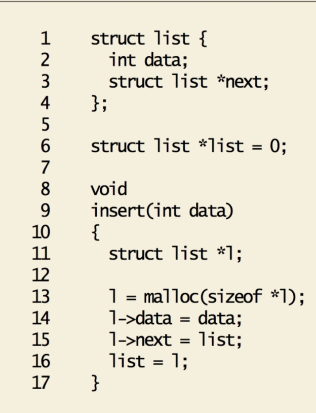
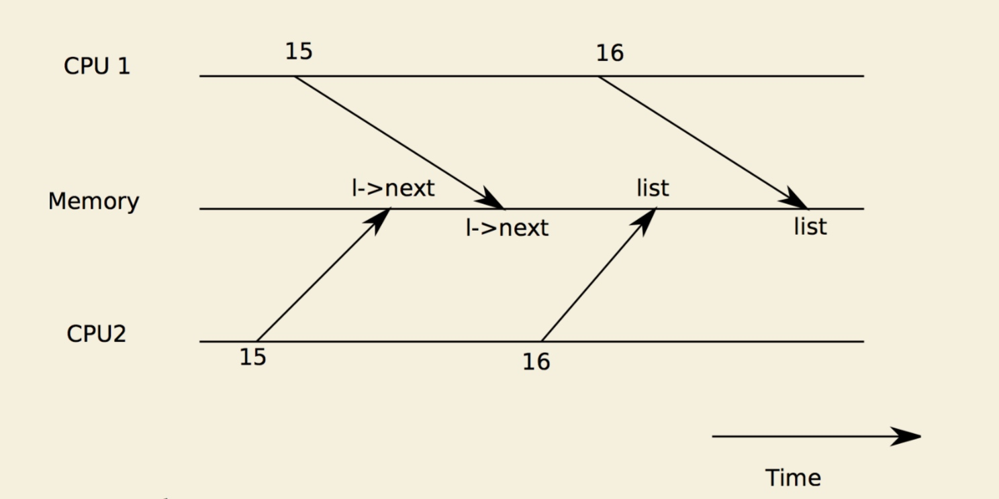
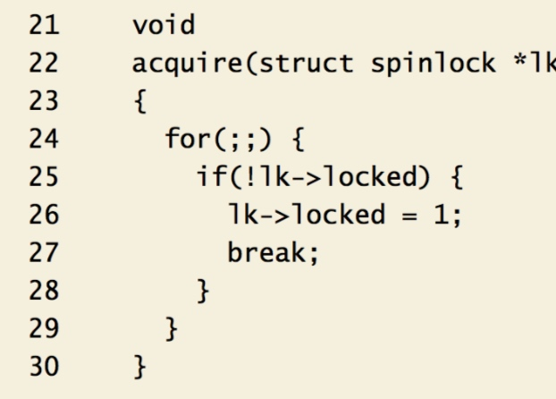

# xv6 chapter4 lock

in xv6, multiple CPU share physical RAM.

there are two kinds of lock, spinlock and sleeplock

## Race Condition

invariant: something must be invariant, for example, in this code. the invariant thing is that **list must point to head of the list**.

if image shows what if lose invariant. One process run to line 15, `l->next = list`, however, another process also run to line 15, so that replace previous process's instruction.

## code of lock

25 and 26 themselves violates the mutual exclusion property, since two process can execute to line 25 simultaneously, then they both go out the loop and "have" lock.

the solution is to **make line 25 and 26 be executed simultaneously**. To do so, use special instruction, **xchg**.

this instruction swap a word in memory with contents of a register.

* to specify, when execute, xchg %eax and lk-&gt;locked. and %eax is 1 at first

  if the lock is held. exchange 1 and 1, nothing happend.

  but if the lock is free, exchange 1 and 0, eax becomes 0, lock become 1.

