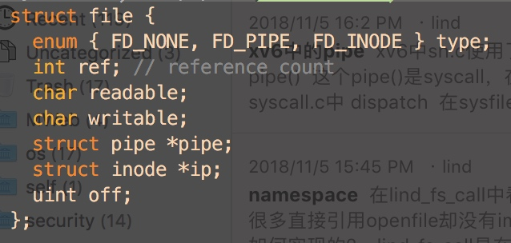
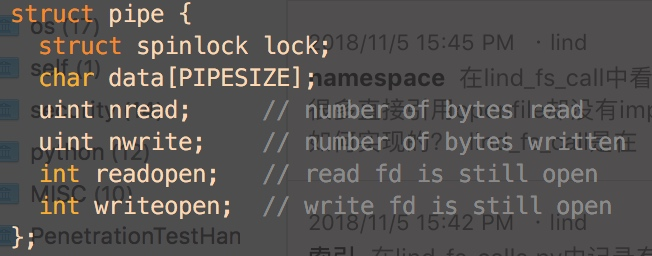

# xv6中的pipe

xv6中sh.c使用了pipe\(\)

这个pipe\(\)是syscall，在syscall.c中 dispatch

在sysfile.c中定义，使用了pipe.c中的函数，函数原型在defs.h中声明

## pipe 的初始化

pipe的初始化使用pipe.c 中的 pipealloc来定义

### pipealloc

pipealloc 先使用filealloc\(\)拿到两个file类型变量

* filealloc\(\)

    在ftable数组\(struct file\)中遍历reference=0的，然后return,

* struct file

  

file-&gt;type = FD\_PIPE file-&gt;pipe = p

p 是 struct pipe 在内核空间中分配的

在filewrite时，会判断file的类型，如果是FD\_PIPE就不会写入硬盘

