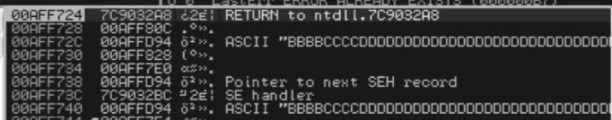

# pen\_handson\_pwn

esp是在

esp是724 72c指向的是第一个seh record 即D94那个， 这是Establish Framer，也就是为什么在ESP+8处能有可以控制的东西 748是上一个SEH

所以说即使 D94的Handler执行了RET RET POP到了72C，那么EIP就会转去执行【本来该是第一个SEH的NSEH】里的东西。 但是一个NSEH只有4bytes,又不可能覆盖下面的Handler（因为Handler用作POP POP RET）这就是为什么需要JMP到另外一个地方写ShellCode

