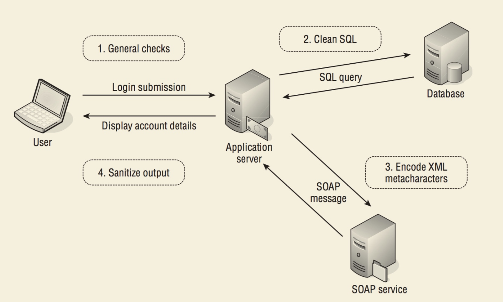

# Chapter 2 Core Defense Mechanisms

## Handling User Input

### Boundary Validation

example:

不要在输入的时候做所有的检查和净化，因为 针对不同部件的攻击 输入语句变化很大，难以全部覆盖，所以在每个功能组件接受输入的时候，都检测针对该module需要实现的功能来检测 传入到该部件 的输入。

每个部件都认为 从上一个部件传入的input 是 dirty的

### Multiple validation & canonicalization

**Canonicalization** is the process of converting or decoding data into a common character set

bypass filter by design problems of "filter"

#### examples

* strip `<stript>` `<scr<script>ipt>`
* first remove ../ recursively and then removes .. recursively: `....\/`
* input is subsequently URL canonicalized `%2527` -&gt; `%27` -&gt; `'`
* strip %27 `%%2727`
* input being filtered by server side, then copied into the application's response. **and** some browsers perform an HTML decode of the `src` parameter value `<iframe src=j&#x61;vasc&#x72ipt&#x3a;alert&#x28;1&#x29; >`
* some server side convert special character to normal character before return it to broswer, and may perform this by "best fit" map. `》` -&gt; `>`

