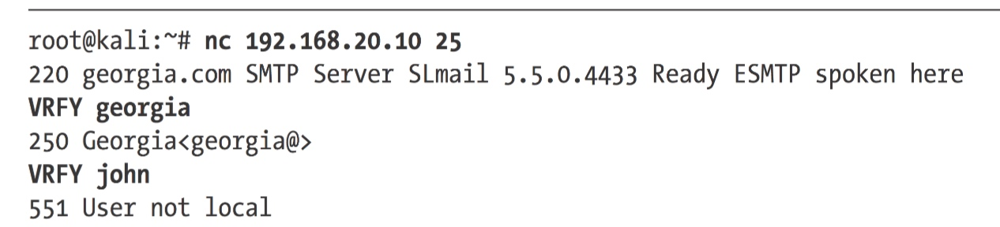

# 第六章 发现漏洞

### nmap

* `nmap -sC 192.168.20.10-12`

  nmap会运行脚本检测是否有常见的漏洞

### 运行特定nmap的脚本\(NSE\)

例如Network File System \(NFS\)在一定的设置情况下会允许客户端直接查看服务器本地文件，nmap有对应的脚本来检测这个--- **nfs-ls**

`nmap --script-help nfs-ls`

`nmap --script=nfs-ls 192.168.20.11`

### Nessus

`service nussus start` Nessus特别强大

漏洞可以在一下地方搜索 [http://www.securityfocus.com/](http://www.securityfocus.com/), [http://www](http://www) .packetstormsecurity.org/, [http://www.exploit-db.org/](http://www.exploit-db.org/), and [http://www.cve.mitre](http://www.cve.mitre) .org/

### metasploit

当设置了一个模块之后，可以使用`check`命令来看目标对当前模块是否vunlerable

## Web扫描

### Nikto

`nikto -h 192.168.20.11` -h是指定host

发现对方使用Zerit 0.4 之后使用目录遍历漏洞攻击。并且直接通过nc连

还有通过nc连SMTP来用VRFY查看是否有用户的

