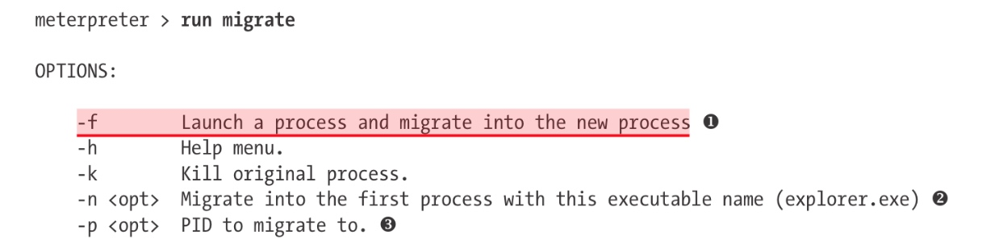

# 第十章 client端攻击

client端攻击不是指直接攻击服务器开放的端口

## reverse\_tcp\_allports

这个payload会从设置的Port开始，逐一测试端口能不能连接，但是整个测试的过程，被exploit的软件会一直卡死。

## HTTP HTTPS payloads

这两个payload msploit会将命令转换成HTTP请求的格式，来过防火墙

## ms10\_002\_aurora

当使用metasploit这个漏洞的时候，开启了web服务器，对方访问网页的时候，即触发payload

针对IE浏览器

`session -i` `jobs` `kill 0`

## script

script都保存在/usr/share/metasploit-framework/scripts/meterpreter

`run migrate` 

`show advanced`可以看到AutoRunScript等东西

`set AutoRunScript migrate -f`

虽然migrate可以达到效果，但是还是得等几秒才能迁移成功，所以可以将： **PrependMigrate** 这个advanced选项设为True

