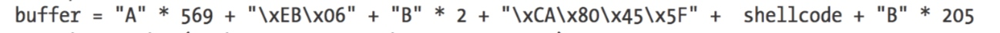

# 攻击war-ftp过程

1100个填入的字符串包括

485个单纯的无用填充 + 4bytes 返回地址 + 4bytes指示由谁来清除栈（无用） + esp指向的地址

* 攻击过程为
* 将返回地址换位MSVCRT库中的一条命令（让PC跳转到esp指向的地址）
* 将esp指向的地址替换为两部分：
  1. 抬高esp
  2. shellcode

这样的话，通过MSVCRT库的命令，命令执行到了esp指向的内存栈中的地址的命令，即首先将esp抬高（防止bug）然后再shellcode

## SEH攻击过程

当输入用户名密码时填充1150个字符是就会产生错误从而调用SEH

但是当填入1150个字符时发现没有寄存器来可以利用**进行稳定的跳转**

但是发现ESP+8处有可控制的地方，并且ESP是保存的返回地址，所以通过SEH Handler来执行POP POP RET 就跳到了ESP+8，

由SEH的机制可知，ESP+8其实保存的是SEH链中第一个SEH的地址，所以跳到了第一个SEH的NSEH，但是在NSEH执行Shellcode的话只有四个字节，不能把Handler覆盖了啊，所以就执行跳转到Handler之后的地址的代码进行执行。

A是无用填充B是由于跳转命令不够4个Bytes的填充，后面的205个B是填充足够长度以触发SEH

