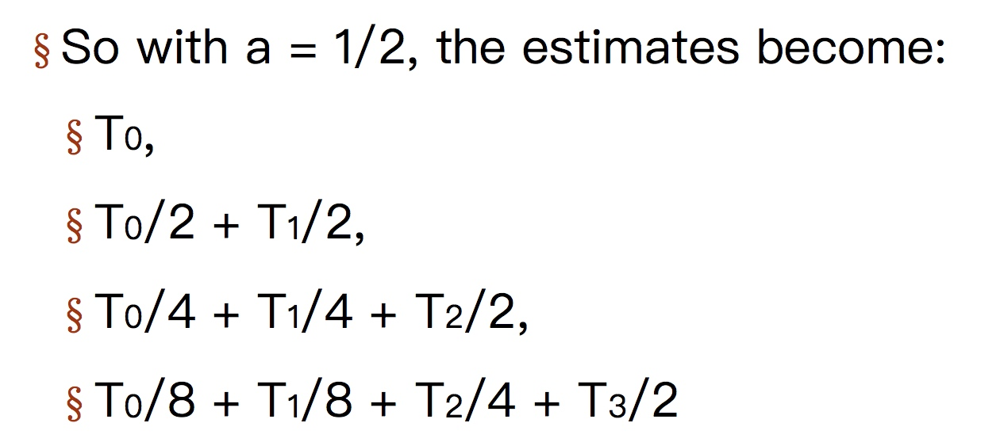
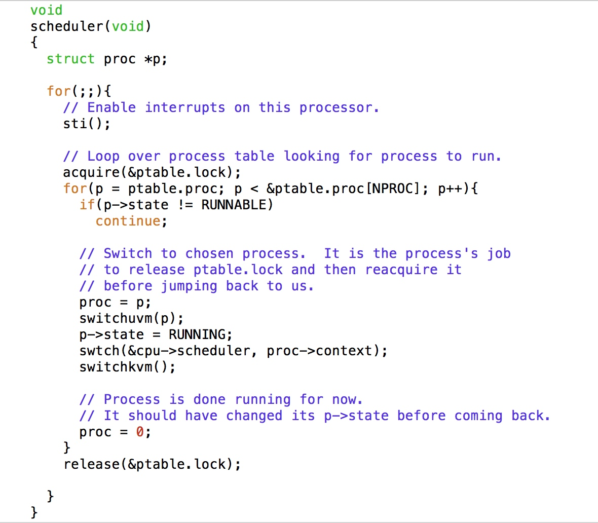
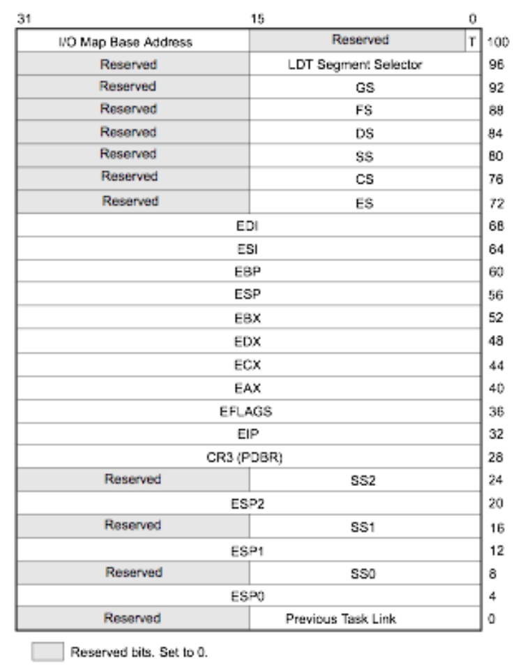
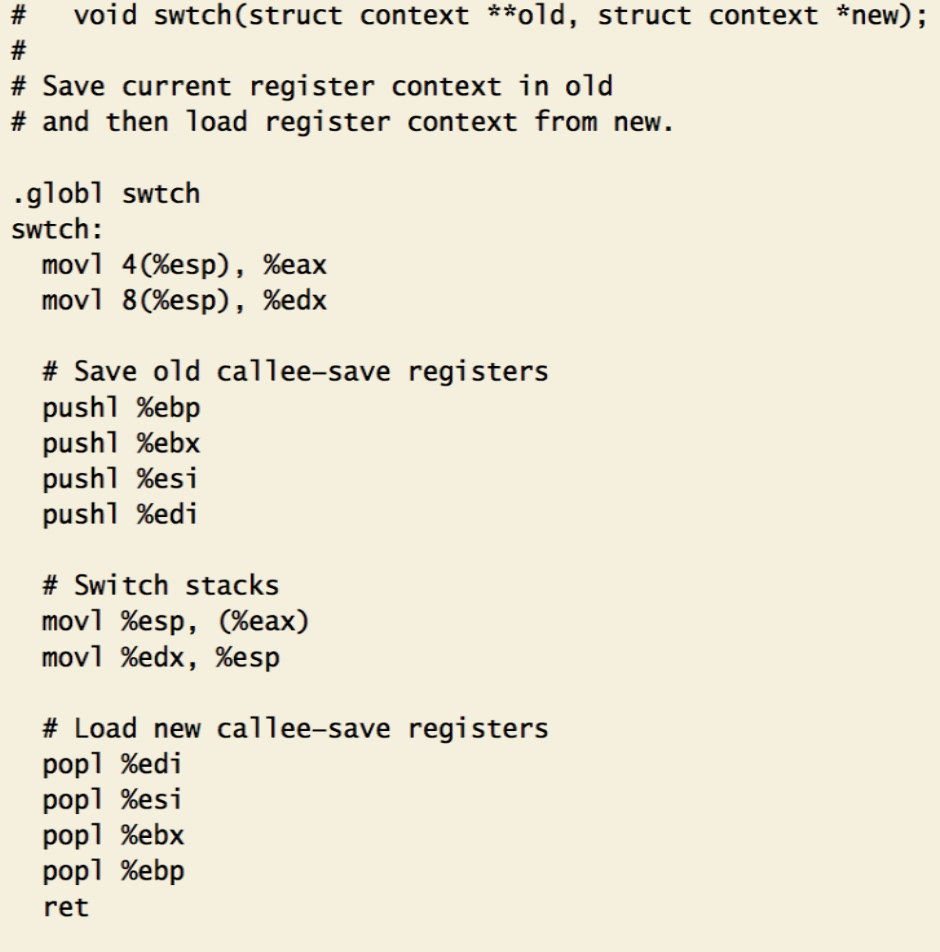
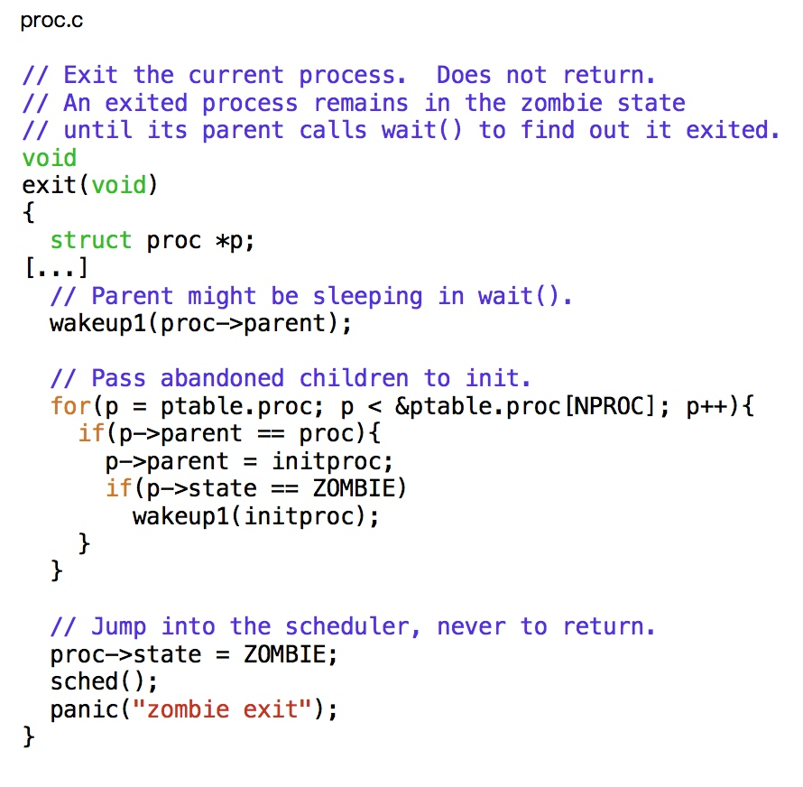
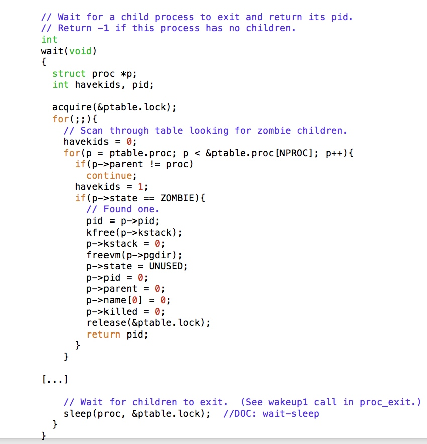

# Process and Schedule

\[TOC\]

## Process

kernel为了追踪进程，keep一个process table

每个进程都会有个process control block在里面

### process table

```c
struct {
  struct spinlock lock;
  struct proc proc[NPROC];
} ptable;
```

### PCB

```text
enum procstate { UNUSED, EMBRYO, SLEEPING, RUNNABLE, RUNNING, ZOMBIE };

// Per-process state
struct proc {
  uint sz;                     // Size of process memory (bytes)
  pde_t* pgdir;                // Page table
  char *kstack;                // Bottom of kernel stack for this process
  enum procstate state;        // Process state
  int pid;                     // Process ID
  struct proc *parent;         // Parent process
  struct trapframe *tf;        // Trap frame for current syscall
  struct context *context;     // swtch() here to run process
  void *chan;                  // If non-zero, sleeping on chan
  int killed;                  // If non-zero, have been killed
  struct file *ofile[NOFILE];  // Open files
  struct inode *cwd;           // Current directory
  char name[16];               // Process name (debugging)
};
```

## 调度

### 什么时候被调度

* timer interrupt
* exit
* block on I/O
* interrupt

## 调度算法

* Throughput job\_completed/time
* Turnaround average time between a job submit and done
* Response time time between a use issue a command and gets the result

### Round Robin

设置一个时间，时间一到换下一个程序，轮流

时间怎么设置是一个trade off

所有程序都是同一个优先级

### Priority

#### Dynamic Priority

一个quantum就是一个时间周期 priority = 1/f f是程序用上一个时间周期的比例

这样IO多的程序，优先级高，才能够有和其他程序有相同的执行时间

#### Aging:



### Lottery

防止有些优先级低的进程一直得不到执行，我们保证n个进程每个都能得到1/n 的 CPU

给程序不同个数的0-100的数， 然后随机选一个，落在哪个程序的区间里就执行哪个程序

## Stage transitions

the interface design of sleep\(chan, lock\) is for preventing a forever-sleep

and sleep\(chan,lock\)必须要在持有锁的时候才能调用

## 调度核心代码

 可以看到其实在schedule中，当执行swtch的时候，控制权已经就交出去了，后面的代码就暂时不执行了，可是锁怎么办？ **锁是不同进程交替release 和 require**

```text
void scheduler:

      proc = p;
      switchuvm(p);
      p->state = RUNNING;
      swtch(&cpu->scheduler, proc->context);
      switchkvm();
```

swtch\(old context, new context\)

#### SWITCHUVM

做了两件事

* Switch the task state segment to the user-mode one
* Changes the current virtual address space to the process's

其实change virtual address就是将页表换一下， 发生的改变，简而言之就是 在查询与上一个进程查询同一个虚拟内存位置的时候，找寻的物理位置不一样了

**TSS**

TSS is a special structure for context switching 但是跟proc.context有什么不一样



#### swtch



正常函数在一开始的时候都会进行push ebp, mov esp, ebp之类的，注意 这里没有！

所以当一个函数call swtch的时候，先将两个参数新、老context先后压进栈中，然后将自己的返回地址压入栈中，然后跳转到这个函数执行，继续push各个寄存器进原栈， \| new context\| \| old conetxt\| \| ret \| \| ebp \| \| ebx \| \| esi \| \| edi \|

然后将现在的esp 存入 old context指向的位置 然后将esp变成 new context 指向的位置 然后开始pop

**old context** 就是 **caller**

因为参数是两个进程的proc.context（其中一个在这里是schdule，每个CPU只有一个schedule context??????）

### yield

```text
oid
yield(void)
{           
  acquire(&ptable.lock);  //DOC: yieldlock
  proc->state = RUNNABLE;
  sched();
  release(&ptable.lock);
}
```

### exit and wait

 当调用了wakeup1后，和父进程是concurrent的，不过无所谓，因为父进程是一直循环找，所以就算单核，子进程先执行完，父进程也是可以监控到的



