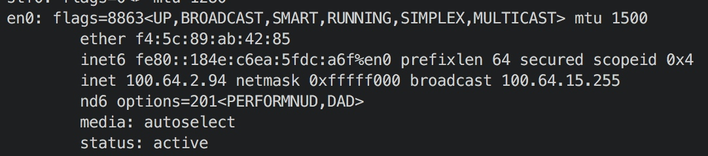
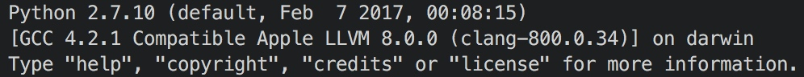
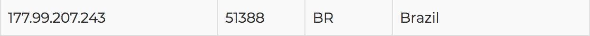
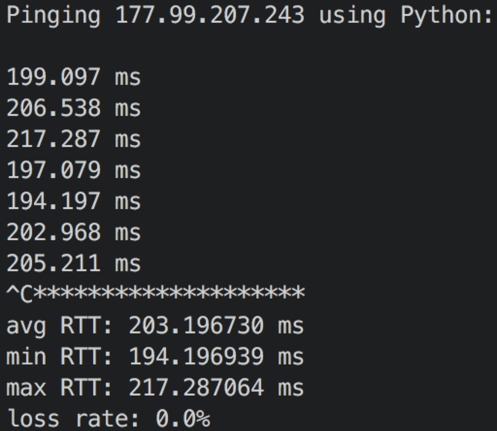
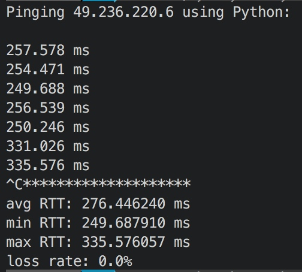
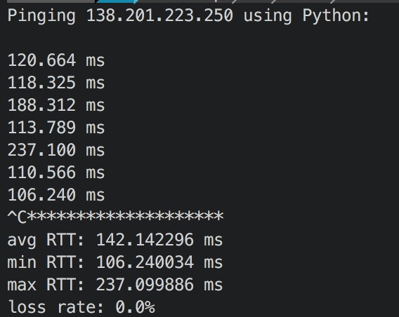
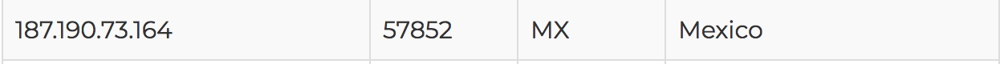
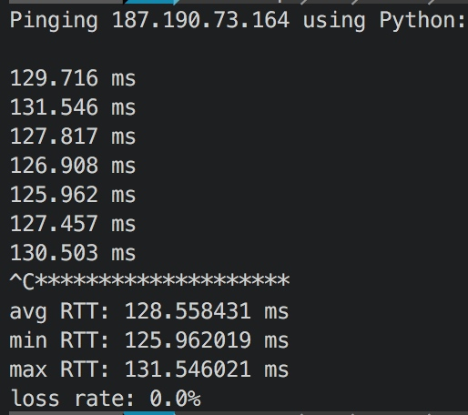

# socket programming Ping

\[TOC\]

## Configuration

* network

* Python

## File List

* report.pdf
* ping\_client.py: basic ping client
* ping\_optional.py: ping client with optional exercise

## Four Pings

I collected server in different continents in free-proxy-list.net

### South America

* server information:

  

* ping

### Asia

* server information 

* ping

### Europe

* server information

* ping

### North America

* server information

* Ping

