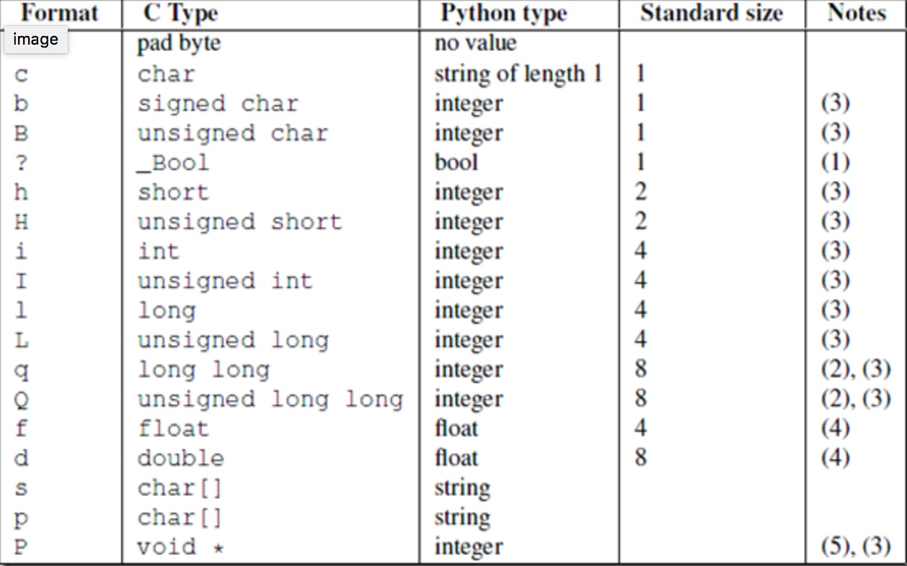

# struct

struct.pack\("bbHHh",ICMP\_ECHO\_REQUEST, 0, myChecksum, ID, 1\) struct.unpack

 

pack之后的就是bytes了 unpack 之后返回一个tuple，按照'bbHHh'的顺序赋值即可得到

```python
        type, code, checksum, packetID, sequence = struct.unpack("bbHHh", icmpHeader)
```

```text
struct.calcsize("i")
4
```

说明类型int 是4个bytes

