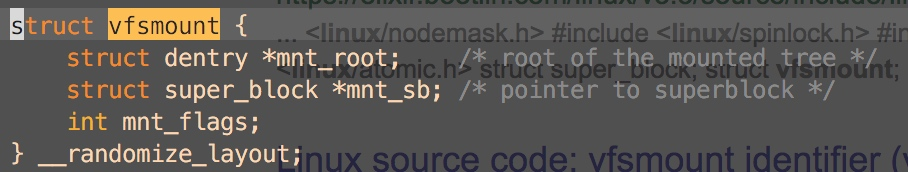
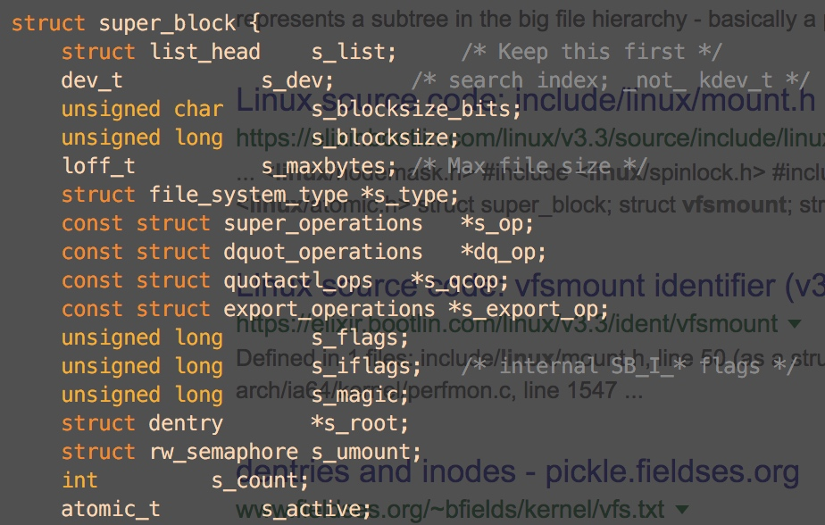

# vfsmount

## 索引

* pipe\_fs\_type  pipe.c  1167
* kern\_mount\_data  fs/namespace.c  3242
* mount\_fs  fs/super.c  1244
  * root = type -&gt; mount\(type, flags, name, data\)
* pipe\_fs\_type-&gt;pipe\_fs\_mount  pipe.c  1160
  * mount\_pseudo\(fs\_type, "pipe:", &pipefs\_ops,

    ```text
     &pipefs_dentry_operations, PIPEFS_MAGIC);  fs.h  2243
    ```
* mount\_pseudo\_xattr  libfs.c  240





kern\_mount 就是 kern\_mount\_data\(,NULL\)的偏函数宏

kern\_mount\_data在fs/namespace.c

sb-&gt;s\_op-&gt;alloc\_inode\(sb\) sb是pipe\_mnt-&gt;mnt\_sb pipe\_mnt是kern\_mount\_data\(&pipe\_fs\_type\)来的

* kern\_mount\_data 调用 vfs\_kern\_mount\(&pipe\_fs\_type\)
* vfs\_kern\_mount的mnt\_sb是先

    root=type.mount\_fs\(type...\) 

    再 root-&gt; sb 来的\(super.c\)

* type.mount\_fs就是pipe\_fs\_type.mount是一个方法
* pipe\_fs\_type.mount是mount\_pseudo\(1163,pipe.c\)

```text
mount_pseudo(fs_type, "pipe:", &pipefs_ops,
            &pipefs_dentry_operations, PIPEFS_MAGIC);
```

mount\_pseudo\(2243,include/linux/fs.h\)直接调用\*mount\_pseudo\_xattr（240,fs/libfs.c\)

```text
    s = sget_userns(fs_type, NULL, set_anon_super, SB_KERNMOUNT|SB_NOUSER,
            &init_user_ns, NULL);
    if (IS_ERR(s))
        return ERR_CAST(s);

    s->s_maxbytes = MAX_LFS_FILESIZE;
    s->s_blocksize = PAGE_SIZE;
    s->s_blocksize_bits = PAGE_SHIFT;
    s->s_magic = magic;
    s->s_op = ops ? ops : &simple_super_operations;
    s->s_xattr = xattr;
    s->s_time_gran = 1;
    root = new_inode(s);
    dentry = __d_alloc(s, &d_name);
    d_instantiate(dentry, root);
    s->s_root = dentry;
    return dget(s->s_root);
```

new\_inode\_pseudo 就是在sb上新建一个inode,但是不加入 sb的inode\_list

就算是普通的new\_inode也会调用new\_inode\_pseudo，再手动加到sb的inode\_list中

