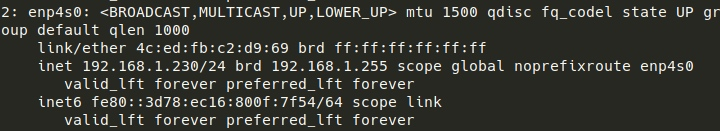
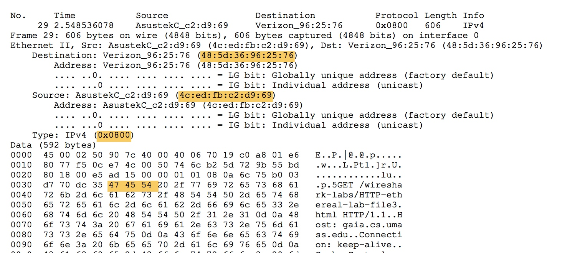

# Wireshark: Ethernet and ARP

## Configuration

## Answer

### Part 1

\(1\) it's 48:5d:36:96:25:76 \(2\)

* 4c:ed:fb:c2:d9:68
* it's not the Ethernet address of gaia.cs.umass.edu
* it's the Ethernet address of the switch in my room

\(3\) 0x0800, ipv4

\(4\) 0x35\(53\) bytes

### Part 2

