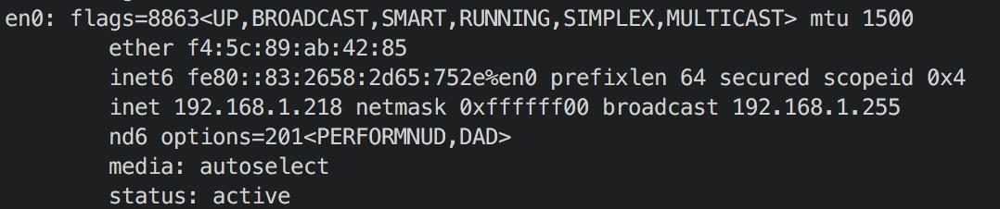
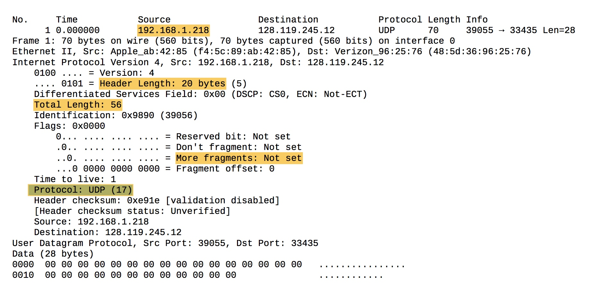
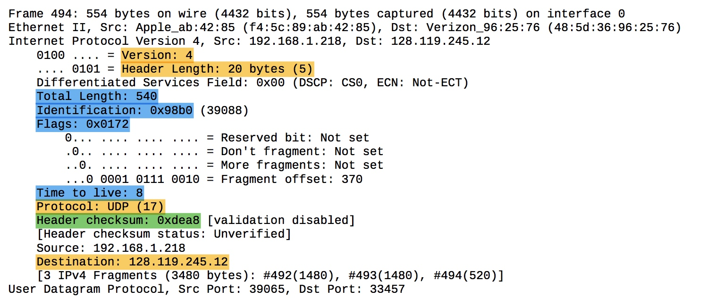
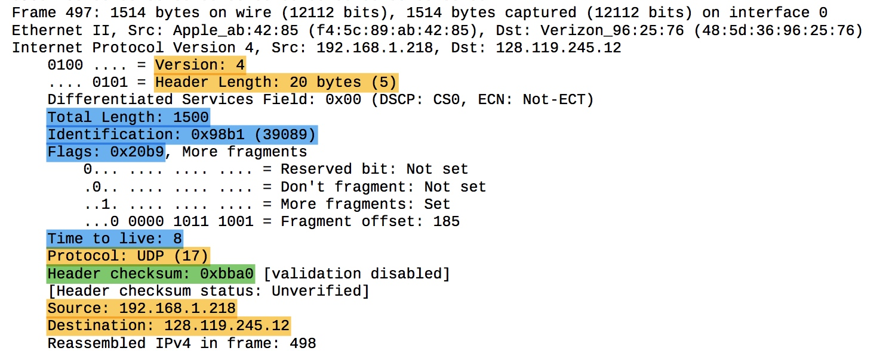
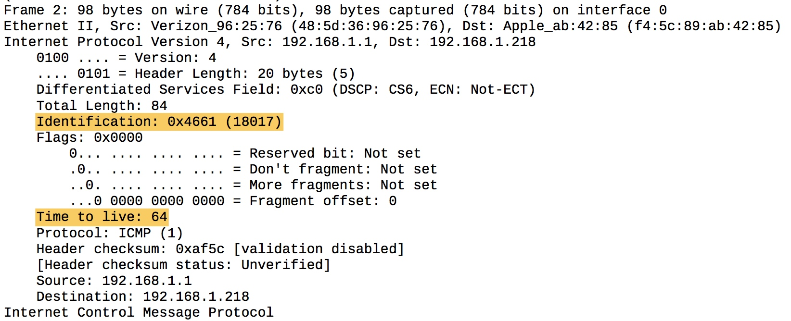
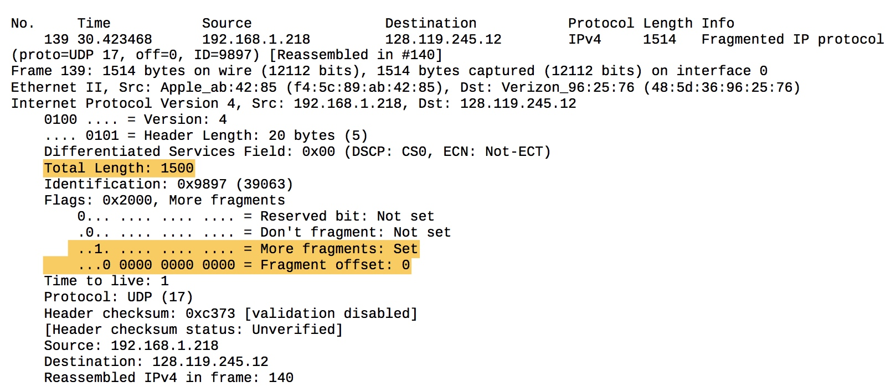
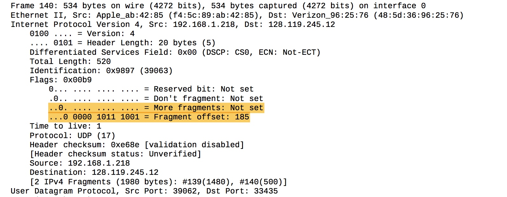
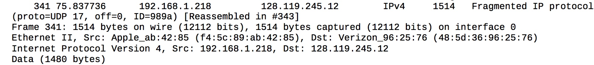
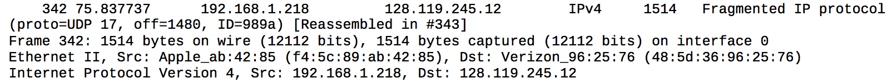
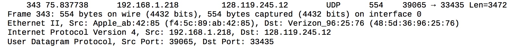

# Wireshark - IP

## Configuration

## Questions

\(1\) 192.168.1.218

\(2\) 17

\(3\) 20 bytes, the payload is of 36 bytes length. Because the total length of the IP datagram is 56, minus 20 bytes header, is 36 bytes.

\(4\) No, because in Flags, "More Fragments" is zero. Also the total length of IP datagram equals to what we told traceroute.

  

These are two packets in different offset of adjacent "original" IP datagram. yellow mark means field stays constant. blue means field changes in some condition. green means field changes from packet to packet.

\(5\)

> not quite sure about the meaning of "always change", because some fields change periodically.

* Only **checksum** field is different between every two packets\(unless they are the same coincidently\)
* Fragments belonging to one "original" IP datagram have the same **identification**. So this field only changes as "original" IP datagram changes.
* **flags** also change for different IP datagrams which belongs the same "original" IP datagram because their "Fragment offset" and "More fragments" change.
* **TTL** changes every three packets.
* **total length** different fragments in one "original" IP datagram have different total length, but fragments that have the same offset of different "original" IP datagram may have the same total length

\(6\)

* stay constant:
  * Version
  * Header Length
  * Type of service
  * Source
  * Destination
  * Protocol
  * Differentiated Services
* must stay constant:
  * Version
  * Protocol
  * Destination
  * Source

Since we trace the route from our computer to specified destination, the Destination and Source fields are not supposed to change.

Also, traceroute use UDP, and now we are using IPv4, so the Version and Protocol fields are not supposed to change either.

\(7\) every IP datagram's identification field pluses one to previous one's. And fragmented IP datagrams which belongs to the same "original" datagram share one identification.

\(8\) 0x4661, 64

\(9\) Identification changes, but TTL remains 64. I think TTL being 64 might be a default setting of router.

\(10\) Yes, it is fragmented.

\(11\) "More Fragments" bit in flags field is set.

"Fragment offset" indicates its position in fragments. 1514 bytes

\(12\) "fragment offset", no, "more fragments" only tell if it's the last fragment. Only the first fragment's offset if 0.

\(13\) flags, checksum and total length

  

\(14\) 3 fragments

\(15\) flags, checksum, total length

