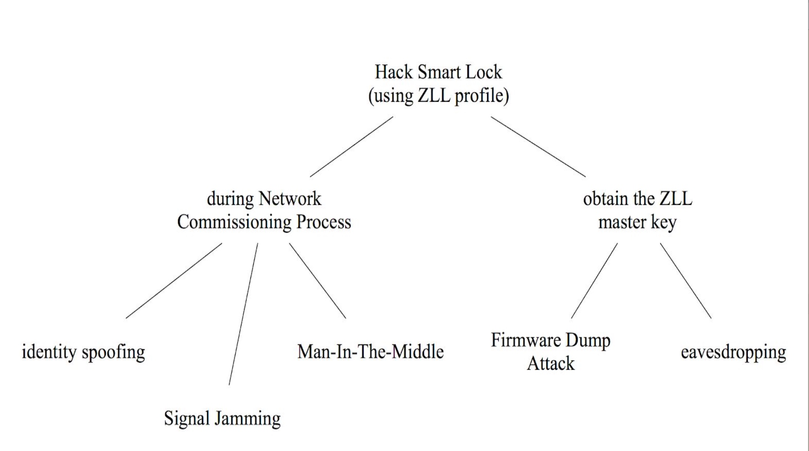

# Assignment 3.3

[TOC]

## DAHUA

### Problem

## Group 15 IoT

IoT devices can be access by no password or simple password

the password is easy to be stolen

two main ways: Phishing and Malware(key loger)

So, 2FA with a virtual keyboard

## Group 5 ZigBee

Zigbee is a protocol use by IoT to communicate with each other

## Group 26 smart car

### problem

the location of a smart cat is easy to be tampered.

### solution

to authenticate base base station and smart car itself

## Group 9 IoT 

### Problem

Iot devices can be easily controlled by remote

### solution

using SDN in local network
to "fileter" the unsafe packet trying to control IoT device

## Group 26 car hack (CAN)

### problem

smart car use CAN to control different components of car

but the CAN can be hacked, so malicious command sent in the network

### Solution

change the CAN network topo to a star topo

so that there's a center to supervise all packets

##  Group 2 Iot devices controlled to conduct DDos

solution: MFA, 2FA or Time-based on-time password

## Group 12 crypto in IoT

### problem

IoT device has little memory or other calculation resource for crpto

### solution

using ECC

## Group 7 BLE protocol

### problem

ble is another version of bluetooth using less energy.
But its authentication is weak

### solution 

change the paring process to use a long term key. and using NFC to pair

##  Group 3 BlueBorne

### problem

Blueborne vulnerabilities let cracker hack into IoT personal assistant smart speaker 

and by hacking into the speaker, the hacker would be able to further exploit the IoT system

### solution

not mend the Blueborne vuln, but add a layer for authentication between IoT devices

## Group 4 Bluetooth lock

### Problem

bluetooth lock can be unlocked easily

### solution

MFA

##Group 22 Tor

### Problem

Tor network depends on reply by volunteer

sensitive information by be exposed to those "volunteers"

### Solution

those bad "volunteers" use similar configuration.
So can be detect. 

Remove those malicious volunteer
Also, mitigate the damage undetected malicious relay can cause  

##  Group 23

### problem 

MFA is not very safe

### Solution

No?A

## Group 17 Torris

### Problem 

Torii will infect IoT devices via telnet attack and bypassing weak credentials.

### Solution

1. telnet attack is the first phase of torris, so detect telnet attack and alert users when attacking attempt occur     
2. Blacklist IP that is suspicious 
3. always prompt users to set strong passwords

## Privacy data collection

### Problem

companies collects data of their customer. But those data suffer from being stolen, which has significant influence.

### Solution 

The goal of privacy preserved data mining is to define methods for extracting data from users and learn from this data without introducing additional risks for the users. Ideally, it would be as if the users’ data was never collected. For the case of the Norton Core, we explored methods for transforming user data into anonymized but still usable shapes.

