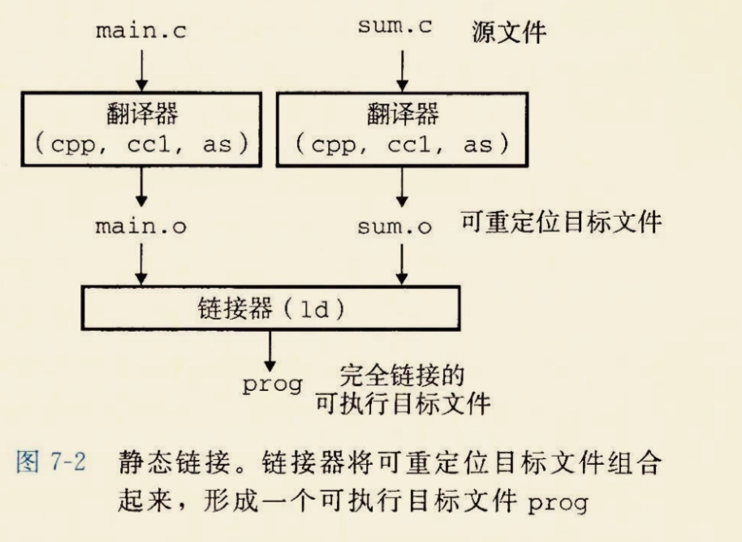
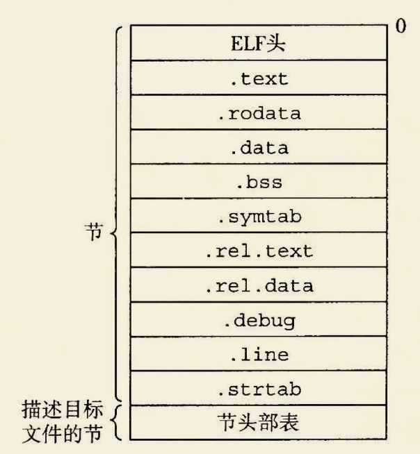
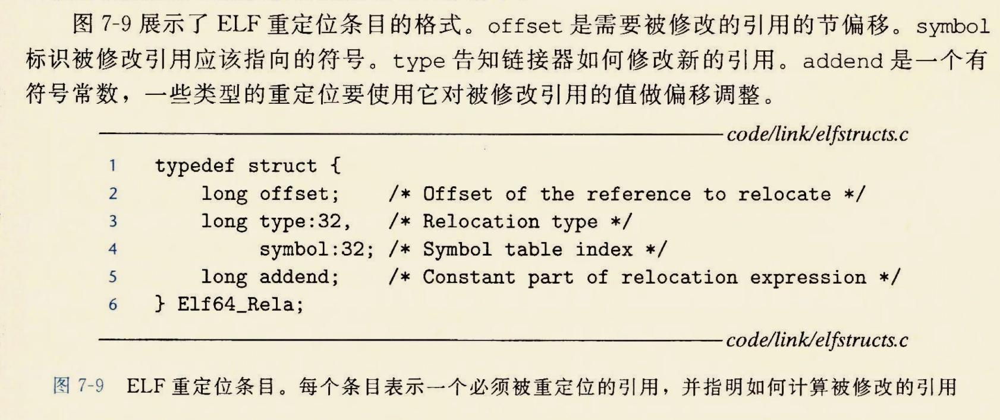
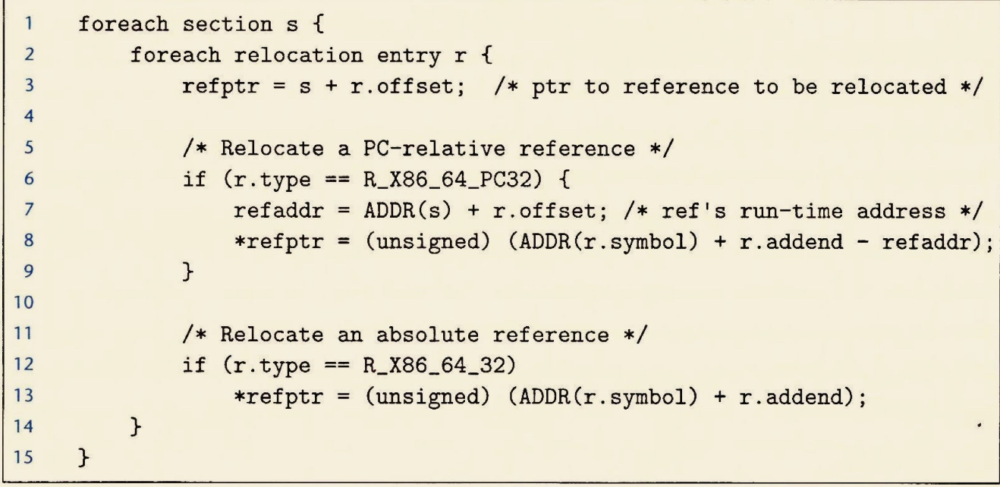
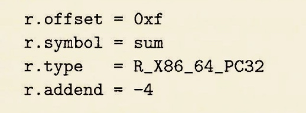
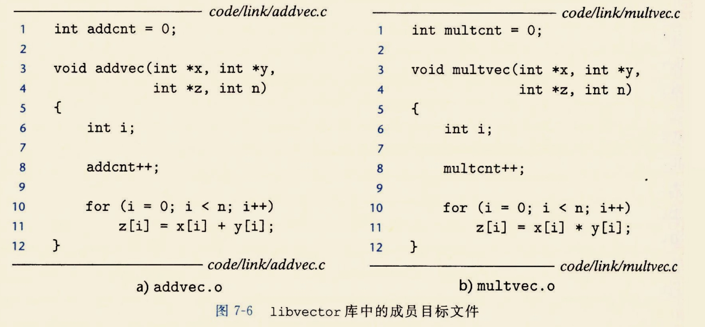
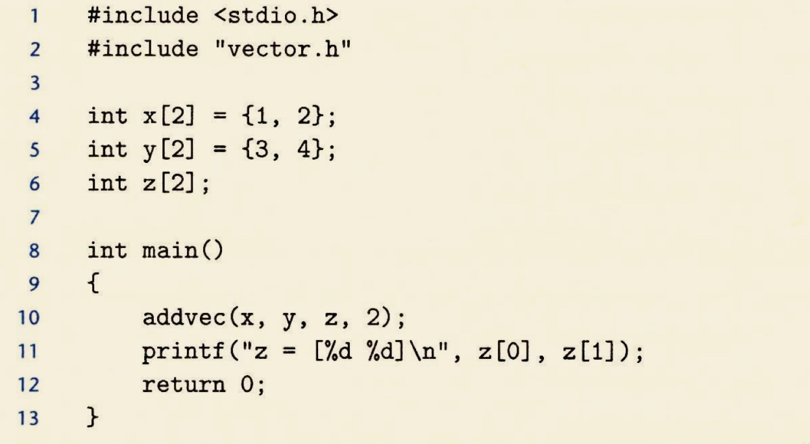
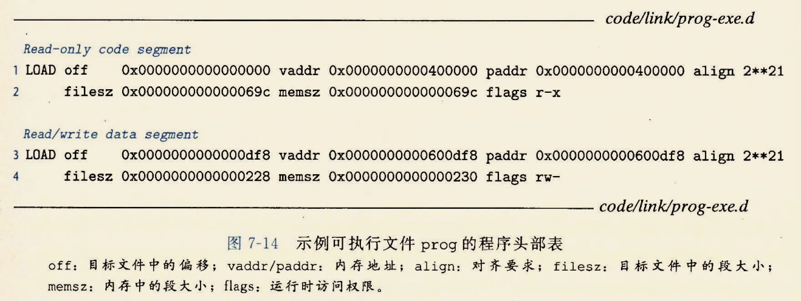

# CSAPP 连接


## 静态编译过程



1. 使用C预处理器（cpp），翻译成ASCII中间文件
`cpp main.c main.i`
2. C编译器（ccl），翻译成ASCII的汇编文件
`ccl main.i -Og -o main.s`
3. 汇编器（as），翻译成可重定位目标文件（relocatable object file)
`as -o main.o main.s`
同样经过这三个过程生成一个sum.o

4. 通过链接器程序（ld）
`ld main.o sum.o -o prog`

5. 执行
`./prog`
shell调用操作系统中的加载器（loader），将可执行文件prog中的代码和数据复制到内存中

## 静态链接

链接器的作用：

- 符号解析(symbol resolution)
    符号：函数 or 全局变量 or 静态变量(static)
    符号解析的作用是将符号**引用**与符号**定义**连接起来
    
- 重定位(relocation)
    编译器和汇编器生成的代码和数据节是从地址0开始的
    
    链接器：
    1. 把每个 符号定义 与 内存位置 关联起来
    2. 修改对每个符号的引用，使他们指向这个内存位置

    链接器使用 **汇编器产生的重定位条目(relocation entry)**，**不加甄别**地进行重定位。
    
    
## 目标文件
三种：
- 可重定位目标文件
- 共享目标文件： 可以在加载或者运行的时候**动态**地被加载进内存并链接
- 可执行目标文件

### 格式
最早是a.out(unix)，现在逐渐演变为ELF(Linux/Unix)

### 可重定位目标文件
<center>

</center>

- ELF头帮助链接器语法分析，解释目标文件的信息
- 不同section的位置和大小由 section头部表描述
- 每个section都有一个固定大小的条目（entry）

#### sections

静态变量应该包含静态局部变量和静态全局变量

- .bss 未初始化的全局/静态，或者初始化为0的全局/静态
- .symtab: 程序中定义/引用的函数和全局变量信息
- .rel.text: .text段中需要被重定位的位置的列表。 可执行目标文件不需要重定位信息
- .rel.data: 被引用的全局变量的重定位信息，所有已初始化的全局变量，如果它的初始值是一个全局变量地址或者外部定义函数的地址，都需要被修改
- .strtab: 好像几乎包含了所有字符串的表，包括.symtab以及.debug的符号，还加上section头部中各section的名字

### 符号和符号表

#### static
 C中的static引用方法有数个
 - 全局static： 不论是函数还是变量，代表invisible 对于other files
 - 局部static： 在函数中定义，但是在函数调用结束后这个变量不会被销毁

#### 三种不同的符号


- 全局链接器符号：在模块m（一个.o）中定义的非静态的C函数和全局变量
- 外部符号：可以再模块m中引用的符号，即其他文件中定义的全局非静态函数或变量
- 局部符号：不是局部变量（局部变量在栈中临时压入，连名字都没有），是带static属性的C函数和变量，这些函数和变量在模块m中全局可见，但不被其他模块可见

#### 符号表

符号表是由汇编器构造的，里面是编译器输出到汇编语言文件.s中的符号
同时会包含一些链接器在链接过程中内部使用的符号

.symtab 是 Elf64_Symbol[]


- name 是 Offset， 这样.symtab + name（伪代码）就是 指向符号的以null结尾的字符串名字
- value 对于可重定位文件，这个是距离 定义该符号 的节 的起始位置的偏移，而对于可执行目标文件，这就是绝对的运行时的地址
- section 符号所在section的编号


可以看出，这是三个符号在对应的段中偏移（value）都是0

### 三个pseudosection（可重定位目标才有）
These tree pseudosections won't be in section headers table
- ABS : symbols shouldn't be relocated
- UNDEF : 引用了但是还尚未被定义的符号
- COMMON : 尚未被分配位置的 未初始化的 数据目标

COMMON is like .bss，但是有一点点区别：
- COMMON: 未初始化的全局变量
- .bss : 未初始化的 静态变量，以及初始化为0的全局和静态变量

## 符号解析

链接器解析符号的方法是，将每个 引用 与可重定位目标文件符号表中的一个确定的符号定义关联起来。
当**编译器（2）**遇到一个不是在当前模块中定义的符号时，假设符号在其他模块中蒂尼，生成一个**链接器符号表**，在链接器连接的时候，如果在任何模块中都找不到这个符号的话，就会抛出错误。

###例如main

链接器在连接main时，就会在符号表中找到main，发现其的定义在text段偏移为0，就能找到main的定义

例如
```S
.main

push ebp
mov esp ebp
```
这样就知道main的”意义“了

### 多重定义的全局符号

编译时，**编译器（2）**给**编译器（3）**输出每个全局符号，并标记Strong/weak，然后编译器将这些信息隐含编码在 可重定位文件 的 符号表中。strong通常是已初始化的函数和全局变量，未初始化为weak
在链接的时候，对strong/weak 尊崇一下规则：
1. no multiple strong symbols
2. one strong + multiple weak = the strong
3. multiple weaks = a random weak

#### 通过strong 和 weak 进一步理解 COMMON 和 .bss

在编译器遇到一个弱全局符号x，并不知道其他模块是否定义x，所以无法预测链接器该用哪一个，所以放进COMMON。

如果 x 初始化为0， 那么X是strong的， 编译器就可以自信地放进.bss了

#### 与静态库连接
##### 为什么使用静态库
如果不使用静态库的话，有了两种解决方案

1. 将所有标准函数（例如C标准函数）放在一个可重定位目标文件。
`gcc main.c libc.o -o main`
这样的话，每个可执行文件都会有一个Libc的完整副本，十分占用硬盘，更占用内存。更糟糕的是，如果标准函数改变了，那么所有用了标准函数的代码 都要重新编译， 并且库文件也需要 整个重新编译

2. 将所有标准函数分开放在不同的可重定位目标文件中
这样的话，每次写代码使用了标准函数，都需要在编译的时候显示地指定
`gcc main.c /usr/lib/printf.o /usr/lib/scanf.o`
麻烦且易出错

3. 将标准函数内容告诉编译器，每次编译器发现有标准函数引用的时候就编译进去
Perl是这样做得，因为perl标准函数少，这样对于编译器的负担很大

#### 使用静态库

使用静态库之后，每次编译的时候，编译器只会从lib中找出 需要使用的函数

静态库以后缀.a标识


#### 链接器链接静态库的过程

#####连接器维护三个集合：

- **E**： 这个集合里面保存可重定位目标文件，最后这个集合里面的文件会被合起来形成可执行目标文件
- **U**： 引用了但是尚未定义的符号
- **D**：在E中的文件已经定义了的符号集合

##### 符号链接流程


```python
for(每个输入文件f):
if f==目标文件：
    E.append(f)
    根据f中的符号引用和定义修改U,D
if f==存档文件:
    搜索f中有没有U中的符号
    if 有：
        E.append(此.o) #存档文件只是生成它的所有.o的Archive，内部依旧相对独立划分
        
for h.o in lib.a:
    if h.o not in E:
        drop(h.o)
        
if U != []:
    raise Error
else:
    用E建立输出可执行文件

```

有一个小问题，连接会因为命令行的输入顺序产生变化。

如果将lib库文件放在最前面，例如
`gcc libc.a main.c -o main`
在链接器对libc.a进行操作的时候，还没有对main.o进行扫描，所以U是空的，所以libc.a中没有.o会进入E，导致最后报错。所以编译的时候一定要注意顺序

在比较极端的情况下，例如foo.c调用libx.a，libx.a调用liby.a，而liby.a又调用libx.a，那么就需要写两次libx.a
`gcc foo.c libx.a liby.a libx.a`

## 重定位

完成符号解析只是确定 代码中 每个符号引用 能够找到对应的 符号（输入的目标模块(即一个.o或lib中的一个.o）中的一个符号表条目关联起来）

然后进行重定位：将输入模块合并，分配运行时的地址

1. 重定位节
   1. 将所有输入模块中相同类型的节合并为segment
   2. 将运行时内存分给segments，付给输入模块定义的每个节和符号。于是程序中的每条指令和全局变量都有唯一的运行时内存了

2. 链接器
   修改代码节和数据节中对每个符号的引用，使他们指向正确的运行时地址。这依赖于可重定位目标模块中relocation entry(重定位条目)
   
### 重定位条目

汇编器（before link)遇到对最终位置未知的引用时，就会生成一个
**重定位条目**，在.rel.text 或者 .rel.data section中



共32种types, we only focus on two types:

符号表是 你定义了哪些符号
.rel是需要哪些符号重定位

- R_X86_64_PC32 : 使用PC相对寻址
  例如在之前的代码中有一个
  jmp haha
  在汇编这段代码的时候，机器码应该类似 jmp 0x0这样的，并且把这个0x0所在地址偏移记在.rel.text中，并且jmp使用的是相对寻址（不确定，假比），所以这个haha在.rel.text中记录就是PC32类型的
  
- R_X86_64_32 ：使用绝对寻址的需要重定位条目

GCC默认 小型代码模型（虽64，用32代替）

### 重定位引用



#### 相对：

重定位13行的call

假设


- ADDR(s)代表符号所在的section， ADDR(s) = ADDR(.text) = 0x4004d0

- ADDR(r.symbol)是这个条目对应符号的运行时地址

所以重定位为ADDR(r.symbol) + r.addend - refaddr(引用的地址)
refaddr = ADDR(s) + r.offset

可以得到结果就是0x5
所以4004de 变成：


## 重定位小结



上面两个文件通过 
`gcc -c addvec.c multvec.c` (.c指明输出两个.o）
`ar rcs libvector.a addvec.o multvec.o` 编译成libvector.a库




参与连接过程的有三个.o文件，他们都分别有.symtab表

main2.o的.symtab表中有addvec，但是.symtab表实际上只记录**addvec**这个符号出现在main2.o的.text节的位置
    
并且由于编译器发现addvec没有被链接，会将addvec加入.rel.text中，形成一个**重定位条目**，重定位条目指示这个符号的位置和在.symtab中的条目index。
    
- 通过符号解析，首先会解析main2.o
   
   1. 将main2.o加入E集合，x/y/z加入D集合，addvec和printf加入U集合（**以下忽略printf**）
    
  2. 然后解析libvector.a，发现在这个archive中，addvec.o中含有U集合中的addvec，于是将addvec.o加入E集合，并从U中将addvec移到D集合中。
  3. 生成一个供下一步重定位用的临时文件（猜测）将main2.o中的addvec与addvec.o的.symtab对应起来

  - 重定位
  
    1. 从上一步的临时文件中知道了main2.o的symtab中的addvec实际上是addvec.o的symtab中的addvec，于是将这两个.symtab合并在一起，只包含一个addvec，需要注意的是，symtab只会记录addvec在.text节中的偏移！而不会记录加载进运行内存的地址。
    2. 给.text和.data什么的赋予运行时内存地址
    3. 遍历.rel.text，发现对addvec的引用（由于这一部分是从main2.o过来的）还是32个0 0x0000（占位），于是根据addvec对应的重定位条目的指示：
       1. 查找到此时的.symtab（已经合并），然后.symtab中有addvec在新的.text中的偏移，此时.text的运行时内存已经确定
       2. 通过上面的信息计算出addvec此时的运行时内存地址，并根据重定位条目的指示，将.text中对addvec的引用修改为正确的地址


## ELF

ELF比较有一个程序的镜像的意思了
程序头部表会进行如下指示：



memsz - filesz = 0x8
这就是.bss段加载进内存，**所以说bss段在内存中是占地方的**
在加载进内存的时候，.bss段对应的符号会全部被初始化为0，(通过objdump发现.bss还真的一点大小没有）


>BSS段内容：无内容，它将在段表中占一个段描述符，该段描述符的size属性将记录未初始化的全局变量与局部静态变量的大小总和

>每个未初始化全局对象与静态对象的大小：存储在符号表的 size 属性中

如果bss段一点空间都不占，它怎么记录哪些符号未初始化呢？
通过symtab可以显示哪些变量是属于bss段的，说明这些就是没有初始化的，
并且没有初始化的变量在symtab中也会记录一个大小，仅仅是记录而已，真正在被加载才会初始化，占用（内存）空间


## 加载elf

linux通过调用execve()来调用驻留在存储器中的loader加载执行ELF，然后跳转到_start函数（ctrl.o定义），_start调用__libc_start_main

代码段总是从0x400000开始，堆在数据段之后，

将程序复制到内存并且运行的过程叫**加载**


## 动态链接共享库

例如printf这种函数，几乎每个程序都会用到，如果使用静态库，那么每个进程的内存文本段，都会有printf的代码

**共享库(shared library)** 也称为 **共享目标(shared object)**，linux中.so，windows中.dll，由**动态链接器**在运行或加载的时候加载到内存的任意位置，并和在内存中的程序连接起来。
两点不同：

- 所有引用a.so的可执行目标文件共享它，而不是静态库被复制到各个可执行文件的代码段和数据段中。
- 一个共享库的.text节可以被不同的正在运行的**进程**共享

### 大致过程


- 创建可执行目标文件的时候，静态执行**一些**链接，没有text或data真的被复制到prog21中，链接器复制一些**重定位/符号表**信息

- 然后在程序加载时动态完成链接过程：加载器加载**部分链接**的可执行文件prog21，然后发现prog21有.interp节，包含动态链接器的路径名，动态链接器本身就是一个.so（ld-linux.so)，加载器加载运行这个动态链接器，动态链接器完成：
    1.重定位libc.so的文本数据到某个内存段
    2.重定位libvector.so到另一数据段
    3.重定位prog21中所有对libc.so和libvector.so的符号引用
    
- 最后，加载器将控制权交给程序，此时共享库位置已经固定


## 动态链接器的三个函数


## 位置无关代码

使用共享库 必须使用 位置无关代码

### PIC引用变量
PIC的编译器利用 **代码段任何一指令** 与 **数据段任何一数据** 的距离 **总是不变**的

这样在.text段，对任何一个变量的引用，只用写0x044000($eip)，因为eip是下一条地址，他和GOT[3]之间的距离  是在生成 可执行目标文件 的时候就确定了的。动态链接器是在**加载时**工作的

**编译器**在**数据段开头**创建GOT表

#### GOT
- 每个被该目标模块引用的**全局数据目标（过程或全局变量）** 都有一个8 bytes的条目
- 每个条目 还会对应一个 重定位条目，动态链接器会重定位GOT中每个条目
- 每个目标模块 都会有个GOT

PIC 的核心是 **链接器不会修改.text**
不论是PIC引用变量还是函数，引用变量的话，.text都是让去.got找，.got在数据段，链接的时候只用根据重定位条目改.got段即可

回想静态连接，在连接的时候，链接器会根据重定位表，对需要重定位的字节进行**修改**（占位符->真实地址）

### PIC


- 延迟绑定(lazy binding) 将过程地址的绑定推迟到第一次调用时

GOT是数据段的一部分
PLT(Procedure Linkage Table)是.text段的一部分


## 小结


