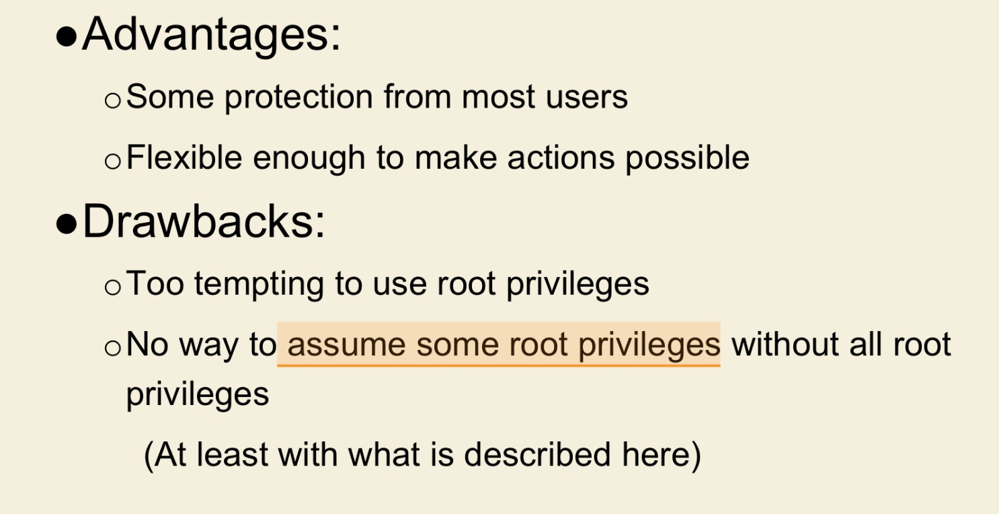
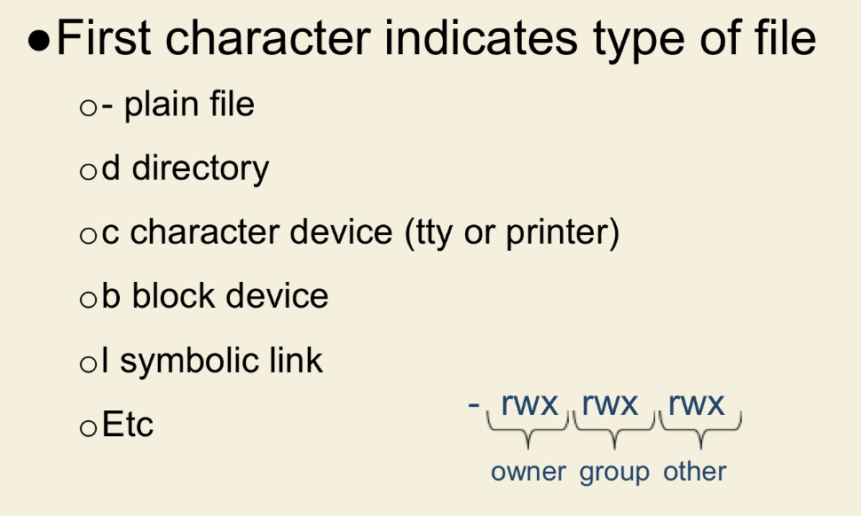
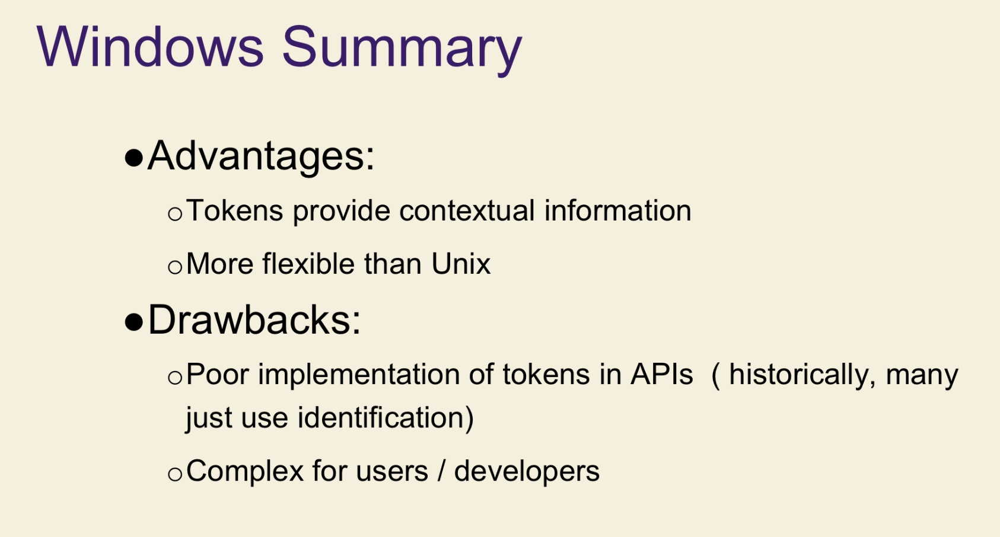
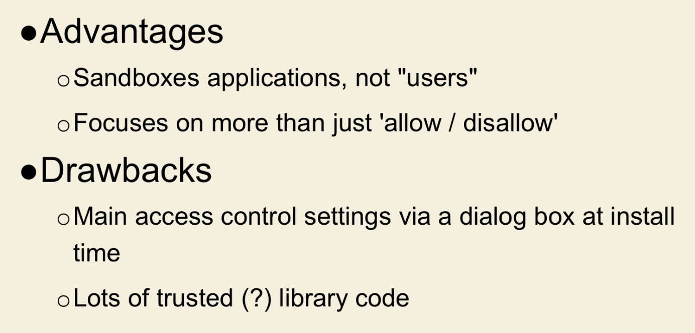
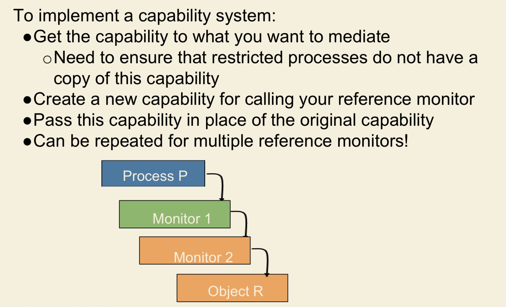

# Exam 2

[TOC]

## Access Control

- Two issues
    - how specify an access control policy
    - how enforce the policy

### Three functions

- Identification
- Authentication
- Authorization

#### Identification

subject's identity
like username or other public information 

#### Authentication

Method of proving the identify

via credentials

####  Autorization

proven identity 有什么 权限

### Access Control Models

How access control decided?
Three main Models

- Discretionary(可自由支配的)   DAC
 owner of the resource to specify which subjects can access which resources
- Mandatory（MAC)
    - Users have security clearances and resources have security labels that contain data classifications.
    - for where information classification and confidentiality is very important(military)
- Non-Discretionary (Role Based) (RBAC)
 centrally administered set of controls to determine how subjects and objects interact

### Access Control tech

#### ACL

- acl(file 1) = {(proc.1, {r,w,o}) (proc. 2, {a})} 
- acl(file 2) = {(proc.1, {r}) (proc. 2, {r,o})} 
- acl(proc.1) = {(proc.1,{r,w,x,o}) (proc.2, {r}) 
- acl(proc.2) = {(proc.1,{rw}) (proc.2, {r,w,x,o})

## OS example

#### Multics

- Ring
- Segment

#### Unix

##### File

##### Umask and Default Permissions

- for new create file,It defines permission you do not want to be given
0002 – umask means 0775 permissions

##### effective UID(euid) for process

each process has 3 IDs

- Real User ID 
    who start the process
- effective user id(euid)
    determine permission of process
    配合file的setuid使用，当file含有setuid的时候，如果一个进程执行这个file，会将进程的euid设置成file的setuid
    
- saved UID
    save previous euid

##### Setid bits (for files)
set uid是权限的一个bit，而不是一个id

- setuid: set EUID of process to ID of file owner

- sticky: 

    If Off: user has write permission on directory, can rename or remove files, even if not owner

-rwsr-xr-x indicates SUID

### windows

#### SID

replace UID

user, group, computers. domains, domain member all have SID

#### token 

is a kind of security context:
- **Security context**: privileges, accounts, and groups associated with the process or thread

#### Security Descriptor

- specifies who can perform actions and what actions they can perform on an object

- DACL

  哪些access allow 哪些 denied 对哪些 user
  
- SACL
  
  哪些access要记录到log

### Android

## Capability

cap(proc. 1) = {(file1, {r,w,o}), (file2, {r}), (proc 1, {r,w,x,o}), (proc 2, {w})}.

cap(proc. 2) = {(file1, {a}), (file2, {r,o}), (proc 1, {r}), (proc 2, {r,w,x,o})}.

### ACL vs Capabilities

ACL: 

- Relies on authentication: need to know user

Capabilities:

- Reference monitor checks ticket,

#### revocation

Capabilities:

- Indirection: capability points to pointer to resource ▪ If C -> P -> R, then revoke capability C by setting P=0

### Amoeba

this is a message to invoke, Rights is your ticket( capability)

#### capabilities 传递与验证

但create 一个 obj的时候，返回cap，并且cap的48bits all 1，check field C0是 48位 hash，

when 传递：
set some bits to 0，
hash(new cap,C0)

接受调用的server也有C0，就可以通过hash来验证了

#### revoke
Amoeba: Change random check and issue new capability. This invalidates all existing capabilities

就是重新生成origin 的 check

### Custom Reference Monitors

Is it easier to build a custom reference monitor when objects (access-control list) or subjects (capability-based systems) contain permissions?

monitor process本身和object同属于一个user R，如果按照ACL，想要access monitor就得获得User R的identity，但是这样monitor 就失效了

从底到上的看，先建立一个capability可以access Object R，然后建立一个capability可以access Monitor 2

##

就像Calender 调用 deserilize 进入 TCB一样，

Calender并没有执行一些的权限，

由于中间隔了TCB，所以调用Calender这个类需要经过检查，是否有权限调用"deserilize"，可能是capability，Calender只有调用deserialize的权限，通过调用deserialization之后，进入TCB，因为代码是受信任的，所以通过Calender传入的参数，就可能传入deserialize，然后进行exploit

所谓policy就是允不允许Calender执行deserialize,或者TCB里其他函数

