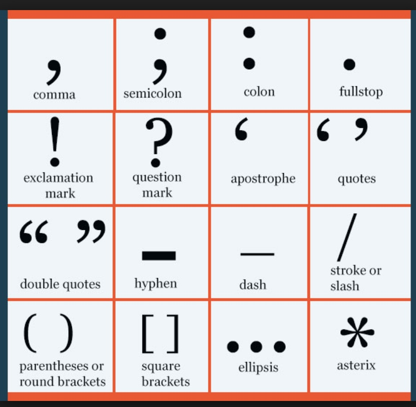

# Interview question

[TOC]

## general 

### GENERAL

General Infosec concepts, risk/threat assessment, wisdom, experience

1. Where do you get your security news?

    reddit, because I don't use twitter much
    reddit: netsec, netsecstudents, ReverseEngineering
    Hack Forums, Exploit Database

2. Tell me about a recent bug/vulnerability or hack you read about recently.

    Adobe weblogic server
    CVE-2018-3191
    T3 protocol
    as I read this as a news. it's a JAVA deserilization

3. What does CIA stand for? How does each relate to security?

    Confidentiality
    Integrity
    Availability

    That's what information security protects

4. If you had to both encrypt and compress data, which would you do first and why?
5. Are open source projects more secure or less secure than closed source?

    It depends  

6. Are there any reasons that a company would not fix a known vulnerability?

    Yes, like weblogic server, before the patch. No one found this vulnerability. But after this, people can use the information in the patch to construct expoit to attach previousversion weblogic servevr. 

7. What’s a cool funny bug you’ve found?

### WEB

Web application security, OWASP Top 10

1. What is XSS? How do you prevent it?
    
    Stored XSS
    Reflected XSS
    DOM Based
    
    prevent: escapse

2. What is CSRF? What can it be used to do? How do you defend against it?

    CSRF
    
    - two elements in CSRF:
        a trusted site, has local cookie
        request site B without logout A
    
    having token in Session or as an a

3. What’s the difference between HTTP and HTTPS?

    SSL/TLS

4. Name at least one difference between HTTP v1.0 and v1.1

    keep Alive.

5. How does HTTP handle state?
    
    Using cookies

6. How can you prevent a client side user from modifying cookies?

    use a key to crypt it 
when setting a cookie, use a key to crypt it first. if modified, the cookie can't be decrypt to a valid value. 

### OPERATING SYSTEMS/HOST ANALYSIS

Processes/threads, vm/container, filesystems

1. What are the differences between processes and threads? Bonus: What are the difference between native threads and green threads?

    Each process has its own address space, threads don't, different threads in a process share their address space 

    - green thread: threads are completely managed by JVM without OS help 
    - native thread: opposite

2. How would you find out what processes are running on linux/mac and windows?

    top/ps. Task manager

3. How can you find out what command was used to start a process on a linux system?

    fork, execv

4. How would you discreetly hide data in a file?
5. What is the difference between a virtual machine and a container?

    container contain different applications host in one OS
    while VM virtualize different OS
    
6. How does the linux file command identify file types?

    file 
    
7. What is deadlock and livelock? How do you prevent them?

    A livelock is similar to a deadlock, except that the states of the processes involved in the livelock constantly change with regard to one another, none progressing. 

8. What is virtual memory and how does it work?
9. How does an operating system determine what process to schedule next? What does the scheduler do when it has chosen a process to execute?

    save the context of current process.
    set virtual space for new process.
    switch to it

### BINARY ANALYSIS/REVERSE ENGINEERING

Static and dynamic analysis, assembly, etc
1. Name five runtime binary protections. (DEP(Data Execution Prevention)/NX(non-execute or non-executable segment), PIE(Position Independent Executable)/ASLR((Address Space Layout Randomization), Stack cookie, relro(relocation read-only), 

2. What is the difference between static analysis and dynamic analysis? What tools would you use for each?

    IDA, Hopper
Ollydbg, GDB

3. Describe the calling convention for arguments on an x86 system. What about x86_64?
4. What is the difference between big endian and little endian?

    big: The most significant byte (the "big end") of the data is placed at the byte with the lowest address.  0x12345678
small: least significant byte (the "little end") of the data is placed at the byte with the lowest address 0x78563412

5. What happens before main() function when a C program is started?

    At close bare minimum, startup code before main() sets up "C environment": it initializes stack pointer, copies initialized variable values (.data) from non-volatile memory to RAM, and sets all uninitialized variables (.bss) to zero.

    Depending on architecture, you may need to do something more. You may need to initialize clocking and/or other crucial peripherals, interrupt vectors, possibly set up processor contexts, and so on, before going to main() to continue system bootup.

6. What is the Zero Flag (ZF) used for?

    the zero flag is used to check the result of an arithmetic operation, including bitwise logical instructions. It is set to 1, or true, if an arithmetic result is zero, and reset otherwise.

7. What is the purpose of the Procedure Linkage Table (PLT)?

    ``lazy binding 
first: plt -> jmp .got -> plt -> .got -> dynamic linker(modify .got.plt)
later: plt -> .got(execute puts)

### NETWORKING

OSI model, firewalls, IDS/IPS, DNS, 
1. Explain the difference between TCP and UDP. When would you use each?
2. How does traceroute/tracert work and what protocol does it use?
3. What’s the difference between a hub and a switch? Is it possible for a single physical port on a switch to have two IP addresses?
4. Explain how DNS works in as much detail as possible.
5. Explain one type of a DDoS attack.
6. Describe how onion routing works.
7. In as much detail as possible, describe what happens when you type “google.com” into your browser and hit enter.

### CRYPTOGRAPHY

1. What is a salt?
2. What is a rainbow table?
3. What is the difference between asymmetric and symmetric encryption?
4. What’s the difference between Diffie Hellman and RSA?
5. What is the difference between stream ciphers and block ciphers?
6. Describe what encoding, hashing, and encrypting are. When would you use each?
7. How does SSL work?

## Flatiron 

### Why Flatiron

as a student in IT area. I think most people go th tech companies, but working in tech companies you just work for tech. But working in a health company is totally different. Especially like Flatiron, it makes me feel that I'm the one fighting against cancer

## JP Morgan

### Why JP Morgan

My application to JP Morgan starts from Industry Fair of CSAW. First, I think all companies come to CSAW are cool. And to be very honest, I applied for most companies which have security related positions. 

1. JP Morgan is a really big company which gives me a better career start.
2. I have account in CHASE. It gives me very good impression. For it's bonus, and efficient. And CHASE is my favorite debit card. Its card design made me feel this is a young, energetic and cool company.
3. Bank is the most direct and important application of Cybersecurity. I think I can use my knowledge to more or less do some contribution.

### Why Audit.

1. Because I like cybersecurity. I only apply for related position.
2. I think this job would be interesting. Because I can see more real world information security to prepare for future career. 

