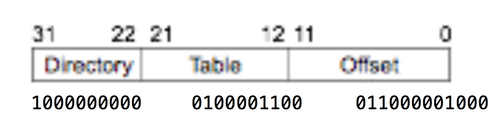

# Memory
```
2**20 = 0x100000 = 1M
2**12 = 0x1000 = 4K
2**10 = 0x400 = 1K
```
## fragment

- As a consequence of swapping things in and out of memory, we might fragment memory

- This could prevent us from loading a program even though we technically have enough memory for it

- If necessary, we can shuffle things around so that we have one contiguous free space instead of multiple small "holes"

- But: it may be slow! E.g. if it takes us 100 ns to read and then write 8 bytes of memory, ~107 seconds to move 8GB

## Growing Process


程序很容易长到另外一个程序那，所以就预先设置一个Growth Area

## Keep track of physical memory

### bitmap

- allocate memory in chunks of size N

- Store a sequence of bits where bit i says whether the ith chunk is free

downside:

- Large unit sizes mean fewer bits are needed to describe memory, but may waste memory if process is not exact multiple of N
- small units leads to too many bits, and slow to search 

####  find a space

- To find space for a new process K units long, we need to search for a consecutive string of K zeroes
- This could be very slow, since most CPUs deal in units of multiple bytes, not bits, and the string of 0s could straddle a byte/word boundary

### list 


####  find space

- First fit – just traverse the list and pick the first free range large enough
- Best fit – traverse the list and pick the smallest big-enough free range
    - Slower and actually wastes more memory than first fit
- Quick fit – keep separate lists for commonly needed sizes
    - Fast to allocate, but much slower to deallocate – hard to merge adjacent free ranges

#### freelist

- Keep a separate freelist of just the unallocated regions

- One nice trick is that we can actually store the list entries in the unallocated spaces themselves!

- Keep the lists sorted by address, so it's easier to merge free regions later

- Keep the lists sorted by size, so we don't have to search the entire list for the smallest

### xv6 (list)

>xv6 uses the physical memory between the end of the kernel and PHYSTOP for run-time allocation

- main


`#define PHYSTOP 0xE000000` 224M
`#define P2V(a) ((void *)(((char *) (a)) + KERNBASE))`
`#define KERNBASE 0x80000000`

KERNBASE以上都被一一映射到了4M：PHYSTOP（比较特殊的页表？）

kinit2这个函数只有在初始化的时候会用，也只有这时候的映射符合使用条件（推测）

可以看出虽然管理的是物理内存，但是代码运行都是基于虚拟内存, 但是因为每个进程的页表都不一样，那岂不是一篇mess？

>内核页表：内核空间也是同样通过「页表」访问的，因为现代 CPU 的寻址不能绕过 MMU。不过内核空间和用户空间不同，它一般不做 swap，也就没有 page fault，而且它一般不会把连续的虚拟地址空间映射成不连续的物理空间，一般只是做一个 offset。所以所有进程的用于访问内核空间的页表都是这么设定的。


- kinit2

PG ROUND UP 就是到当前内存为止的页起始处，
通过循环一页一页kfree

- kfree


只是相当于在kmem.freelist的最前面加上当前页

```
struct run {
  struct run *next;
};

struct {
  struct spinlock lock;
  int use_lock;
  struct run *freelist;
} kmem;
```

- kalloc

策略是直接分配freelist的第一块


## Virtual memory

### TLB
- Walking the page table hierarchy each time memory is accessed gets very expensive
    - If we have to do 2 table lookups for every memory access, we've just made memory 3x slower

- Instead, the CPU keeps a small set of mappings that it can translate directly without consulting the page tables

TLB is in CPU

### paging 

- The current mappings in use are determined by the value of the CR3 CPU register, which stores the physical address of the page directory，存的是directory的地址


一个32位的线性地址 |  10bits PDE offset |   10bits PTE offset  |   12bits offset|

PDE 中 真实记录 Page Table地址的只有 20位， 2**20 = 1M， 所以其实page table存在Virtual memory 的前1M？

####  Example

- 0x8010c608, 假比cr3 为 0x003ff000



| | | |
|---|---|---|
|Directory index | 	1000000000 | 512|
Table index | 	0100001100 | 	268
Offset |	011000001000   |	1544

- 在Page Directory中寻找，每个entry 4bytes


Page Directory 有20位用于寻址 PT，每个PTE占4 bytes，所以最多有 1M/4B = 256 * 1024 个 entry

- 寻找page table


然后用高20位作为 物理内存的 高20位，加上virtual的最后12位 offset，即可


#### 与4M 页对比

同样一个Entry 4 bytes， 一个表占位置 4 KB

每个table都有1024个entry， 那么4kb页只能映射4M， 4mb页可以映射4G

#### 初始化


初始化的时候，KERNBASE是从 Virtual 0x80000000(2G) 映射到0
但是映射表的入口是以4M为单位的，key 和 value 的意思都是“第几个4M"
0x80000000 是第 (0x80000000/4M) 个4M, 4M是2**22，所以就是将KERNBASE右移22位，PDXSHIFT = 22

是否开启4M的页是通过设置 cr4中的某一位达到的，
是否开启Paging 是通过设置 cr0中 某一位 达到的
这些在entry.S中都有体现

```asm
.globl entry
entry:
  # Turn on page size extension for 4Mbyte pages
  movl    %cr4, %eax
  orl     $(CR4_PSE), %eax
  movl    %eax, %cr4
  # Set page directory
  movl    $(V2P_WO(entrypgdir)), %eax
  movl    %eax, %cr3
  # Turn on paging.
  movl    %cr0, %eax
  orl     $(CR0_PG|CR0_WP), %eax
  movl    %eax, %cr0

  # Set up the stack pointer.
  movl $(stack + KSTACKSIZE), %esp

  # Jump to main(), and switch to executing at
  # high addresses. The indirect call is needed because
  # the assembler produces a PC-relative instruction
  # for a direct jump.
  mov $main, %eax
  jmp *%eax

.comm stack, KSTACKSIZE
```

V2P_WO 是 without case(强制类型转换） 的 V2P

#### 普通进程map

`#define KERNLINK (KERNBASE+EXTMEM)  // Address where kernel is linked`
`#define EXTMEM  0x100000            // Start of extended memory`


每个进程中都会有的内核 kmap:

```C
static struct kmap {
  void *virt;
  uint phys_start;
  uint phys_end;
  int perm;
} kmap[] = {
 { (void*)KERNBASE, 0,             EXTMEM,    PTE_W}, // I/O space
 { (void*)KERNLINK, V2P(KERNLINK), V2P(data), 0},     // kern text+rodata
 { (void*)data,     V2P(data),     PHYSTOP,   PTE_W}, // kern data+memory
 { (void*)DEVSPACE, DEVSPACE,      0,         PTE_W}, // more devices
};

```


kmap 并非一个pgdir, 在这个函数中，新建了一个pgdir,然后通过kmap来设置，最后返回
可以看到Setupkvm中，使用的是kmap这个全局变量，然后对里面每个pde,调用mappages

```C
static int
mappages(pde_t *pgdir, void *va, uint size, uint pa, int perm)
{
  char *a, *last;
  pte_t *pte;

  a = (char*)PGROUNDDOWN((uint)va);
  last = (char*)PGROUNDDOWN(((uint)va) + size - 1);
  for(;;){
    if((pte = walkpgdir(pgdir, a, 1)) == 0)
      return -1;
    if(*pte & PTE_P)
      panic("remap");
    *pte = pa | perm | PTE_P;
    if(a == last)
      break;
    a += PGSIZE;
    pa += PGSIZE;
  }
  return 0;
}
```

mappages 用一个循环 一个page一个page地写
核心代码：
pte = walkpgdir(pgdir, a, 1) walkpgdir在pgdir中寻找a(virtual address),第三个参数是1，代表找不到就创建
*pte = pa | perm | PTE_P   即是在对应的entry处填上内容（physical address）

```
// page directory index
#define PDX(va)         (((uint)(va) >> PDXSHIFT) & 0x3FF)

// page table index
#define PTX(va)         (((uint)(va) >> PTXSHIFT) & 0x3FF)
```


why JOS maps two 4-MB ranges during booting?

- will move kernel to high memory and leave low memory for user space
- make sure you understand exercise 8, lab 1
- writes to [0, 4M) will cause a page fault; writes to the other won’t - why


