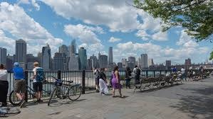

# NYC travelling plan

[TOC]

## 地图

- :优先级1      
- :优先级2
- :优先级3

## 列表

### 优先级1

####Metropolitan Museum of Art(大都会博物馆)

####Times Square(时代广场)

####Central Park(中央公园)

####Empire State Building/Rockefeller Center(帝国大厦/洛克菲勒中心)

(照片是从洛克菲勒中心顶照的)

####Liberty Statue(自由女神像)

####Wall Street(华尔街)

- 铜牛

- 纽交所

####911(911纪念馆)

####Brooklyn Bridge(布鲁克林大桥)

### 优先级2

####Flatiron Building 

世界上第一座摩天大厦

####Washington Square(华盛顿广场,纽约大学)

####Williamsburg

####Dumbo/Brooklyn Height

####High line(高空走廊)

####MoMA(现代艺术博物馆)

####Columbia University (哥伦比亚大学）

####United Nations Headquarters (联合国总部大厦)

### 优先级3

####Flushing(法拉盛)

####Starbucks Rostery(星巴克工厂)

####Little Korea(小韩国)

