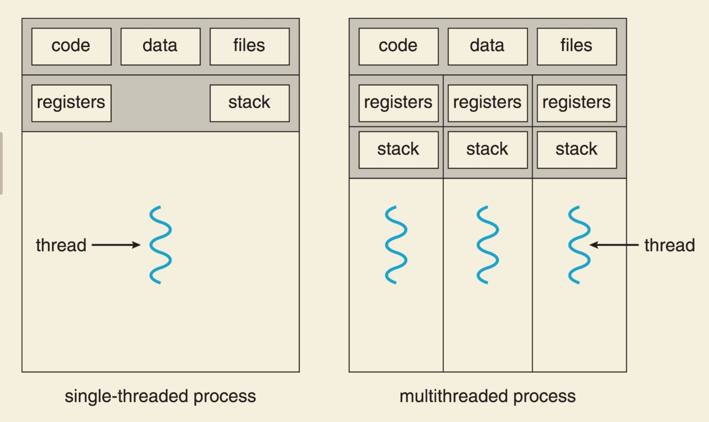

# Threads

- As with processes, each thread has its own program counter & CPU state

- Unlike processes, multiple threads within a process share their address space and memory

- Each process can maintain a table of threads, keeping track of its CPU context & stack

- The process can implement a thread scheduler that chooses the next thread to run when one exits or yields

though diff threads share space, API like TlsAlloc() can set a thread-local storage area.

## User space threading
every time a thread need a blocking system call, the whole process yield

but can use non-blocking system call if OS support

## Kernel Threads

threading handle by OS scheduler, just no address space change

Downside: switching is slower

内核线程使用内核栈和内核资源，并且代码会在每个进程的虚拟空间中？

