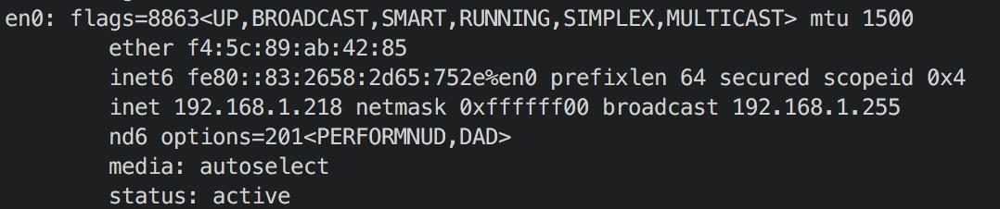
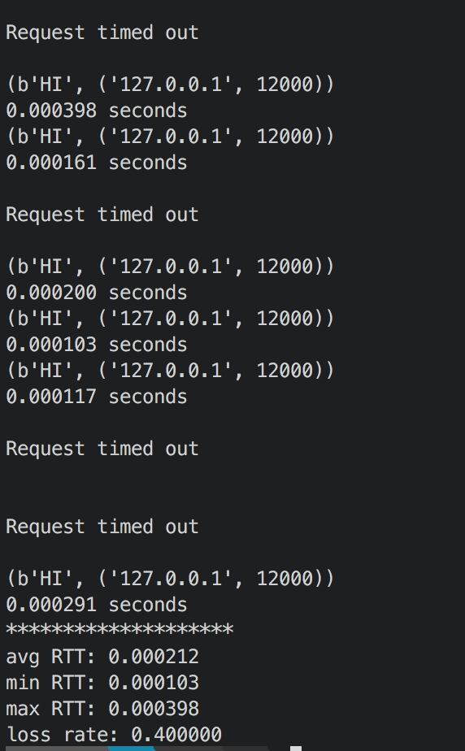
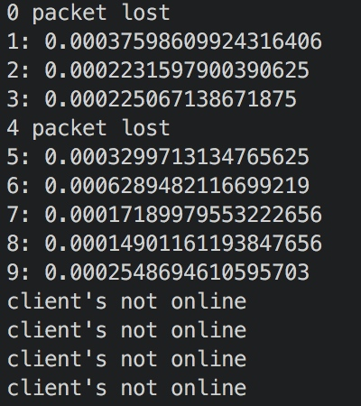

# UDP socket programming

## configuration

## UDP Ping client

It will send 10 packets one by one, and report time out event. After ten packets, it reports average RTT, minimum RTT, max RTT and loss rate.

## HeartBeat

Client send a packet with sequence number every second.

after send ten packet, we pretend Client to go offline, and we see Server report client's not online.

