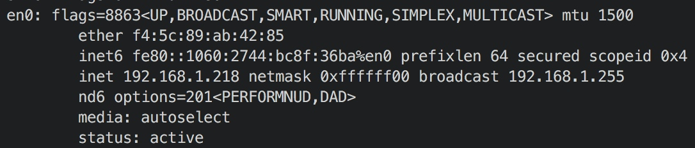
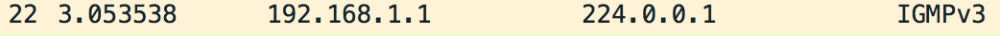
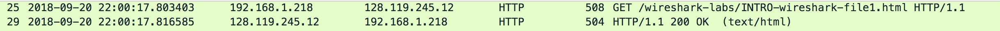
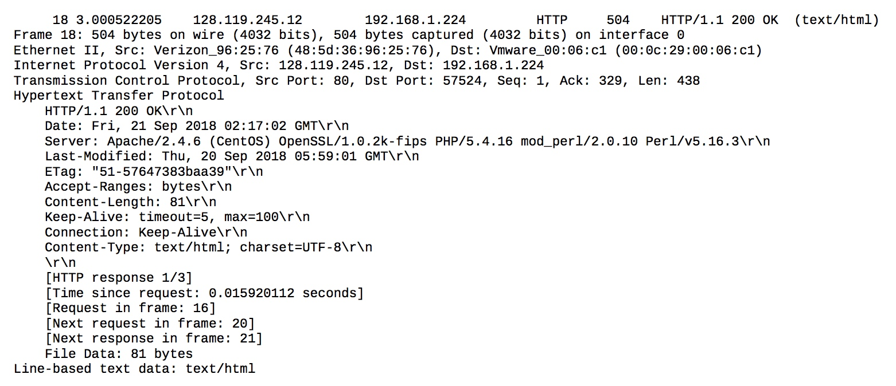
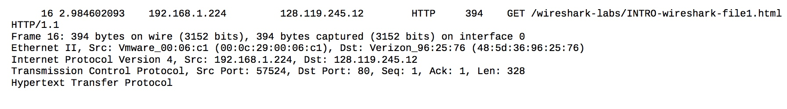

# Wireshark Lab
> Xu Congyu

[TOC]

## IP configuration

## List 3 different protocols

- ICMP

- IGMPv3

- DNS

## Time between request and reply

17.816585 - 17.803403 = 0.13182 (s)

## Print GET and its reply

Since there're some problems with my physical machine, I use Wireshark in my virtual machine to print it

- GET

- Reply

