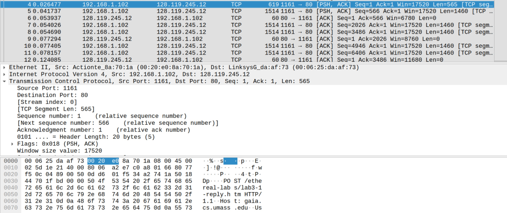
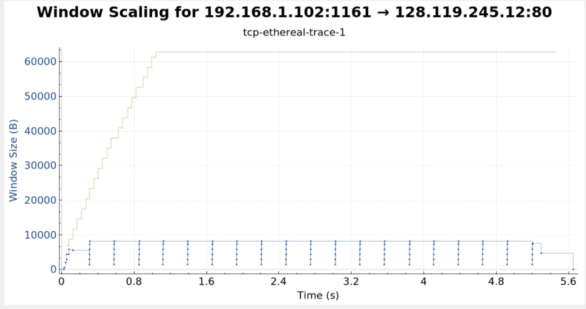
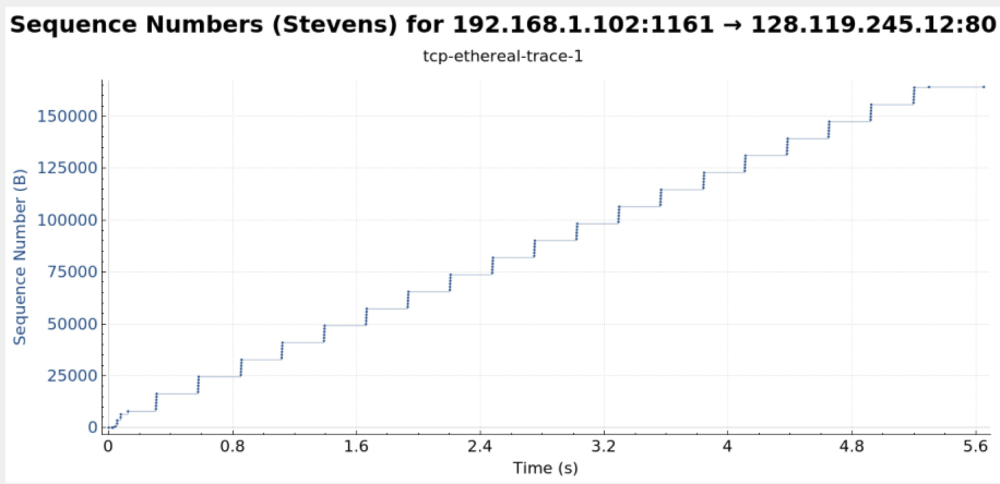
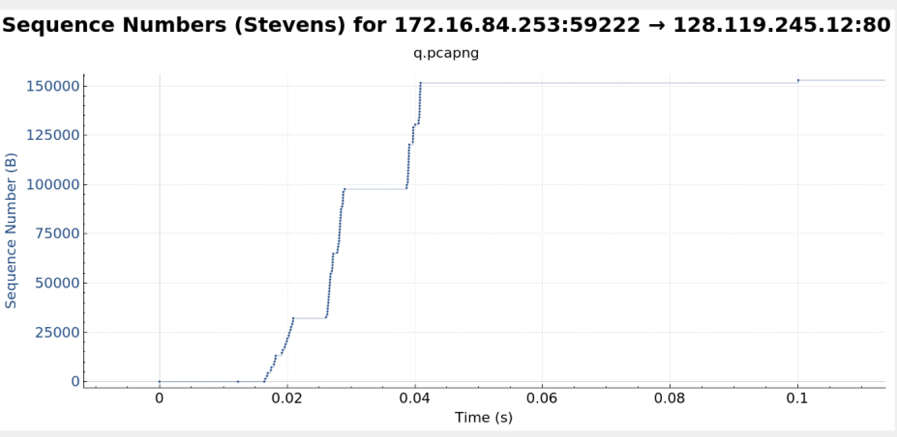

# Wireshark Lab: TCP

## Configuration 

## A first look at captured trace 

1: 

- IP: 192.168.1.102
- port Number: 1161

2: 

- IP: 128.119.245.12
- port Number: 80

3:

- IP: 172.16.84.253
- Port number: 59222

## TCP Basic
4: 

- 0dd601f4(relative: 0)
- Flags: 0x002 (SYN)

5: 

- 34a27419(relative: 0). 
- Acknowledgement Number:0dd601f5(relative: 1), it's SYN's sequence number(0dd601f4) plus 1. 
- Flags: 0x012 (ACK, SYN)

6: 

- Sequence number: 0dd601f5(relative: 1)

7:

|No.|sequence num(relative)|sent time|ACK recv time|RTT|Est RTT|
---|---|---|---|---|---|---|
1|1|0.026477|0.053937|0.02746|0.02746|
2|566|0.041737|0.077294|0.035557|0.0285|
3|2026|0.054026|0.124085|0.070059|0.0337|
4|3486|0.054690|0.169118|0.11443|0.0438|
5|4946|0.077405|0.217299|0.13989|0.0558|
6|6406|0.078157|0.267802|0.18964|0.0725|

EstimatedRTT1 = = 0.02746
EstimatedRTT2 = 0.875 * 0.02746 + 0.125 * 0.035557 = 0.0285
EstimatedRTT3 = 0.875 * 0.0285 + 0.125 * 0.070059 = 0.0337
EstimatedRTT4 = 0.875 * 0.0337+ 0.125 * 0.11443 = 0.0438
EstimatedRTT5 = 0.875 * 0.0438 + 0.125 * 0.13989 = 0.0558
EstimatedRTT6 = 0.875 * 0.0558 + 0.125 * 0.18964 = 0.0725 

8:

|No.|Length|
---|---
1|565
2|1460
3|1460
4|1460
5|1460
6|1460

9:

The window size on the server side is 17520
The window size on the client side grows from 5840 to 62780

There's no throttle due to lack of receiver buffer size

10:

No retransmitted are found. The sequence number during the trace file is growing, no reduce or same sequence number.

11:

Receiver typically acknowledges data transferred by last unacknowledged TCP segment sent by sender(1460 bytes).

In some cases, receiver acknowledges bytes in two segments every ACK

12:

Bytes transferred from the first TCP segment to the last ACK divided by time used between these two segments.

164090/(5.455830-0.026477) = 30.222 kbps

## TCP Congestion Control

13:

The slowest phase is at the very start 0.15s. congestion control takes over after that 0.15s.

Comparing to idealized behavior of TCP, it seems that because application layer constrains the amount of data being sent, we can't see the expected linear increase in text.

14:

The slowest part it from 0 to around 0.025 seconds. Congestion control takes over at 0.035s.

Since the file is too small for the fast network to sent it, we can't see the expected linear increase in text.

