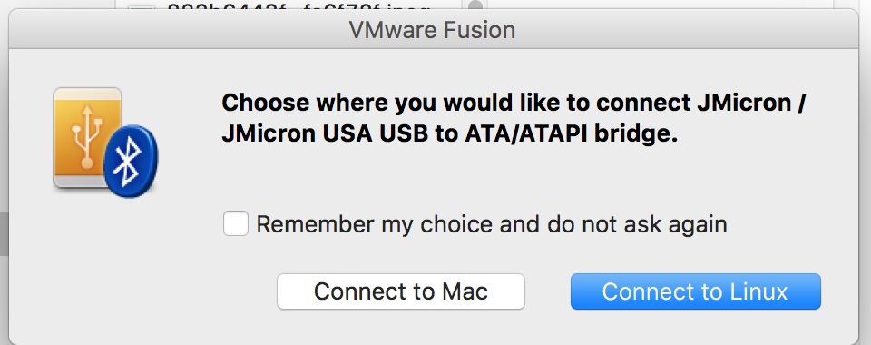

# hard drive

0000000000000000000000000000070080010000000000000000000000000000

389400
3a0a00
410800

看一看是什么filesystem
一个hard drive是什么file system 应该信息在分区的superblock中

## used instruction
 df -Th
mount -o exec /dev/sdc1 /media/root
sudo fdisk -l

## level 0 

/dev/sdc1      vfat      1.4G  2.0M  1.4G   1% /media/root/LEVEL0

cbf06ad97efb847d040d178ae953715c  ../lod//31//level_1.lod

> done
be5f9c34d37d40e4486a7e8d7616dac4  Contents.txt
f3e40b2f305b02159a69d287d09ba9e3  level0_instructions.txt
b76b02088c658bf3faeaea448d160321  level1.md5
ac04ddd55bfdd210473a681a32f15fe8  reference.pdf
9e5c043c0981e4f1b641bde358ea6a37  seaflashlin_rbs

### mount 

mount -o exec /dev/cdrom /mnt/cdrom

if the disk is unmount, it exists as /dev/xxx, and is only a regular file, not directory

### embedded system structure

two parts: disk, SoC

#### Soc

- a ROM containing a "mask ROM" bootloader
- internal SRAM memories
- external serial FLASH (via SPI bus)
- external DRAM memory (largest)

this hard drive also provides a serial con- sole accessible through a physical serial port

1. bootloader in ROM execute first
2. boot firmware from FLASH
3. main firmware from magnetic disks(not user accessible)
4. (additional overlays) loaded on demand

##### 写指令 

when write,

1. 写指令应该是指定了写多少Block，每个block写什么，传给cache task
2. cache task aggregates those blocks, pass it to write/read task
3. write/read task position the head to write data

## 硬盘raw data

SCSI generic (sg) devices are 

0x002a1400 记录有文件名，其中包含了level_1.lod

0x002a0400 记录了短文件名

0x400是1024 0x1000是4096

