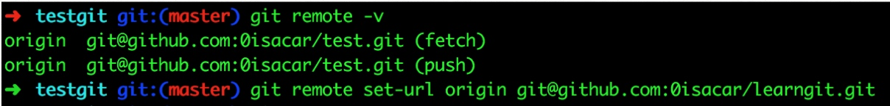
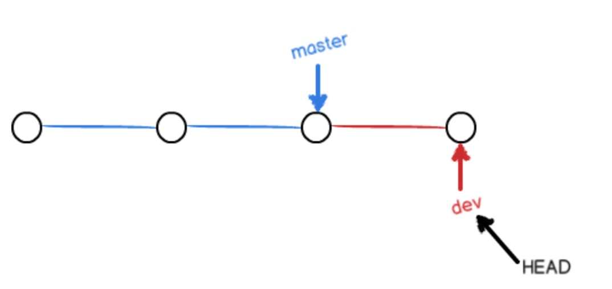
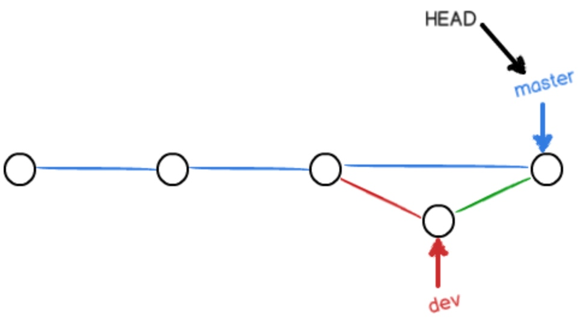
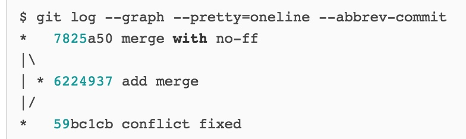

# origin note 2

git init 新建
git config —global user.name
git config —global user.email

vi readme.txt
git add readme.txt
git commit -m “haha”

vi readme.txt
git status
git add readme.txt
git commit -m “hehe”

git log (—pretty=oneline)

git reset --hard HEAD^ 一个^代表上一个版本
git reset --hart HEAD~100

reset到A版本后，A版本之后的版本在log中就没有了
可以通过git reset --hart 3628164 到A后面的版本 (git reflog看A之后版本的commit id)

修改之后的status显示有变化，并且untracked
add之后status显示有变化
commit之后status不显示有变化
log和reset都是针对 commit过的版本

commit只提交暂存区中，不提交工作区中的修改

git checkout -- filename 将工作区文件退回到最近一次(add OR commit) 的状态

git rm filename 将“删除 filename" 这个修改放到暂存区，然后git commit 就将这个暂存区中的修改同步到库中
----------------------------------------------------------------------------------------------------------------

我把origin理解成一个指向远程仓库的指针
没有origin的话：
git remote add origin git@github.com:michaelliao/learngit.git

git push -u origin master
git push origin master

git clone git@github.com:michaelliao/gitskills.git

----------------------------------------------------分支------------------------------------------------------------

git branch 列出分支
git checkout master 切换到master
git checkout -b haha 新建master并切换到master
git merge haha 将当前分支 合并到haha(例如快进到haha)
经过尝试如果haha比master前面的话，haha不能merge到master 虽然这样的merge好像没有意义
A和B两个分支的文件如果同一个文件发生了不可调和的冲突，那么不能merge，手动修改文件到没有冲突后再merge

之前如果是 dev有修改 master merge 到dev 则是一条线直接合并

git merge --no-ff -m "merge with no-ff" dev

比fast forward多一个节点，可以显示一次信息

-------------------
为什么要有stash呢
是因为一旦一个分支haha是修改了没有add的话，切换到master了，master分区是haha更改之后的样子，haha分支commit完了再到master才是master本来的样子
如果haha分支修改了，add了但是没有commit的话，根本不允许切换到其它分支

所以
stash
stash list
stash apply 

