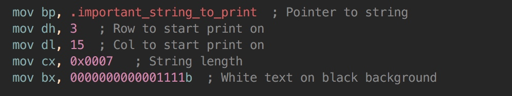
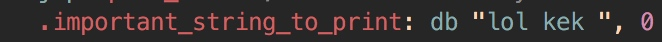

# recruite

tshark -r usb1.pcapng -T fields -e usb.capdata > usbdata.txt

strings framed.whoops|awk 'length($0)>10' | sort -u

a = '41424344'
binascii.unhexlify(a)就成了b'ABCD'
其实b''就是一个一个的比特，其中的每个元素都是0x某某，只是方便表达，在屏幕上显示其解释为ascii代表的字符串

比如在multi_byte_xor的文件中
a=read('a.txt','r')和a=read('a.xtx','rb')是不同的
前者会将一些比特串做一些特殊的 编码解释 
rb模式读出来，a[i]是跟hexdump 完全一样的，
但是r模式读出来a[i]就可能会将几个byte连着解释，视编码方式而定

openssl rsa -in private_key.pem -out rsa_public_key.pem -pubout

python2的gmpy包比较好使

gmpy.root(a,3)[0].digits(16)

然后再binascii.unhexlify

## reverse engineer part1

汇编是按照在文件 中的顺序执行，当通过label定义一些东西的时候，需要手动地将他们跳过

db的意思是存储一些东西到内存里，好像是自动增长存在栈里，需要自己手动在存储的末尾加上0表示结束

当int 0x10之前，如果ah,即ax的高八位是0x0e代表打印第八位的一个byte字符

不管一个标记前面加不加点，都是相同作用，不过加点代表local

当调用int 0x10, ax是0x1301，代表coloring mode, bp存pointer to string,

这样一个标记.important_string_to_print就存储了存储的字符串地址了

- div bx 的意思是用bx去除ax,并且结果保留在ax,余数保留在dx

- jne = jump not equal
    jz == je

