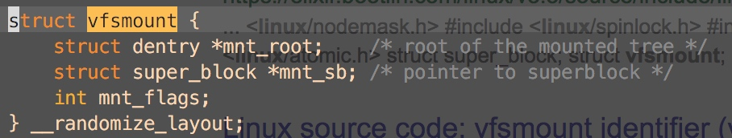
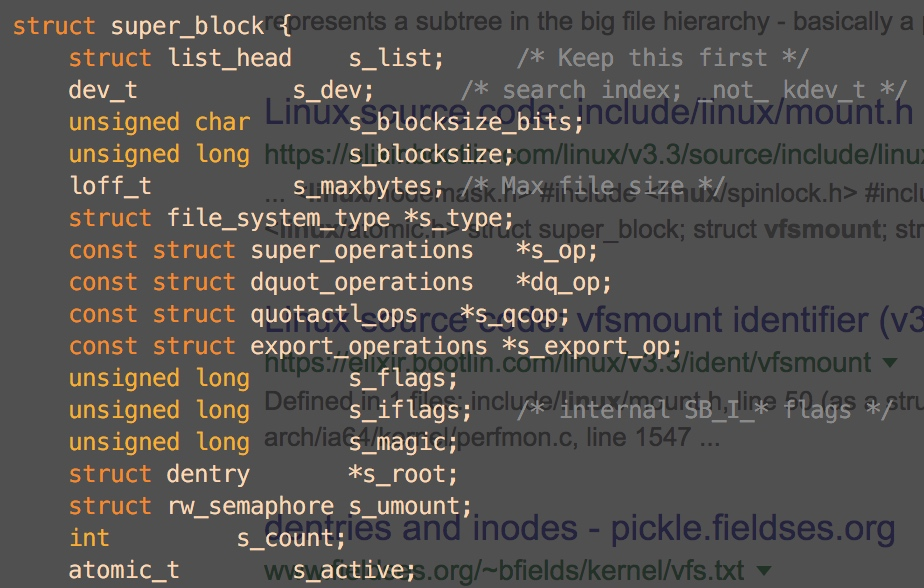

# vfsmount

##索引

- pipe_fs_type  pipe.c  1167
- kern_mount_data  fs/namespace.c  3242
- mount_fs  fs/super.c  1244
    - root = type -> mount(type, flags, name, data)
- pipe_fs_type->pipe_fs_mount  pipe.c  1160
    -  mount_pseudo(fs_type, "pipe:", &pipefs_ops,
			&pipefs_dentry_operations, PIPEFS_MAGIC);  fs.h  2243
- mount_pseudo_xattr  libfs.c  240








kern_mount 就是 kern_mount_data(,NULL)的偏函数宏

kern_mount_data在fs/namespace.c

sb->s_op->alloc_inode(sb)
sb是pipe_mnt->mnt_sb
pipe_mnt是kern_mount_data(&pipe_fs_type)来的

- kern_mount_data 调用 vfs_kern_mount(&pipe_fs_type)
- vfs_kern_mount的mnt_sb是先
    root=type.mount_fs(type...) 
    再 root-> sb 来的(super.c)
- type.mount_fs就是pipe_fs_type.mount是一个方法
- pipe_fs_type.mount是mount_pseudo(1163,pipe.c)


```
mount_pseudo(fs_type, "pipe:", &pipefs_ops,
			&pipefs_dentry_operations, PIPEFS_MAGIC);
```

mount_pseudo(2243,include/linux/fs.h)直接调用*mount_pseudo_xattr（240,fs/libfs.c)

```
	s = sget_userns(fs_type, NULL, set_anon_super, SB_KERNMOUNT|SB_NOUSER,
			&init_user_ns, NULL);
	if (IS_ERR(s))
		return ERR_CAST(s);

	s->s_maxbytes = MAX_LFS_FILESIZE;
	s->s_blocksize = PAGE_SIZE;
	s->s_blocksize_bits = PAGE_SHIFT;
	s->s_magic = magic;
	s->s_op = ops ? ops : &simple_super_operations;
	s->s_xattr = xattr;
	s->s_time_gran = 1;
	root = new_inode(s);
	dentry = __d_alloc(s, &d_name);
	d_instantiate(dentry, root);
	s->s_root = dentry;
	return dget(s->s_root);
	
	```


new_inode_pseudo 就是在sb上新建一个inode,但是不加入 sb的inode_list

就算是普通的new_inode也会调用new_inode_pseudo，再手动加到sb的inode_list中

