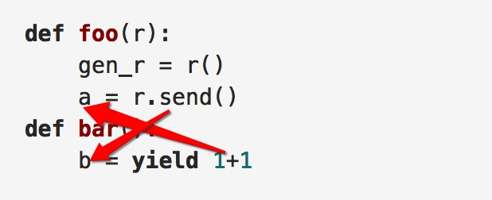

# yield

[TOC]

```python3
def haha():
    r = 3
    while True:
        n = yield r
        print(n)
        
a = haha()
#这时候什么都不会发生
next(a) #与a.send(None)一个意思
next(a) #输出None , 返回值为3
next(a) #输出None , 返回值为3
a.send(5)#输出5，返回值为3
```

>当函数编程n = yield的时候 结果并没有什么不同，只是没有返回值了，如果被send的话n还是可以有值的

- n = yield r 这个语句，虽然返回值是r，但是(yield r)表达式的值是被send的值

- n = yield 5 的意思是：
给n复制为其他函数send进来的，与5无关
同时本次迭代该函数返回值为5

## yield from 

### fluent python 例子
```python
from collections import namedtuple
Result = namedtuple('Result', 'count average')
# the subgenerator
def averager():
    total = 0.0
    count = 0
    average = None
    while True:
        term = yield
        if term is None:
            break
        total += term
        count += 1
        average = total/count
    return Result(count, average)   # the delegating generator

def grouper(results, key):
    while True:
        results[key] = yield from averager()   # the client code, a.k.a. the caller

def main(data):
    results = {}
    for key, values in data.items():
        import pdb; pdb.set_trace()  # XXX BREAKPOINT

        group = grouper(results, key)
        next(group)
        for value in values:
            group.send(value)
        group.send(None)  # important!
    #print(results)  # uncomment to debug
    report(results) # output report

def report(results):
    for key, result in sorted(results.items()):
        group, unit = key.split(';')
        print('{:2} {:5} averaging {:.2f}{}'.format(
            result.count, group, result.average, unit))
data = {
    'girls;kg':
        [40.9, 38.5, 44.3, 42.2, 45.2, 41.7, 44.5, 38.0, 40.6, 44.5],
    'girls;m':
        [1.6, 1.51, 1.4, 1.3, 1.41, 1.39, 1.33, 1.46, 1.45, 1.43],
    'boys;kg':
        [39.0, 40.8, 43.2, 40.8, 43.1, 38.6, 41.4, 40.6, 36.3],
    'boys;m':
        [1.38, 1.5, 1.32, 1.25, 1.37, 1.48, 1.25, 1.49, 1.46], }

if __name__ == '__main__':
    main(data)

```

- main是caller, grouper是delegating generator, averager是subgenerator
- yield from 只是构建一个管道，当send之后，数据会**直接**与subgenerator交流
- 包括throw, 也会直接从caller 到 subgenerator
-  只有当subgenerator *return*时，results[key]才会被赋予当次return的值，在所有value的传输过程中，grouper是被**挂起**的

- 只有在main中group.send(None)执行后，averager退出了while循环，才会return，此时results[key]才会有值
- 在函数foo中有a变量，调用bar(b)，若bar对b进行加减；foo中的a也不会改变，但是如果该变量是dict，那就会真实改变

---

### PEP例子

For simple iterators, yield from iterable is essentially just a shortened form of for item in iterable: yield item:


```python
>>>
>>> def g(x):
...     yield from range(x, 0, -1)
...     yield from range(x)
...
>>> list(g(5))
[5, 4, 3, 2, 1, 0, 1, 2, 3, 4]
```

However, unlike an ordinary loop, yield from allows subgenerators to receive sent and thrown values directly from the calling scope, and return a final value to the outer generator:

```python
>>>
>>> def accumulate():
...     tally = 0
...     while 1:
...         next = yield
...         if next is None:
...             return tally
...         tally += next
...
>>> def gather_tallies(tallies):
...     while 1:
...         tally = yield from accumulate()
...         tallies.append(tally)
...
>>> tallies = []
>>> acc = gather_tallies(tallies)
>>> next(acc)  # Ensure the accumulator is ready to accept values
>>> for i in range(4):
...     acc.send(i)
...
>>> acc.send(None)  # Finish the first tally
>>> for i in range(5):
...     acc.send(i)
...
>>> acc.send(None)  # Finish the second tally
>>> tallies
[6, 10]
```


## 内联回调(use yield)

```python
def apply_async(func, args, *, callback):
# Compute the result
    result = func(*args) # Invoke the callback with the result
    callback(result)

from queue import Queue
from functools import wraps
class Async:
    def __init__(self, func, args):
        self.func = func
        self.args = args


def inlined_async(func):
    @wraps(func)
    def wrapper(*args):
        f = func(*args)
        result_queue = Queue()
        result_queue.put(None)
        while True:
            result = result_queue.get()
            try:
                a = f.send(result)
                apply_async(a.func, a.args, callback=result_queue.put)
            except StopIteration:
                break
    return wrapper

def add(x, y):
    return x+y

@inlined_async
def test():
    r = yield Async(add, (2,3))
    print(r)
    r = yield Async(add, ('hello', 'world'))
    print(r)
    for n in range(10):
        r = yield Async(add, (n,n))
        print(r)
    print('Goodbye')
```

定义了inlined_asyn装饰器

* 因为func是带yield的函数，所以f = func()就返回了一个generator
* Queue的作用是实现一个队列数据结构，没有其他作用，但是依赖这个队列，实现规划


1. 一开始队列为空，通过result_queue.put(None)放入一个空置，紧接着result将这个空值get到，并f.send(result)达到激活的目的，对于函数test来说，就相当于用装饰器预激活过了

2. 激活之后，test函数yield一个Async给a = f.send中的a
3. 然后通过apply_async，把A计算出来，通过callback，把结果放入队列
4. 然后进入下一圈，result = result_queue.get()得到callback放入队列的result，并send这个result，同时发信号，让test函数yield下一个Async类

- 其实loop的起始点变成了a = f.send(result)


##感想

**对于yield语句和send语句，一定要将等式左右分开看

```python
def foo(r):
    gen_r = r()
    a = r.send()
def bar():
    b = yield 1+1
```





* foo(bar)执行后，a与yield 1+1相关，b与r.send相关，是交叉的。
* yield 与 send 一方面是传递值给对方等式左边，一方面是发信号

